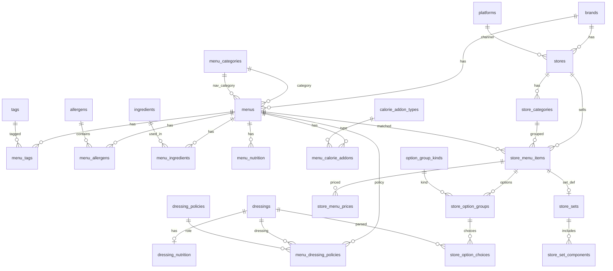

# Salady DB 스키마 (3정규형)

`output/*.json`에 흩어져 있는 공식 메뉴·영양·알레르기·드레싱·매장 가격/옵션 데이터를 **관계형 DB**로 옮기기 위한 설계입니다.

## 설계 원칙 (3NF)

| 정규형 | 적용 예 |
|--------|---------|
| **1NF** | `tags`, `allergens`, `option_groups` 등 반복값을 별도 테이블·연결 테이블로 분리 |
| **2NF** | `store_menu_prices`는 가격만, `store_menu_items`는 상품 정보만 — 복합키의 부분 종속 제거 |
| **3NF** | `menu_categories`와 `menus` 분리(카테고리명→`category_id`), `dressing_nutrition`과 `dressings` 분리, `platforms`와 `stores` 분리 |

### 의도적으로 나눈 것

- **공식 카탈로그(`menus`) vs 매장 SKU(`store_menu_items`)**  
  같은 "탄단지 샐러디"라도 매장·세트·이벤트 메뉴는 별도 행. `menu_id` FK로 공식 메뉴와 연결(매칭 실패 시 NULL).
- **영양 `menu_nutrition.source`**  
  웹(`nutrition`)과 PDF(`nutrition_pdf`) 값이 다를 수 있어 `(menu_id, source)` 복합 PK.
- **드레싱**  
  마스터(`dressings`) + 메뉴 정책(`menu_dressing_policies`) + 매장 정책(`store_menu_dressing_policies`) + 옵션 선택지(`store_option_choices.dressing_id`).
- **가격 이력**  
  `store_menu_prices`에 `valid_from`으로 스냅샷·이력 확장 가능.

## ER 다이어그램



## 테이블 요약

### 마스터·룩업

| 테이블 | 설명 |
|--------|------|
| `brands` | 브랜드 (salady) |
| `platforms` | official / passorder / naver_order |
| `menu_categories` | 공식·네비·매장 카테고리 (`menu_category_types`로 구분) |
| `tags`, `allergens`, `ingredients` | 태그·알레르겐·토핑/베이스/세트구성품 |
| `dressings`, `dressing_policies` | 드레싱 마스터·정책 유형 |
| `calorie_addon_types` | 채소/곡물/메밀/누들 추가 칼로리 유형 |
| `option_group_kinds` | 베이스 선택, 드레싱 선택 등 옵션 그룹 분류 |

### 공식 메뉴 (`menus.json` 등)

| 테이블 | JSON 매핑 |
|--------|-----------|
| `menus` | `id`, `name_ko`, `name_en`, `category`, `nav_category`, `menu_type`, `url`, `image_url`, `description`, `base` |
| `menu_tags` | `tags[]` |
| `menu_allergens` | `allergy[]` |
| `menu_ingredients` | `toppings_text` 파싱 또는 `vegetables[]` |
| `menu_nutrition` | `nutrition` (source=web), `nutrition_pdf` (source=pdf) |
| `menu_calorie_addons` | `calorie_calculator.addon_kcal` |
| `menu_dressing_policies` | `default_dressing`, `recommended_dressing`, `included_dressing`, `dressing_type` |

### 드레싱 (`dressings.json`)

| 테이블 | JSON 매핑 |
|--------|-----------|
| `dressings` | `items[].name`, `name_normalized` |
| `dressing_nutrition` | `items[].nutrition_pdf` |

### 매장 (`store_menus.json`)

| 테이블 | JSON 매핑 |
|--------|-----------|
| `stores` | `stores[].id`, `platform`, `store_name`, `url`, `business_id`, `biz_item_id` |
| `store_categories` | `stores[].categories[]` |
| `store_menu_items` | `stores[].items[]` |
| `store_menu_item_badges` | `items[].badges[]` |
| `store_menu_prices` | `price_krw`, `price_text` |
| `store_external_ids` | `naver_menu_id`, `naver_option_id` |
| `store_sets` | `is_set`, `set_info` / `base_menu_name`, 가격 필드 |
| `store_set_components` | `set_components[]` |
| `store_option_groups` | `naver_options.option_groups[]` |
| `store_option_choices` | `option_groups[].items[]` |
| `store_menu_dressing_policies` | description의 `포함/추천 드레싱` + `dressing_selection` 등 |

### 병합 결과 (`menus.json` → `store_pricing`)

`merge_store_menus()` 결과는 다음에 분산 저장합니다.

- 단품/세트 가격 → `store_menu_prices` + `store_sets`
- `store_pricing.*.naver_options` → `store_option_groups` / `store_option_choices`
- `dressing.store_sources` → `store_menu_dressing_policies` + `menu_dressing_policies`(source=store)

## 초기 시드 (룩업)

```sql
INSERT INTO brands (code, name) VALUES ('salady', '샐러디');
INSERT INTO platforms (code, name) VALUES
  ('official', '공식 홈페이지'),
  ('passorder', '패스오더'),
  ('naver_order', '네이버 예약/주문');
INSERT INTO menu_category_types (code, name) VALUES
  ('official', '공식 카테고리'),
  ('nav', '네비게이션 카테고리'),
  ('store', '매장 카테고리');
INSERT INTO dressing_policies (code, name) VALUES
  ('default', '기본 드레싱'),
  ('recommended', '추천 드레싱'),
  ('included', '포함 드레싱'),
  ('selection', '드레싱 선택 옵션'),
  ('amount', '드레싱 양'),
  ('extra_purchase', '드레싱 추가 구매');
INSERT INTO calorie_addon_types (code, name_ko) VALUES
  ('vegetable', '채소 추가'),
  ('grain', '곡물 추가'),
  ('buckwheat', '메밀면 추가'),
  ('noodles', '파스타/누들 추가');
INSERT INTO option_group_kinds (code, name_ko) VALUES
  ('base_selection', '베이스 선택'),
  ('base_extra', '베이스 추가'),
  ('dressing_selection', '드레싱 선택'),
  ('dressing_amount', '드레싱 양 선택'),
  ('dressing_extra_purchase', '드레싱 추가 구매'),
  ('topping_extra', '토핑 추가'),
  ('soup_extra', '스프 추가'),
  ('set_side', '세트 사이드');
```

## JSON → DB 적재 순서

1. `brands`, `platforms`, 룩업 시드
2. `allergens`, `tags`, `dressings`, `ingredients` (마스터 추출·dedupe)
3. `menu_categories` → `menus` → 연결 테이블 (`menu_tags`, `menu_allergens`, …)
4. `stores` → `store_categories` → `store_menu_items`
5. `store_menu_prices`, `store_sets`, `store_option_groups`, `store_option_choices`
6. `menu_id` 역매칭 (`name_normalized` / 공식 `menus.id`)

## 파일

| 파일 | 용도 |
|------|------|
| [schema.sql](./schema.sql) | DDL (PostgreSQL 기준) |
| [seed_lookup.sql](./seed_lookup.sql) | 룩업 초기 데이터 |
| [views.sql](./views.sql) | 조회용 뷰 (메뉴+드레싱+매장가격) |

## SQLite 사용 시

- `SMALLSERIAL` → `INTEGER PRIMARY KEY AUTOINCREMENT`
- `BIGSERIAL` → `INTEGER PRIMARY KEY AUTOINCREMENT`
- `TIMESTAMPTZ` → `TEXT` (ISO8601)
- `BOOLEAN` → `INTEGER` (0/1)

## 다음 단계 (구현 시)

- `db/import_json.py`: `output/menus.json`, `store_menus.json`, `dressings.json` → INSERT
- 가격·옵션은 `collected_at` / `valid_from`로 스크래핑 회차별 이력 관리
- `menu_id` 매칭 품질: `name_normalized` + 세트 접미사 제거 규칙 공유 (`salady_scraper.normalize_menu_name`)
