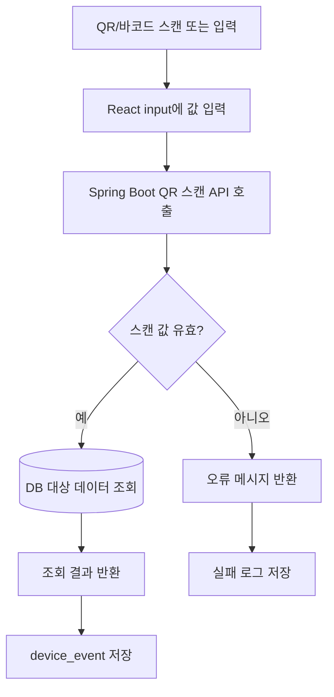

# QR/바코드 스캔 흐름

## Mermaid 흐름도


```mermaid
flowchart TD
    A[QR/바코드 스캔 또는 입력] --> B[React input에 값 입력]
    B --> C[Spring Boot QR 스캔 API 호출]
    C --> D{스캔 값 유효?}
    D -->|예| E[(DB 대상 데이터 조회)]
    E --> F[조회 결과 반환]
    F --> G[device_event 저장]
    D -->|아니오| H[오류 메시지 반환]
    H --> I[실패 로그 저장]
```

## 예시 입력값

```
ORDER-20260701-0001
RESV-20260701-0003
SEAT-A12
```
