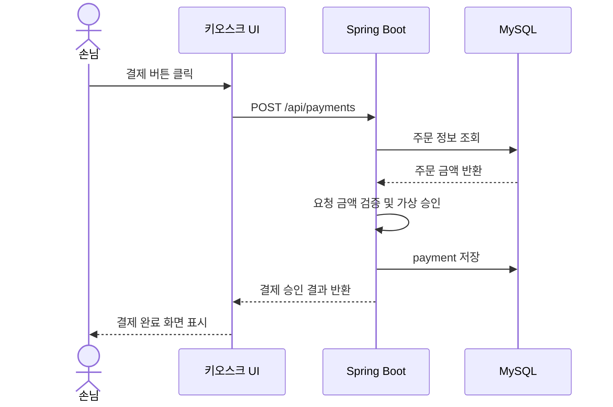

# 가상 결제 처리 흐름

## Mermaid 시퀀스 다이어그램

```mermaid
sequenceDiagram
    actor Customer as 손님
    participant Kiosk as 키오스크 UI
    participant API as Spring Boot
    participant DB as MySQL

    Customer->>Kiosk: 결제 버튼 클릭
    Kiosk->>API: POST /api/payments
    API->>DB: 주문 정보 조회
    DB-->>API: 주문 금액 반환
    API->>API: 요청 금액 검증 및 가상 승인
    API->>DB: payment 저장
    API-->>Kiosk: 결제 승인 결과 반환
    Kiosk-->>Customer: 결제 완료 화면 표시
```
