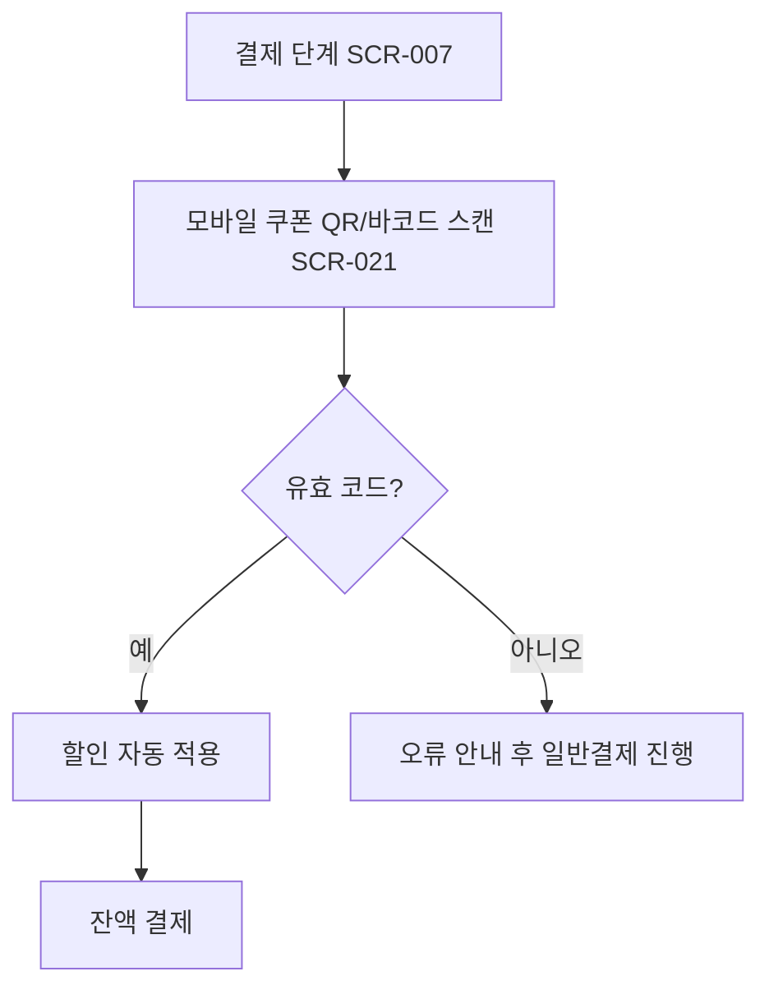

# QR/바코드로 쿠폰 인식 후 결제

시작 조건: 고객이 모바일 쿠폰을 보유하고 있음
종료 조건: 할인 적용된 금액으로 결제 완료
기본 흐름: 결제 단계 진입 → 모바일 쿠폰/멤버십 바코드 스캔 → 할인 자동 적용 → 잔액 결제 진행
예외 흐름: 스캔 실패/만료된 쿠폰 시 오류 메시지 안내 후 일반결제로 진행
관련 화면: SCR-007, SCR-021
기능계층: 추가기능
관련 요구사항: RTOS-DEVICE-004, RTOS-DEVICE-005, RTOS-DEVICE-006, LMIS-ORDER-005
관련 API: POST /api/device/scan
단계: RTOS
비고: Week 5 MVP 범위에서 제외. 멤버십/쿠폰 확장 시 QR/바코드 스캔 API 후보로 관리한다.
사용자 유형: 손님
상태: 초안
시나리오 ID: SC-016
시나리오 유형: QR
우선순위: 중
Related to 테스트 시나리오 데이터베이스 (↔ 시나리오): 포인트·쿠폰 적립 및 QR 할인 적용 (../../09%20%ED%85%8C%EC%8A%A4%ED%8A%B8%20%EC%98%A4%EB%A5%98%20%EA%B4%80%EB%A6%AC/%ED%85%8C%EC%8A%A4%ED%8A%B8%20%EC%8B%9C%EB%82%98%EB%A6%AC%EC%98%A4%20%EB%8D%B0%EC%9D%B4%ED%84%B0%EB%B2%A0%EC%9D%B4%EC%8A%A4/%ED%8F%AC%EC%9D%B8%ED%8A%B8%C2%B7%EC%BF%A0%ED%8F%B0%20%EC%A0%81%EB%A6%BD%20%EB%B0%8F%20QR%20%ED%95%A0%EC%9D%B8%20%EC%A0%81%EC%9A%A9.md)
↔ API: QR/바코드 스캔 처리 (../../06%20API%20%EB%AA%85%EC%84%B8/API%20%EB%AA%85%EC%84%B8%20%EB%8D%B0%EC%9D%B4%ED%84%B0%EB%B2%A0%EC%9D%B4%EC%8A%A4/QR%20%EB%B0%94%EC%BD%94%EB%93%9C%20%EC%8A%A4%EC%BA%94%20%EC%B2%98%EB%A6%AC%20(API-020).md)
↔ 요구사항: QR/바코드 스캔 인식 (../../02%20%EC%9A%94%EA%B5%AC%EC%82%AC%ED%95%AD%20%EC%A0%95%EC%9D%98/%EC%9A%94%EA%B5%AC%EC%82%AC%ED%95%AD%20%EB%AA%A9%EB%A1%9D%20%EB%8D%B0%EC%9D%B4%ED%84%B0%EB%B2%A0%EC%9D%B4%EC%8A%A4/QR%20%EB%B0%94%EC%BD%94%EB%93%9C%20%EC%8A%A4%EC%BA%94%20%EC%9D%B8%EC%8B%9D.md), QR/바코드 스캔 처리 (../../02%20%EC%9A%94%EA%B5%AC%EC%82%AC%ED%95%AD%20%EC%A0%95%EC%9D%98/%EC%9A%94%EA%B5%AC%EC%82%AC%ED%95%AD%20%EB%AA%A9%EB%A1%9D%20%EB%8D%B0%EC%9D%B4%ED%84%B0%EB%B2%A0%EC%9D%B4%EC%8A%A4/QR%20%EB%B0%94%EC%BD%94%EB%93%9C%20%EC%8A%A4%EC%BA%94%20%EC%B2%98%EB%A6%AC.md), QR/바코드 스캔(쿠폰/멤버십) (../../02%20%EC%9A%94%EA%B5%AC%EC%82%AC%ED%95%AD%20%EC%A0%95%EC%9D%98/%EC%9A%94%EA%B5%AC%EC%82%AC%ED%95%AD%20%EB%AA%A9%EB%A1%9D%20%EB%8D%B0%EC%9D%B4%ED%84%B0%EB%B2%A0%EC%9D%B4%EC%8A%A4/QR%20%EB%B0%94%EC%BD%94%EB%93%9C%20%EC%8A%A4%EC%BA%94(%EC%BF%A0%ED%8F%B0%20%EB%A9%A4%EB%B2%84%EC%8B%AD).md)

