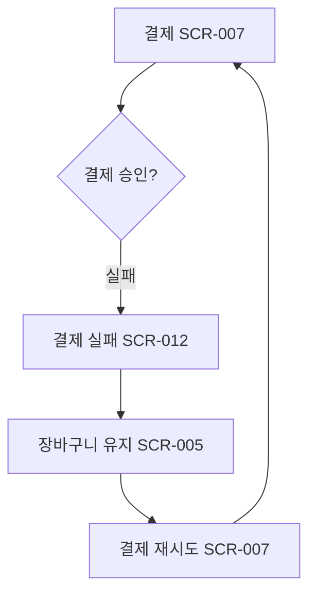

# 결제 실패 흐름

시작 조건: 결제 진행 중
종료 조건: 재시도 성공 또는 직원 호출 안내
기본 흐름: 결제 진행 → 승인 실패 응답 수신(금액 불일치/주문 만료 등) → 실패 원인 화면 안내 → 결제 재시도 유도
예외 흐름: 장바구니 내용은 유지되며 사용자가 다시 결제를 시도할 수 있음
관련 테스트: TC-004
관련 화면: SCR-005, SCR-007, SCR-012
기능계층: 기본기능
관련 요구사항: FWD-PAY-002,KSD-PAY-001
관련 API: API-006 POST /api/payments
단계: KSD
비고: 2026-07-06: SCR-006→005 병합. 결제 실패 시 장바구니·주문확인(SCR-005) 유지.
사용자 유형: 손님
상태: 초안
시나리오 ID: SC-005
시나리오 유형: 결제
우선순위: 상
Related to 테스트 시나리오 데이터베이스 (↔ 시나리오): 결제 실패 시 원인 안내 및 장바구니 유지 확인 (../../09%20%ED%85%8C%EC%8A%A4%ED%8A%B8%20%EC%98%A4%EB%A5%98%20%EA%B4%80%EB%A6%AC/%ED%85%8C%EC%8A%A4%ED%8A%B8%20%EC%8B%9C%EB%82%98%EB%A6%AC%EC%98%A4%20%EB%8D%B0%EC%9D%B4%ED%84%B0%EB%B2%A0%EC%9D%B4%EC%8A%A4/%EA%B2%B0%EC%A0%9C%20%EC%8B%A4%ED%8C%A8%20%EC%8B%9C%20%EC%9B%90%EC%9D%B8%20%EC%95%88%EB%82%B4%20%EB%B0%8F%20%EC%9E%A5%EB%B0%94%EA%B5%AC%EB%8B%88%20%EC%9C%A0%EC%A7%80%20%ED%99%95%EC%9D%B8.md)
↔ API: 가상 결제 처리 (../../06%20API%20%EB%AA%85%EC%84%B8/API%20%EB%AA%85%EC%84%B8%20%EB%8D%B0%EC%9D%B4%ED%84%B0%EB%B2%A0%EC%9D%B4%EC%8A%A4/%EA%B0%80%EC%83%81%20%EA%B2%B0%EC%A0%9C%20%EC%B2%98%EB%A6%AC.md)
↔ 요구사항: 결제 성공/실패 처리 (../../02%20%EC%9A%94%EA%B5%AC%EC%82%AC%ED%95%AD%20%EC%A0%95%EC%9D%98/%EC%9A%94%EA%B5%AC%EC%82%AC%ED%95%AD%20%EB%AA%A9%EB%A1%9D%20%EB%8D%B0%EC%9D%B4%ED%84%B0%EB%B2%A0%EC%9D%B4%EC%8A%A4/%EA%B2%B0%EC%A0%9C%20%EC%84%B1%EA%B3%B5%20%EC%8B%A4%ED%8C%A8%20%EC%B2%98%EB%A6%AC.md), 결제 데이터 무결성 보장 (../../02%20%EC%9A%94%EA%B5%AC%EC%82%AC%ED%95%AD%20%EC%A0%95%EC%9D%98/%EC%9A%94%EA%B5%AC%EC%82%AC%ED%95%AD%20%EB%AA%A9%EB%A1%9D%20%EB%8D%B0%EC%9D%B4%ED%84%B0%EB%B2%A0%EC%9D%B4%EC%8A%A4/%EA%B2%B0%EC%A0%9C%20%EB%8D%B0%EC%9D%B4%ED%84%B0%20%EB%AC%B4%EA%B2%B0%EC%84%B1%20%EB%B3%B4%EC%9E%A5.md)

