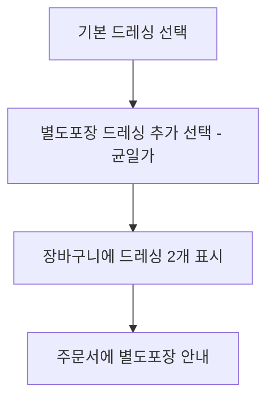

# 드레싱 별도포장 추가 주문 (FWD-MENU-002)

시작 조건: 옵션선택 단계에서 드레싱을 하나 더 맛보고 싶은 고객
종료 조건: 장바구니에 기본 드레싱과 별도포장 드레싱이 각각 표시됨
기본 흐름: 기본 드레싱 선택 → 드레싱 별도포장 추가 선택(균일가) → 장바구니에 드레싱 2개(기본+추가) 반영 → 주문서에 별도포장 표시
예외 흐름: 없음
관련 화면: 옵션선택
기능계층: 옵션기능
관련 요구사항: FWD-MENU-002
관련 API: GET /menus/{id}/options, POST /orders
사용자 유형: 손님
상태: 초안
시나리오 ID: SC-020
시나리오 유형: 주문
우선순위: 중

