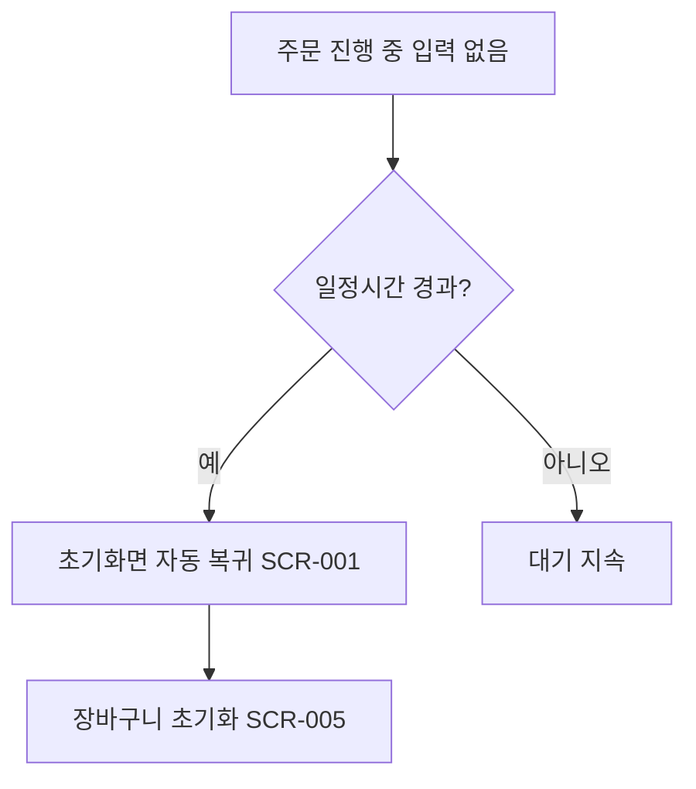

# 일정시간 미입력 시 자동 초기화 (FWD-SYS-001)

시작 조건: 주문 진행 중 고객이 자리를 비움
종료 조건: 초기화면으로 전환되고 다음 고객이 깨끗한 상태로 이용 가능
기본 흐름: 고객이 주문 진행 중 자리를 뜨 → 일정시간(예 30초) 동안 입력 없음 → 경고 없이 초기화면으로 자동 복귀 → 장바구니 초기화
예외 흐름: 타임아웃 직전 다시 터치하면 타이머 리셋(앞팀 사례 참고)
관련 화면: SCR-013, SCR-005
기능계층: 추가기능
관련 요구사항: FWD-SYS-001
관련 API: 없음(프론트 로컬 타이머)
단계: FWD
사용자 유형: 시스템
상태: 초안
시나리오 ID: SC-012
시나리오 유형: 장치
우선순위: 중
Related to 테스트 시나리오 데이터베이스 (↔ 시나리오): 타임아웃 안내 후 자동 초기화 검증 (../../09%20%ED%85%8C%EC%8A%A4%ED%8A%B8%20%EC%98%A4%EB%A5%98%20%EA%B4%80%EB%A6%AC/%ED%85%8C%EC%8A%A4%ED%8A%B8%20%EC%8B%9C%EB%82%98%EB%A6%AC%EC%98%A4%20%EB%8D%B0%EC%9D%B4%ED%84%B0%EB%B2%A0%EC%9D%B4%EC%8A%A4/%ED%83%80%EC%9E%84%EC%95%84%EC%9B%83%20%EC%95%88%EB%82%B4%20%ED%9B%84%20%EC%9E%90%EB%8F%99%20%EC%B4%88%EA%B8%B0%ED%99%94%20%EA%B2%80%EC%A6%9D.md)
↔ 요구사항: 일정 시간 미입력 시 초기화면 자동 복귀 (../../02%20%EC%9A%94%EA%B5%AC%EC%82%AC%ED%95%AD%20%EC%A0%95%EC%9D%98/%EC%9A%94%EA%B5%AC%EC%82%AC%ED%95%AD%20%EB%AA%A9%EB%A1%9D%20%EB%8D%B0%EC%9D%B4%ED%84%B0%EB%B2%A0%EC%9D%B4%EC%8A%A4/%EC%9D%BC%EC%A0%95%20%EC%8B%9C%EA%B0%84%20%EB%AF%B8%EC%9E%85%EB%A0%A5%20%EC%8B%9C%20%EC%B4%88%EA%B8%B0%ED%99%94%EB%A9%B4%20%EC%9E%90%EB%8F%99%20%EB%B3%B5%EA%B7%80.md)

