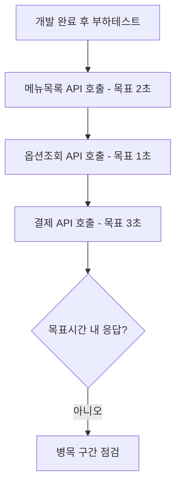

# 핵심 API 응답속도 검증 (DEV-SYS-002)

시작 조건: 개발 완료 후 부하테스트 진행 시점
종료 조건: 각 API가 명시된 목표 응답시간 내에 응답함
기본 흐름: 메뉴목록/옵션조회/결제 각 API 호출 → 목표 응답시간(2초/1초/3초) 내 응답 확인
예외 흐름: 목표시간 초과 시 병목 구간(DB 인덱스, 쿼리문) 점검
관련 화면: 전체 시스템
기능계층: 추가기능
관련 요구사항: DEV-SYS-002
관련 API: GET /api/menus, GET /api/menus/{id}/options, POST /api/payments
사용자 유형: 시스템
상태: 초안
시나리오 ID: SC-023
시나리오 유형: 주문
우선순위: 중

