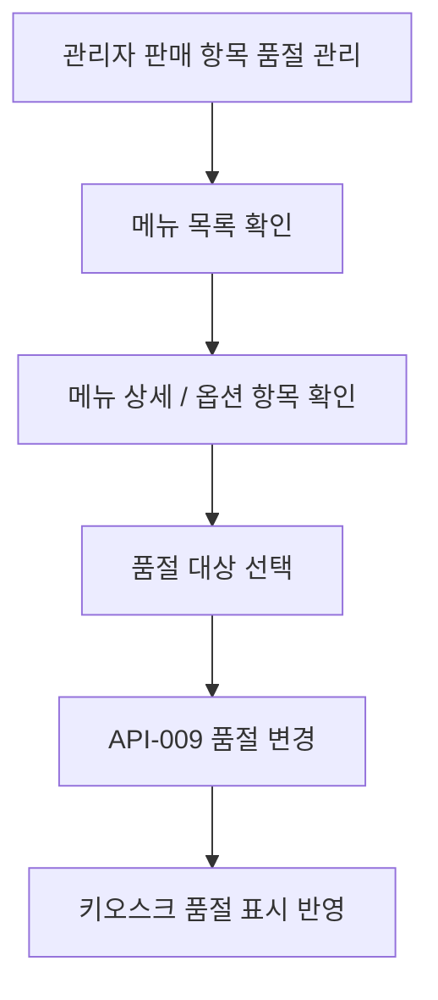

# 판매 항목 품절 관리 흐름

> 시나리오 `SC-007` · 요구사항 `LMIS-MENU-001`, `LMIS-MENU-002` · 화면 `SCR-011`, `SCR-003`, `SCR-004` · API `API-002`, `API-003`, `API-004`, `API-009` · 테스트 `TC-006`

## Mermaid 흐름도

## 연결 화면

- SCR-011 관리자 판매 항목 품절 관리
- SCR-003 메뉴 선택
- SCR-004 메뉴 상세 / 옵션 선택

## 연결 API

- API-002 GET /api/menus
- API-003 GET /api/menus/{menuId}
- API-004 GET /api/menus/{menuId}/options
- API-009 PATCH /api/admin/sold-out-items

## 데이터 처리 기준

- 별도 재료 목록 조회 API는 Week 6(SCR-009~011) MVP에 추가하지 않습니다.
- 관리자는 메뉴 상세와 옵션 항목에서 `ingredientId`를 확인한 뒤 품절 대상을 선택합니다.
- targetType이 `MENU`이면 `menu.sold_out`을 변경합니다.
- targetType이 `INGREDIENT`이면 `ing.sold_out`을 변경합니다.
- targetType이 `OPTION_ITEM`이면 `opt_item.sold_out`을 변경합니다.
- CORE 재료 품절은 해당 메뉴 주문 불가로 표시합니다.
- BASE 재료 품절은 관련 메뉴/카테고리와 베이스 변경 옵션을 주문 불가 또는 선택 불가로 표시합니다.
- DEFAULT 재료 품절은 메뉴 주문은 허용하고 품절 뱃지만 표시합니다.
- 같은 재료가 기본 구성과 추가 토핑 양쪽에 쓰이면 한 번의 재료 품절 변경으로 메뉴 카드, 상세 기본 재료, 옵션 항목 상태가 함께 갱신됩니다.
