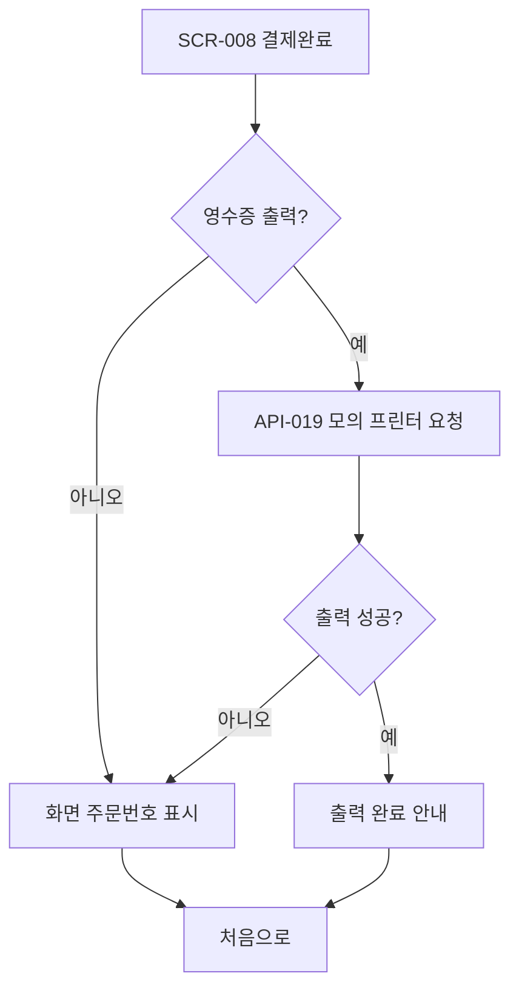

# 영수증 출력 여부 선택

개발 완료: No
관련 API: API-019 POST /api/orders/{orderId}/receipt-print
관련 시나리오: SC-015
관련 요구사항: RTOS-DEVICE-001
관련 테스트: TC-015
구분: 키오스크
단계: 장치
도메인: 식당
비고: Week 5 MVP 제외, Week 7~8 장치 확장. SCR-008 주문 완료 화면에서 분기 또는 오버레이.
상태: 기획중
우선순위: 하
입력 데이터: orderId, orderNo, paymentStatus, totalPrice
화면 ID: SCR-020
화면 설명: 결제 완료 직후 고객이 영수증 출력 여부를 선택하는 화면. 출력 선택 시 모의 프린터 요청, 미선택 시 화면 주문번호로 대체.
출력 데이터: 영수증 출력 선택(예/아니오), 출력 결과 또는 화면 주문번호 표시

# 화면 목적

결제 승인 완료 직후 고객이 영수증 출력 여부를 선택합니다. 출력을 선택하면 모의 프린터로 영수증을 출력하고, 미선택 시 화면에 주문번호를 크게 표시합니다.

# 주요 요소

- 주문 완료 안내 메시지
- 주문번호 표시 영역
- **영수증 출력** / **출력 안 함** 선택 버튼 (터치 ≥48px)
- 출력 진행 중 로딩·결과 안내
- 프린터 오류 시 화면 주문번호 자동 대체 안내

# 이동

- SCR-008 주문 완료 → (영수증 선택) → 출력 완료 또는 주문번호 표시 → **처음으로** (SCR-001)
- 프린터 오류 → 화면 주문번호 표시 후 완료



# Wireframe (834×1194)

```
┌────────────────────┐
│        ✓           │
│  주문이 완료됐어요!    │
│   주문번호 #1234    │
│                    │
│  영수증을 출력할까요?  │
│  ┌──────────────┐  │
│  │  영수증 출력   │  │
│  └──────────────┘  │
│  ┌──────────────┐  │
│  │  출력 안 함    │  │
│  └──────────────┘  │
└────────────────────┘
```

**REQ / SC:** RTOS-DEVICE-001 · SC-015
