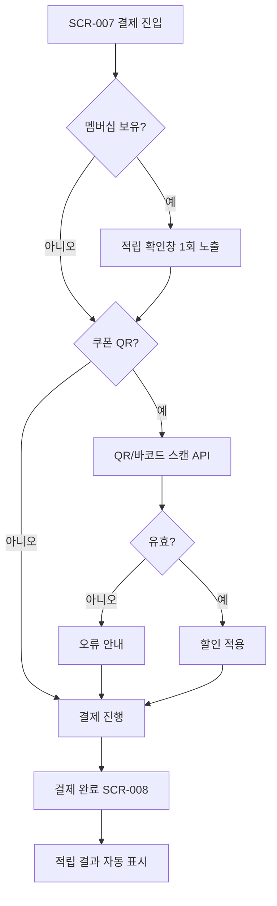

# 포인트·쿠폰 적립

개발 완료: No
관련 API: API-018 POST /api/membership/stamps, POST /api/device/scan
관련 시나리오: SC-006, SC-016
관련 요구사항: LMIS-MEMBER-001, KSD-MEMBER-001, RTOS-DEVICE-002
관련 테스트: TC-016
구분: 키오스크
단계: KSD
도메인: 식당
비고: Week 5 MVP 제외, 9주 후반 멤버십/쿠폰 확장. 결제 전 적립 확인 1회만 노출, 결제 전후 중복 확인 금지.
상태: 기획중
우선순위: 하
입력 데이터: memberId, orderId, scanValue(쿠폰/멤버십 QR), 결제 금액
화면 ID: SCR-021
화면 설명: 결제 단계에서 멤버십 스탬프 적립을 1회 확인하고, 모바일 쿠폰/멤버십 QR 스캔 시 할인·적립 정보를 표시하는 화면
출력 데이터: 적립 확인 결과, 스탬프 적립 여부, 쿠폰 할인 금액, 최종 결제 금액

# 화면 목적

결제 단계에서 멤버십 고객의 스탬프 적립을 **1회만** 확인하고, 모바일 쿠폰·멤버십 QR/바코드 스캔 시 할인·적립 정보를 표시합니다. 결제 완료 후에는 적립 결과만 자동 표시하며, 결제 전후 이중 확인은 하지 않습니다.

# 주요 요소

- 멤버십 적립 확인 모달 (1회 노출): 「이번 주문으로 스탬프 1개 적립할까요?」
- QR/바코드 스캔 영역 또는 입력 필드 (쿠폰·멤버십)
- 적용된 쿠폰·할인 금액 표시
- 적립 예정 스탬프·포인트 안내
- **적립하기** / **건너뛰기** / **쿠폰 스캔** CTA
- 스캔 실패·만료 쿠폰 오류 안내

# 이동

- SCR-007 결제 → (멤버십 보유) → 적립 확인 1회 → 결제 진행 → SCR-008에서 적립 결과 표시
- SCR-007 결제 → (쿠폰 보유) → QR 스캔 → 할인 적용 → 잔액 결제
- 멤버십 미가입 → 적립 단계 생략, 일반 결제 진행



# Wireframe (834×1194)

```
┌────────────────────┐
│ ←       결제        │
├────────────────────┤
│ 결제금액 ₩12,000    │
│ ┌────────────────┐ │
│ │ 📱 쿠폰 스캔     │ │
│ └────────────────┘ │
│ ─ 멤버십 적립 ─     │
│ 스탬프 1개 적립 예정  │
│ [적립하기] [건너뛰기] │
├────────────────────┤
│ [가상 결제 승인]     │
└────────────────────┘
```

**REQ / SC:** LMIS-MEMBER-001, KSD-MEMBER-001, RTOS-DEVICE-002 · SC-006, SC-016