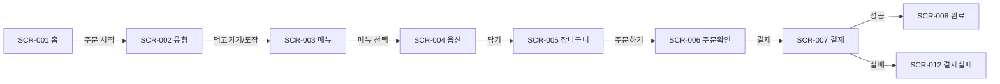

# 화면 설계 **초기** 회의 · 사전 의견 (인덱스)

> **ASAK 키오스크** · SCR-001~021 · SC-001~024  
> **Notion 인덱스**: [화면 설계 초기 회의 · 사전 의견](https://app.notion.com/p/39551ef04f0b8190b76ae4b48b8497ac)  
> **정본**: Notion [04. 화면 설계](https://app.notion.com/p/1c751ef04f0b825ea3aa8145f563bbc8) · [디자인 & 화면 hub](https://app.notion.com/p/39451ef04f0b8163b1f9ebb477917efc)  
> **개인 페이지 목록**: [`docs/design/meetings/README.md`](./meetings/README.md)

---

> **📋 팀원별 페이지 (Duplicate 없음)**
>
> | 작성자 | Notion |
> |--------|--------|
> | **이하진** | [사전의견 · 이하진](https://app.notion.com/p/39551ef04f0b81b4a6d7cbbdb76fbd0e) |
> | **김나연** | [사전의견 · 김나연](https://app.notion.com/p/39551ef04f0b810a887afddfc5dd383c) |
> | **박유진** | [사전의견 · 박유진](https://app.notion.com/p/39551ef04f0b81248c15d260e38c0042) |
> | **강민준** | [사전의견 · 강민준](https://app.notion.com/p/39551ef04f0b813aa1e5f2e21d305b22) |

> **⏱ 3분 빠른 시작**
>
> 1. 위 표에서 **본인 페이지** 열기
> 2. **Step 1** 작성일 · **Step 2~5** 채우기 (작성자는 미리 채움)
> 3. 아래 **팀 제출 현황**에 완료 체크

---

> **💡 초기 회의 = 화면 나누기·구성·흐름 합의**
>
> - **Figma 화면 없어도 됩니다** — 아직 화면이 만들어지지 않은 단계입니다.
> - **Notion 화면 목록** 보고 **이름만** 적어도 OK (SCR 번호 몰라도 됨).
> - **담당 SCR 없어도 됩니다** — 전체 21개를 다 쓸 필요 없습니다.
> - 토론 기준: [04. 화면 설계 DB](https://app.notion.com/p/1c751ef04f0b825ea3aa8145f563bbc8) · [SCR 화면별 가이드](https://app.notion.com/p/39451ef04f0b81109d07c01293d73c6d) (와이어프레임)

---

## 참고 링크 (읽기 필수 아님)

| 항목 | 링크 |
|------|------|
| **화면 설계 DB** | [04. 화면 설계 SCR-001~021](https://app.notion.com/p/1c751ef04f0b825ea3aa8145f563bbc8) |
| **화면별 와이어 가이드** | [SCR 화면별 가이드](https://app.notion.com/p/39451ef04f0b81109d07c01293d73c6d) |
| **DS 후보 미리보기** | 아래 **DS Preview** · [Figma 02 User Flow](https://www.figma.com/design/iqaoVwFjFE6Zq1WpOVgjeG/kiosk_design) · [DS 인덱스](./kiosk-design-system-index.md) |

---

## DS Preview — 한눈에 보기

> Step 4에서 골라 쓰세요. **Figma 화면 없어도** 아래 표만으로 1순위 정리 가능합니다.

### 한눈에 보기

| | **DS-01** | **DS-02** | **DS-03** | **DS-04** | **DS-05** | **DS-06** | **DS-07** |
|---|:---:|:---:|:---:|:---:|:---:|:---:|:---:|
| **느낌 한줄** | 신선·안전 | 미니멀·라임 | 다크·트렌디 | A+C 실험 | coral CTA | blush+forest | B×coral |
| **배경** | 🟢 cream | ⬛ charcoal | 🌲 dark | 🌿 warm | cool pink | blush | cool gray |
| **CTA** | green | lime | mint grad | sage grad | coral grad | forest | coral grad |
| **언제?** | MVP 기본 | 차별화 | Week7+ | 실험 | Variables A | Variables B ⭐ | youth hybrid |

### Figma에서 보기

- [Figma 02 User Flow](https://www.figma.com/design/iqaoVwFjFE6Zq1WpOVgjeG/kiosk_design) → **`DS-01`~`DS-07`** 프레임 (가로 7개)
- 프레임 없으면: `Ctrl + /` → **Create DS Candidates** (플러그인: [figma-create-ds-plugin](./figma-create-ds-plugin/README.md))

### 플러그인 예시 컴포넌트 (12개 · DS-01~07 공통)

각 프레임 **Components** 섹션에 자동 생성 — 키오스크 UI를 한눈에 비교:

1. Home hero strip (SCR-001) · 2. Category tab bar · 3. Menu photo card · 4. Menu card horizontal · 5. Menu card sold-out
6. Option chip row · 7. Option radio group (SCR-004) · 8. Quantity stepper · 9. List group ×2
10. Payment method row (SCR-007) · 11. Success toast · 12. Bottom sticky CTA bar

> DS-05~07은 youth pink·coral CTA·blush 무드가 컴포넌트에 반영됩니다. 상세: [플러그인 README](./figma-create-ds-plugin/README.md)

### 구 이름 → DS-0N (매핑)

| 구 이름 | DS |
|---------|-----|
| DS Candidate A — Fresh Greens | **DS-01** |
| DS Candidate B — Modern Minimal | **DS-02** |
| DS Candidate D — Trend Forward | **DS-03** |
| DS Candidate E — A+C Trend | **DS-04** |
| DS Trend-1 — Pink-Green | **DS-05** |
| DS Trend-4 — Blush Forest | **DS-06** |
| DS Hybrid B×T1 — Bold Pink-Lime | **DS-07** |

### Trend 연결 (한 줄)

| Trend | Figma DS | 메모 |
|-------|----------|------|
| **Trend-1** Pink-Green | **DS-05** | **coral CTA** — DS-01·04·06과 **별개** |
| Trend-2 Warm Coral | (Variables) | terracotta·food photo — ~~후보 C 제외~~ |
| Trend-3 Electric Lime | **DS-02** | charcoal + 라임 한 점 |
| **Trend-4** Blush+Forest | **DS-06** | Notion 1순위 — **DS-01·04와 병합하지 않음** |
| Trend-5 Citrus Navy | — | 결제(SCR-007) 옵션 모드만 |

> **SCR-001 A/B**: Figma Variables **Trend-1 vs Trend-4** (coral CTA vs blush+forest) = **DS-05 vs DS-06**. 후보 비교는 **DS-01 vs DS-04**. [인덱스 §4](./kiosk-design-system-index.md#4-자주-헷갈리는-쌍)

Notion: [브랜드 · Trend 컬러](https://app.notion.com/p/39451ef04f0b814a9447f6fbf171b3b7)

### 초기 회의용 DS 선택 가이드

**화면 안 만들었어도 Step 4에서 골라 주세요.** 아래 3가지만 답하면 후보가 좁혀집니다.

1. **밝은가 어두운가?** → 밝음: DS-01·02·04·05·06 / 어두움: DS-03
2. **따뜻한가 시원한가?** → 따뜻: DS-04 / 시원: DS-01·02·03·05·06
3. **사진 많은가 텍스트 많은가?** → 사진: DS-01·03·04·05·06 / 텍스트·리스트: DS-02·07

---

## 팀 제출 현황

| 완료 | 작성자 | 작성일 | 코멘트한 화면 (요약) | 개인 페이지 |
|:----:|--------|--------|----------------------|-------------|
| [ ] | 이하진 | | | [Notion](https://app.notion.com/p/39551ef04f0b81b4a6d7cbbdb76fbd0e) |
| [ ] | 김나연 | | | [Notion](https://app.notion.com/p/39551ef04f0b810a887afddfc5dd383c) |
| [ ] | 박유진 | | | [Notion](https://app.notion.com/p/39551ef04f0b81248c15d260e38c0042) |
| [ ] | 강민준 | | | [Notion](https://app.notion.com/p/39551ef04f0b813aa1e5f2e21d305b22) |

---

## Step 1 — 기본 정보

| 항목 | 내용 |
|------|------|
| **작성자** | |
| **작성일** | |

---

## Step 2 — 전체 보고 들은 것 (3줄)

> 화면 설계 DB·와이어 가이드를 **대략** 훑어본 뒤 적어 주세요. Figma 화면은 없어도 됩니다.

1. **화면이 몇 개인지 이해했는지** — 21개? 고객/관리자 구분은?
2. **헷갈리는 화면 구분** — 예: 장바구니 vs 주문확인, 메뉴 상세 vs 옵션 선택
3. **빠진 화면 / 합쳐도 될 것 같음** — 예: 결제 실패를 별도 화면으로? 홈+유형 선택 합치기?

---

## Step 3 — 화면 DB에서 골라 2~3개만 코멘트

> [04. 화면 설계](https://app.notion.com/p/1c751ef04f0b825ea3aa8145f563bbc8) 또는 [SCR 화면별 가이드](https://app.notion.com/p/39451ef04f0b81109d07c01293d73c6d)를 보고 **관심 있는 화면 2~3개**만 골라 주세요. SCR 번호 없이 **이름만** 적어도 됩니다.

| 보고 싶은 화면 (이름만) | 이 화면에 뭐가 있어야 함 | 다음 화면으로 어떻게 넘어감 | DS 느낌 (DS-01~07) |
|------------------------|--------------------------|------------------------------|:------------------:|
| 예: 장바구니 | 수량 변경, 총액, 담은 메뉴 목록 | [주문하기] → 주문확인 | DS-04 |
| | | | |
| | | | |

---

## Step 4 — DS 1순위

위 **DS Preview** 표를 보거나, Figma **02. User Flow**의 `DS-01`~`DS-07` 프레임을 먼저 봐 주세요. 없어도 표·설명만으로 골라도 됩니다.

| 선택 | DS | 한 줄 설명 |
|:----:|------|------------|
| [ ] | **DS-01** Fresh Greens | 밝은 크림 + 녹색. 샐러드·신선·MVP 기본 (구 Candidate A) |
| [ ] | **DS-02** Modern Minimal | 흑백 + 라임. 대담·고대비 (구 Candidate B) |
| [ ] | **DS-03** Trend Forward | 딥포레스트 + 민트 글래스. 다크 모드·Week7+ (구 Candidate D) |
| [ ] | **DS-04** A+C Trendy | A 신선함 + warm terracotta. sage gradient (구 Candidate E) |
| [ ] | **DS-05** Pink-Green | vivid coral CTA + sage. SCR-001 Variables A (구 Trend-1) |
| [ ] | **DS-06** Blush Forest | blush + forest CTA. SCR-001 Variables B ⭐ (구 Trend-4) |
| [ ] | **DS-07** Pink-Lime Hybrid | B minimal + coral CTA. 7번째 비교 (구 Hybrid B×T1) |

**1순위**: ___　**한 줄 이유**: ___

> 매핑: A→DS-01 · B→02 · D→03 · E→04 · Trend-1→05 · Trend-4→06 · Hybrid→07 · ~~C 보관~~

> **DS-05 vs DS-06** (Notion·Variables): 홈(SCR-001)에서 coral CTA vs blush+forest를 A/B로 비교. DS-01·04·06은 **각각 독립** — [왜 다른가](./kiosk-design-system-comparison.md#6-왜-다른가-옵션별)

---

## Step 5 — 걱정·질문

회의에서 꼭 물어보고 싶은 것, 불안한 점을 자유롭게 적어 주세요.

-
-
-

---

## 📌 작성 예시

아래는 Step 2~5를 한 번에 채운 예시입니다. 그대로 복사해서 바꿔 쓰세요.

### Step 2 예시

1. 고객 8개 + 관리자 9개 + 예외 4개 = 21개 정도로 이해함. 고객은 홈→주문→결제, 관리자는 로그인 후 주문/메뉴 관리
2. 장바구니와 주문확인이 둘 다 "주문 내용 확인" 느낌이라 구분이 헷갈림
3. 영수증 출력(SCR-020)을 결제 화면에 합칠 수 있을 것 같음

### Step 3 예시

| 보고 싶은 화면 (이름만) | 이 화면에 뭐가 있어야 함 | 다음 화면으로 어떻게 넘어감 | DS 느낌 |
|------------------------|--------------------------|------------------------------|:--------:|
| 장바구니 | 담은 메뉴·옵션·수량, 합계, +/- 버튼 | [주문하기] → 주문확인 | DS-04 |
| 메뉴 선택 | 카테고리 탭, 메뉴 카드(사진+가격), 품절 표시 | 카드 탭 → 메뉴 상세 | DS-04 |
| 주문 확인 | 최종 내역, 먹고가기/포장, [결제하기] | [결제하기] → 결제 | DS-04 |

### Step 4 예시

**1순위**: DS-04　**한 줄 이유**: 신선하면서도 따뜻한 식당 느낌, 키오스크에서 읽기 좋을 것 같음

### Step 5 예시

- 장바구니가 비었을 때 어떤 화면을 보여줄까요?
- 관리자 화면은 고객 화면이랑 DS를 같이 쓸까요, 따로 갈까요?
- 포인트·쿠폰(SCR-021)은 MVP에 넣을까요?

---

## 회의 후 메모 (선택)

| 결정 사항 | 담당 | 일정 |
|-----------|------|------|
| | | |

---

<strong>부록 — DS 상세 비교 (선택)</strong>

후보별 토큰·SCR 추천·Figma mode는 아래 인덱스에서 확인하세요.

| 항목 | 링크 |
|------|------|
| **DS 인덱스 (DS-01~07)** | [kiosk-design-system-index.md](./kiosk-design-system-index.md) |
| DS-01~04 개별 문서 | [01 Fresh Greens](./kiosk-design-system-candidate-A.md) · [02 Modern Minimal](./kiosk-design-system-candidate-B.md) · ~~[C 보관](./kiosk-design-system-candidate-C.md)~~ · [03 Trend Forward](./kiosk-design-system-candidate-D.md) · [04 A+C Trendy](./kiosk-design-system-candidate-E-ac-trendy.md) |
| DS 비교 + 왜 다른가 | [kiosk-design-system-comparison.md](./kiosk-design-system-comparison.md) |
| Figma 플러그인 | [figma-create-ds-plugin](./figma-create-ds-plugin/README.md) |

<strong>부록 — SCR 목록 참고용 (선택)</strong>

SCR 번호가 궁금할 때만 참고하세요. 여기를 채울 필요는 없습니다.

### A. 전체 화면 목록 (SCR-001~021)

| SCR ID | 화면명 | 합침/분리 의견 | 우선순위 |
|--------|--------|----------------|----------|
| SCR-001 | 홈 화면 | | P0 / Week6 / Week7+ |
| SCR-002 | 먹고가기/포장 선택 | | |
| SCR-003 | 메뉴 선택 | | |
| SCR-004 | 메뉴 상세/옵션 선택 | | |
| SCR-005 | 장바구니 | | |
| SCR-006 | 주문 확인 | | |
| SCR-007 | 결제 | | |
| SCR-008 | 주문 완료 | | |
| SCR-009 | 관리자 주문 관리 | | |
| SCR-010 | 관리자 주문 상세 | | |
| SCR-011 | 관리자 품절 관리 | | |
| SCR-012 | 결제 실패/재시도 | | |
| SCR-013 | 타임아웃 안내 | | |
| SCR-014 | 접근성 설정 | | |
| SCR-015 | 관리자 로그인 | | |
| SCR-016 | 관리자 메뉴 관리 | | |
| SCR-017 | 관리자 메뉴 등록/수정 | | |
| SCR-018 | 관리자 결제수단 설정 | | |
| SCR-019 | 관리자 매출 요약 | | |
| SCR-020 | 영수증 출력 여부 선택 | | |
| SCR-021 | 포인트·쿠폰 적립 | | |

### B. 고객 주문 흐름 (Mermaid)

### C. 참고 링크

| 항목 | 링크 |
|------|------|
| SCR 목록 | [Notion 04. 화면 설계 DB](https://app.notion.com/p/1c751ef04f0b825ea3aa8145f563bbc8) |
| 와이어 가이드 | [SCR 화면별 가이드](https://app.notion.com/p/39451ef04f0b81109d07c01293d73c6d) |
| Figma 체크리스트 | `docs/design/SCR_FIGMA_CHECKLIST.md` |
| DS DS-01~07 | [kiosk-design-system-index.md](./kiosk-design-system-index.md) |

