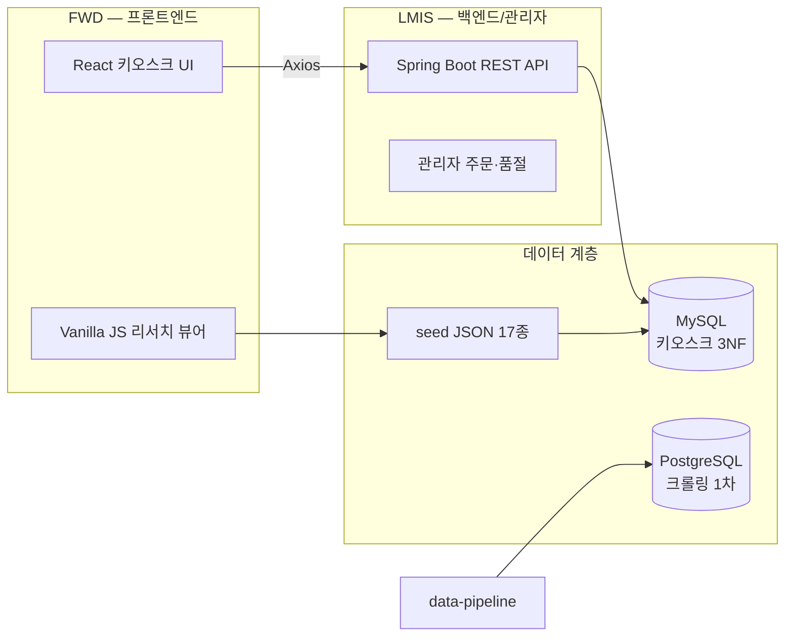

# ASAK — 개발 포트폴리오 (요약)

# Overview

**ASAK(A Salad A Kiosk, 아삭)** 는 샐러드·볼·랩 등 옵션 조합형 메뉴를 키오스크로 주문하는 **4인 팀 · 9주 풀스택 프로젝트**입니다. 가상 브랜드 ASAK을 사용하며, 메뉴·영양·옵션 데이터는 학원 과제·포트폴리오 목적으로 공개 정보를 참고했습니다.

| 항목 | 내용 |
| --- | --- |
| 기간 | 9주 (Week 5 MVP 8/1 목표 · 9/2 최종 발표) |
| 팀 규모 | 4명 |
| 역할 | FWD(프론트) · LMIS(백엔드/관리자) · KSD(통합) · RTOS(장치) |
| 저장소 | [통합 ASAK](https://github.com/hagenie128/ASAK) · [ASAK-front](https://github.com/hagenie128/ASAK-front) · [ASAK-back](https://github.com/hagenie128/ASAK-back) |

---

# Problem

> **한 줄 문제정의**: 옵션·재료·알레르기 조합이 복잡한 샐러드 키오스크에서, 고객은 빠르게 주문하고 매장은 주문·품절·상태를 한 흐름으로 관리해야 한다.
>
- 실제 프랜차이즈 키오스크는 **메뉴 × 옵션 × 재료 품절** 규칙이 복잡해 백엔드 모델링과 프론트 상태관리 역량을 동시에 요구합니다.
- 9주 안에 **설계 → 시드 데이터 → API → UI → 통합**까지 끊김 없이 연결되는 산출물 체계가 필요합니다.

---

# Tech Stack — 계획 vs 구현

| 영역 | 계획 (9주 목표) | 현재 구현 ([ASAK repo](https://github.com/hagenie128/ASAK) 기준) | 비고 |
| --- | --- | --- | --- |
| 프론트엔드 | React 18 + Vite + Zustand + Axios | **Vanilla JS** 정적 뷰어 (`frontend/viewer/`) — 메뉴 리서치·시드 확인용 | 키오스크 UI는 `ASAK-front` 별도 repo |
| 백엔드 | Spring Boot + JPA + MySQL | Spring Boot **골격**  • 시드 JSON 17종 (`backend/`) | API 구현은 `ASAK-back` 별도 repo |
| DB (키오스크) | MySQL · 3NF 22테이블 | 시드 manifest v2 반영 · **주문 5테이블 미포함** | MVP 다음 단계 |
| DB (크롤링) | — | **PostgreSQL** 스키마 (`data-pipeline/phase1/db/`) | 매장·플랫폼 수집용, ASAK 앱 DB와 분리 |
| 데이터 | ASAK 샘플 메뉴 | **84 menus · 9,166 menu_options · 6 categories** · 90 ingredients | `asak-data/seed/manifest.json` |
| 배포 | Railway/Render or 로컬 | Netlify 정적 뷰어 (리서치용) | 키오스크 데모 URL은 팀 확정 후 추가 |
| 핵심 라이브러리 (BE) | Spring Web · JPA · Validation · Lombok · Springdoc · MapStruct | 골격 + 시드 (Week 3~5 도입 예정) | ASAK-back |
| 핵심 라이브러리 (FE) | React Router · Zustand · TanStack Query · Axios | Vanilla 뷰어만 (Week 3~5 도입 예정) | ASAK-front |

---

# Architecture

**용어 (외부인용 병기)**

- **FWD** (Front Web Development): 키오스크 React 화면
- **LMIS** (Local Management Information System): Spring Boot API + 관리자
- **KSD** (Kiosk System Development): FWD ↔ LMIS 통합
- **RTOS** (Real-Time OS 연계): 영수증·QR·결제 장치 모의 연동

---

# Highlights

- **3NF DB 설계 22테이블** — `menu_option` 분리, 추천 드레싱·세트 옵션 규칙 문서화
- **시드 데이터 자동화** — salady 참고 84메뉴, 9,166 옵션 조합, 6카테고리
- **API 명세 20개** — Week 5 MVP(API-001~009) + 9주 확장(API-010~020, 멤버십·영수증·QR 포함)
- **시나리오 Relation** — SC-001~018 ↔ 요구사항/↔API Notion Relation 연결 (5차 QA: SC-011·014 누락 보완, LMIS-ORDER-005 ID 정합)
- **ERD Mermaid** — 05. DB 설계 22테이블 erDiagram
- **통합 monorepo + 분리 repo** — 문서/파이프라인([ASAK](https://github.com/hagenie128/ASAK)) vs React/Spring 개발 repo

---

# Demo Links

| 구분 | URL | 설명 |
| --- | --- | --- |
| 메뉴 리서치 뷰어 | [fanciful-beignet (Netlify)](https://fanciful-beignet-f9f736.netlify.app/) | 크롤링·시드 1차 데이터 **확인용** (키오스크 데모 아님) |
| GitHub 통합 | [hagenie128/ASAK](https://github.com/hagenie128/ASAK) | 시드·파이프라인·문서 |
| GitHub 프론트 | [hagenie128/ASAK-front](https://github.com/hagenie128/ASAK-front) | React 키오스크 (별도 repo) |
| GitHub 백엔드 | [hagenie128/ASAK-back](https://github.com/hagenie128/ASAK-back) | Spring Boot API (별도 repo) |
| Notion 허브 | [ASAK 키오스크 프로젝트](../ASAK%20%ED%82%A4%EC%98%A4%EC%8A%A4%ED%81%AC%20%ED%94%84%EB%A1%9C%EC%A0%9D%ED%8A%B8%20cd951ef04f0b82b081de019cc9a4c580.md) | 설계·WBS·요구사항 전체 |

---

# Limitations & Disclaimer

<aside>
⚠️

**학원 과제·포트폴리오용**입니다. 메뉴 데이터·이미지는 [샐러디(](https://salady.com)[salady.com](http://salady.com)[)](https://salady.com) 공개 정보를 **벤치마킹·참고**했으며, 상업적 서비스·실매장 배포·브랜드 표기에 **그대로 사용하지 마세요**.

</aside>

- **구현 gap**: Notion 설계(React/Spring 풀스택) 대비 [ASAK repo](https://github.com/hagenie128/ASAK)는 시드·뷰어·백엔드 골격 중심
- **주문 테이블**: 시드 manifest에 주문 5테이블(`orders`~`payment`) **미포함** — MVP API 구현 시 추가 예정
- **실결제·멤버십·다매장**: 9주 범위 밖 (가상 결제·단일 매장만)
- **장치/RTOS**: Week 5 MVP 제외, 후반 확장

---

# 정량 성과 (현재 기준)

| 지표 | 수치 | 출처 |
| --- | --- | --- |
| 메뉴 | 84 | manifest.json |
| 메뉴별 옵션 설정 | 9,166 | menu_option |
| 카테고리 | 6개 (신메뉴 / 샌드위치 / 샐러디·볼 / 랩 / 프로틴 / 기타) | category.json |
| 재료 | 90 | ingredient |
| 옵션 항목 | 157 | option_item |
| DB 설계 테이블 | 22 (MVP 17 + 확장 5) | 05. DB 설계 |
| API 명세 | 20 (MVP 9 + 확장 11) | 06. API 명세 |
| 메뉴 이미지 | 84 PNG | asak-data/images/menu/ |

---

*최종 갱신: 2026-07-05 (5차 QA) · Notion 문서 완성 · 코드베이스 [ASAK repo](https://github.com/hagenie128/ASAK) 기준*