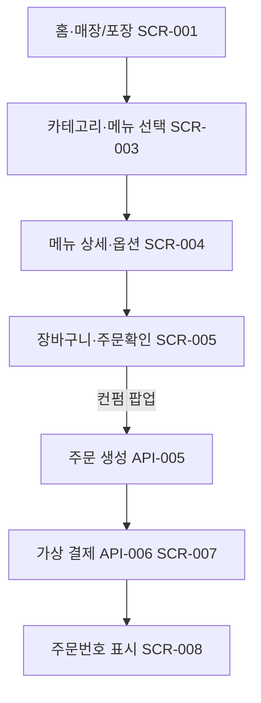
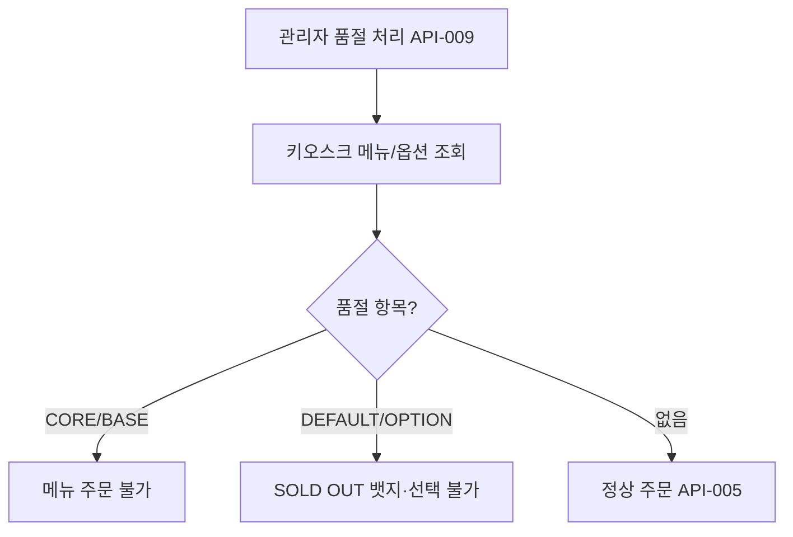
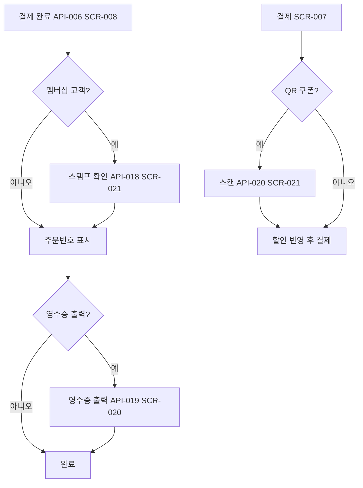

# 03. 사용자 시나리오

<aside>
📌

**관련 화면 필드 규칙 (2026-07-06 회의 반영)** — 시나리오 DB `관련 화면`은 화면명이 아닌 **SCR ID**로 작성합니다. **2026-07-06 병합**: SCR-002→SCR-001「홈 (매장·포장)」, SCR-006→SCR-005「장바구니·주문확인」(컨펌 팝업). 고객 UI **6단계**. SCR-002·006은 `병합됨` 참조용.

고객 기본 흐름: `SCR-001 → SCR-003 → SCR-004 → SCR-005(컨펌 팝업) → SCR-007 → SCR-008`

</aside>

---

<aside>
🔗

**DB Relation 추가 (2026-07-05)**: 시나리오 DB에 `↔ 요구사항`, `↔ API` **Relation 속성**을 추가했습니다. 
기존 텍스트 ID(`관련 요구사항`, `관련 API`)와 **병행** 사용하세요. Relation은 Notion UI에서 드래그로 연결하고, 텍스트 ID는 문서·검색용으로 유지합니다.

</aside>

# 목적

이 페이지는 사용자 시나리오를 데이터베이스로 관리합니다.

사용자 시나리오는 단순 문서로만 작성하면 어떤 요구사항, 화면, API, 테스트와 연결되는지 추적하기 어렵습니다. 
 따라서 시나리오 단위로 관리하고, 각 시나리오 상세 페이지 안에 Mermaid 흐름도를 작성합니다.

## 관리 기준

- 시나리오 ID를 부여합니다.
- 사용자 유형을 구분합니다.
- 시작 조건과 종료 조건을 작성합니다.
- 기본 흐름과 예외 흐름을 분리합니다.
- 관련 요구사항, 화면, API, 테스트 ID를 함께 적습니다.
- Mermaid 차트는 각 시나리오 페이지 본문에 작성합니다.

## 사용자 유형

손님 / 관리자 / 장치 / 시스템

## 시나리오 유형

주문 / 결제 / 영수증 / QR / 관리자 / 장치

> 실제 시나리오 DB의 선택 옵션은 위 7개로 고정되어 있습니다. 
옵션 선택/장바구니/품절 관리 등 세부 주제는 별도 유형으로 나누지 않고, 
가장 가까운 유형(주로 "주문" 또는 "관리자")으로 분류하고 세부 내용은 시나리오명과 기본 흐름에 적습니다.
> 

## 옵션기능 시나리오

판매 항목 품절 관리 → 시나리오 유형 "관리자"로 등록합니다.

> 영수증 출력, QR/바코드 시나리오는 Week 5 MVP 범위에서 제외하고 9주 로드맵의 이후 확장 시나리오로 분리합니다. 
DB상 시나리오 유형은 각각 "영수증", "QR"로 지정합니다.
> 

## 단계 값

실제 시나리오 DB의 "단계" 선택 옵션은 FWD / LMIS / KSD / RTOS / 장치 / 테스트 7개입니다. 
07번 WBS 문서의 단계 코드(PLAN/DEV/FWD/LMIS/KSD/RTOS/TEST/PRESENT)와 이름이 다르므로, 시나리오 DB에서는 이 7개 중에서만 골라야 합니다.

## 상태값

초안 / 검토중 / 확정 / 수정필요

[사용자 시나리오 데이터베이스](03%20%EC%82%AC%EC%9A%A9%EC%9E%90%20%EC%8B%9C%EB%82%98%EB%A6%AC%EC%98%A4/%EC%82%AC%EC%9A%A9%EC%9E%90%20%EC%8B%9C%EB%82%98%EB%A6%AC%EC%98%A4%20%EB%8D%B0%EC%9D%B4%ED%84%B0%EB%B2%A0%EC%9D%B4%EC%8A%A4.csv)

## Week 5 MVP 기준 핵심 시나리오

[식당 키오스크 주문 흐름](03%20%EC%82%AC%EC%9A%A9%EC%9E%90%20%EC%8B%9C%EB%82%98%EB%A6%AC%EC%98%A4/%EC%8B%9D%EB%8B%B9%20%ED%82%A4%EC%98%A4%EC%8A%A4%ED%81%AC%20%EC%A3%BC%EB%AC%B8%20%ED%9D%90%EB%A6%84.md)

[전체 주문 결제 흐름](03%20%EC%82%AC%EC%9A%A9%EC%9E%90%20%EC%8B%9C%EB%82%98%EB%A6%AC%EC%98%A4/%EC%A0%84%EC%B2%B4%20%EC%A3%BC%EB%AC%B8%20%EA%B2%B0%EC%A0%9C%20%ED%9D%90%EB%A6%84.md)

[가상 결제 처리 흐름](03%20%EC%82%AC%EC%9A%A9%EC%9E%90%20%EC%8B%9C%EB%82%98%EB%A6%AC%EC%98%A4/%EA%B0%80%EC%83%81%20%EA%B2%B0%EC%A0%9C%20%EC%B2%98%EB%A6%AC%20%ED%9D%90%EB%A6%84.md)

[관리자 주문 확인 흐름](03%20%EC%82%AC%EC%9A%A9%EC%9E%90%20%EC%8B%9C%EB%82%98%EB%A6%AC%EC%98%A4/%EA%B4%80%EB%A6%AC%EC%9E%90%20%EC%A3%BC%EB%AC%B8%20%ED%99%95%EC%9D%B8%20%ED%9D%90%EB%A6%84.md)

## 옵션기능 시나리오

[판매 항목 품절 관리 흐름](03%20%EC%82%AC%EC%9A%A9%EC%9E%90%20%EC%8B%9C%EB%82%98%EB%A6%AC%EC%98%A4/%ED%8C%90%EB%A7%A4%20%ED%95%AD%EB%AA%A9%20%ED%92%88%EC%A0%88%20%EA%B4%80%EB%A6%AC%20%ED%9D%90%EB%A6%84.md)

## 이후 확장 시나리오

[영수증 출력 흐름](03%20%EC%82%AC%EC%9A%A9%EC%9E%90%20%EC%8B%9C%EB%82%98%EB%A6%AC%EC%98%A4/%EC%98%81%EC%88%98%EC%A6%9D%20%EC%B6%9C%EB%A0%A5%20%ED%9D%90%EB%A6%84.md)

[QR/바코드 스캔 흐름](03%20%EC%82%AC%EC%9A%A9%EC%9E%90%20%EC%8B%9C%EB%82%98%EB%A6%AC%EC%98%A4/QR%20%EB%B0%94%EC%BD%94%EB%93%9C%20%EC%8A%A4%EC%BA%94%20%ED%9D%90%EB%A6%84.md)

## 9주 로드맵 추가 시나리오 관리 대상

- 장바구니 수량 변경 / 삭제
- 타임아웃 안내 및 자동 초기화
- 접근성 설정 변경
- 관리자 로그인
- 관리자 메뉴 등록/수정
- 관리자 결제수단 설정
- 관리자 일별 매출 조회
- 품절 상태 변경 후 고객 화면 반영
- 기본 재료 제외 및 알레르기 표시 확인

---

# 핵심 흐름 Mermaid

## SC-001 신규 고객 기본 주문

> 2026-07-06: SCR-002→001, SCR-006→005 병합. 고객 UI 6단계.
> 

## SC-003 품절 포함 주문

> SC-001~008 개별 Mermaid는 각 시나리오 DB row 본문에도 작성되어 있습니다. Relation(↔요구사항/↔API)은 SC-001~018 전체 연결 완료(2026-07-05).
> 

## 9주 후반 확장 흐름 (영수증·QR·멤버십)

