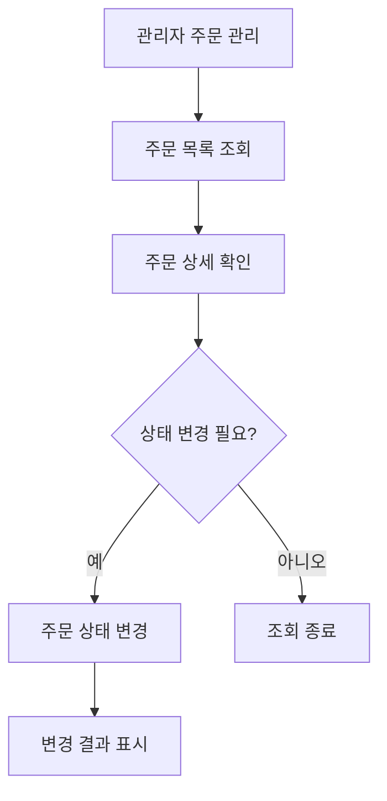

# 관리자 주문 확인 흐름

## Mermaid 흐름도

## 연결 화면

- SCR-009 관리자 주문 관리
- SCR-010 관리자 주문 상세

## 연결 API

- API-007 GET /api/admin/orders
- API-008 PATCH /api/admin/orders/{orderId}/status

## 최종 검증 기준

- 관리자는 주문 목록을 조회할 수 있어야 합니다.
- 관리자는 주문 상세를 확인할 수 있어야 합니다.
- 관리자는 주문 상태를 RECEIVED, PREPARING, COMPLETED 기준으로 변경할 수 있어야 합니다.
- 관리자 로그인은 Week 5 MVP에서는 제외하고 이후 확장으로 분리합니다.