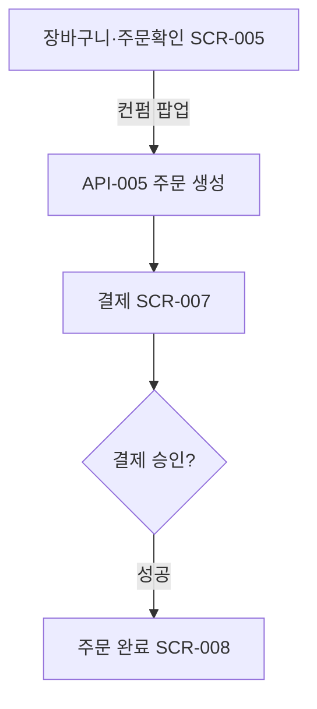

# 결제 성공 흐름(수단 노출 포함)

시작 조건: 장바구니에 1개 이상 메뉴가 담겨있음
종료 조건: 결제 승인 완료 및 주문번호 표시
기본 흐름: 장바구니·주문확인(SCR-005, 컨펌 팝업) → API-005 주문 생성 → 결제(SCR-007) → 승인 → 주문 완료(SCR-008)
예외 흐름: 없음(정상 흐름)
관련 화면: SCR-005, SCR-007, SCR-008
기능계층: 기본기능
관련 요구사항: FWD-PAY-001,FWD-PAY-002,KSD-PAY-001
관련 API: API-006 POST /api/payments, API-005 POST /api/orders
단계: KSD
비고: 2026-07-06: SCR-006→005 병합
사용자 유형: 손님
상태: 초안
시나리오 ID: SC-004
시나리오 유형: 결제
우선순위: 상
↔ API: 주문 생성 (../../06%20API%20%EB%AA%85%EC%84%B8/API%20%EB%AA%85%EC%84%B8%20%EB%8D%B0%EC%9D%B4%ED%84%B0%EB%B2%A0%EC%9D%B4%EC%8A%A4/%EC%A3%BC%EB%AC%B8%20%EC%83%9D%EC%84%B1.md), 가상 결제 처리 (../../06%20API%20%EB%AA%85%EC%84%B8/API%20%EB%AA%85%EC%84%B8%20%EB%8D%B0%EC%9D%B4%ED%84%B0%EB%B2%A0%EC%9D%B4%EC%8A%A4/%EA%B0%80%EC%83%81%20%EA%B2%B0%EC%A0%9C%20%EC%B2%98%EB%A6%AC.md)
↔ 요구사항: 결제 수단 노출 (../../02%20%EC%9A%94%EA%B5%AC%EC%82%AC%ED%95%AD%20%EC%A0%95%EC%9D%98/%EC%9A%94%EA%B5%AC%EC%82%AC%ED%95%AD%20%EB%AA%A9%EB%A1%9D%20%EB%8D%B0%EC%9D%B4%ED%84%B0%EB%B2%A0%EC%9D%B4%EC%8A%A4/%EA%B2%B0%EC%A0%9C%20%EC%88%98%EB%8B%A8%20%EB%85%B8%EC%B6%9C.md), 결제 성공/실패 처리 (../../02%20%EC%9A%94%EA%B5%AC%EC%82%AC%ED%95%AD%20%EC%A0%95%EC%9D%98/%EC%9A%94%EA%B5%AC%EC%82%AC%ED%95%AD%20%EB%AA%A9%EB%A1%9D%20%EB%8D%B0%EC%9D%B4%ED%84%B0%EB%B2%A0%EC%9D%B4%EC%8A%A4/%EA%B2%B0%EC%A0%9C%20%EC%84%B1%EA%B3%B5%20%EC%8B%A4%ED%8C%A8%20%EC%B2%98%EB%A6%AC.md), 결제 데이터 무결성 보장 (../../02%20%EC%9A%94%EA%B5%AC%EC%82%AC%ED%95%AD%20%EC%A0%95%EC%9D%98/%EC%9A%94%EA%B5%AC%EC%82%AC%ED%95%AD%20%EB%AA%A9%EB%A1%9D%20%EB%8D%B0%EC%9D%B4%ED%84%B0%EB%B2%A0%EC%9D%B4%EC%8A%A4/%EA%B2%B0%EC%A0%9C%20%EB%8D%B0%EC%9D%B4%ED%84%B0%20%EB%AC%B4%EA%B2%B0%EC%84%B1%20%EB%B3%B4%EC%9E%A5.md)

