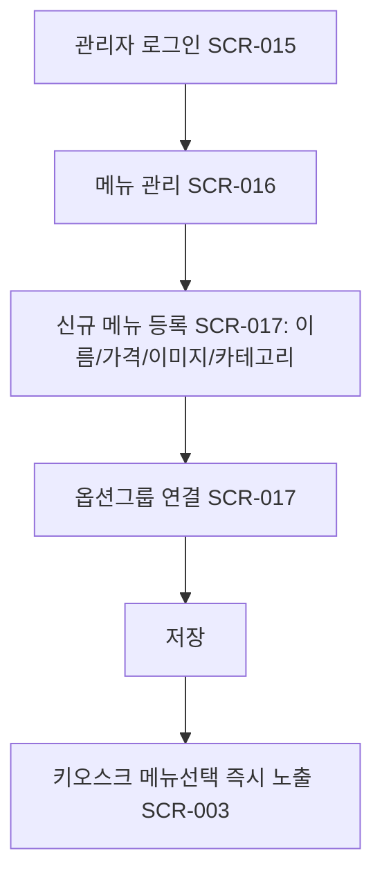

# 관리자의 신규 메뉴 등록 (LMIS-MENU-004)

시작 조건: 관리자가 신규 메뉴를 추가하려는 상황
종료 조건: 신규 메뉴가 키오스크 메뉴선택 화면에 즉시 노출
기본 흐름: 관리자 로그인 → 신규 메뉴 등록(이름/가격/이미지/카테고리) → 옵션그룹 연결 → 저장
예외 흐름: 필수값 누락 시 저장 불가 안내
관련 테스트: TC-011
관련 화면: SCR-015, SCR-016, SCR-017, SCR-003
기능계층: 추가기능
관련 요구사항: LMIS-MENU-004
관련 API: 확장 예정: API-012 POST/PUT /api/admin/menus
단계: LMIS
비고: Week 6(SCR-009~011) 이후 확장 기능으로 관리한다.
사용자 유형: 관리자
상태: 초안
시나리오 ID: SC-017
시나리오 유형: 관리자
우선순위: 상
↔ API: 관리자 메뉴 목록 조회 (../../06%20API%20%EB%AA%85%EC%84%B8/API%20%EB%AA%85%EC%84%B8%20%EB%8D%B0%EC%9D%B4%ED%84%B0%EB%B2%A0%EC%9D%B4%EC%8A%A4/%EA%B4%80%EB%A6%AC%EC%9E%90%20%EB%A9%94%EB%89%B4%20%EB%AA%A9%EB%A1%9D%20%EC%A1%B0%ED%9A%8C.md), 관리자 메뉴 등록/수정 (../../06%20API%20%EB%AA%85%EC%84%B8/API%20%EB%AA%85%EC%84%B8%20%EB%8D%B0%EC%9D%B4%ED%84%B0%EB%B2%A0%EC%9D%B4%EC%8A%A4/%EA%B4%80%EB%A6%AC%EC%9E%90%20%EB%A9%94%EB%89%B4%20%EB%93%B1%EB%A1%9D%20%EC%88%98%EC%A0%95.md)
↔ 요구사항: 메뉴 등록/수정/삭제 (../../02%20%EC%9A%94%EA%B5%AC%EC%82%AC%ED%95%AD%20%EC%A0%95%EC%9D%98/%EC%9A%94%EA%B5%AC%EC%82%AC%ED%95%AD%20%EB%AA%A9%EB%A1%9D%20%EB%8D%B0%EC%9D%B4%ED%84%B0%EB%B2%A0%EC%9D%B4%EC%8A%A4/%EB%A9%94%EB%89%B4%20%EB%93%B1%EB%A1%9D%20%EC%88%98%EC%A0%95%20%EC%82%AD%EC%A0%9C.md)

