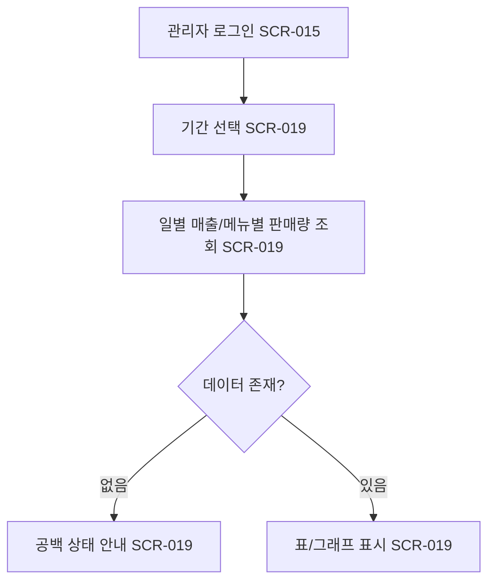

# 관리자의 일별 매출 조회 (LMIS-ORDER-005)

시작 조건: 관리자가 매출 현황을 확인하려는 상황
종료 조건: 기간별 매출/판매량이 화면에 표시됨
기본 흐름: 관리자 로그인 → 기간 선택 → 일별 매출/메뉴별 판매량 조회
예외 흐름: 해당 기간에 데이터가 없을 경우 공백 상태 안내
관련 화면: SCR-015, SCR-019
기능계층: 추가기능
관련 요구사항: LMIS-ORDER-005
관련 API: API-015 GET /api/admin/sales/daily
단계: LMIS
비고: Week 6(SCR-009~011) 이후 확장 기능으로 관리한다.
사용자 유형: 관리자
상태: 초안
시나리오 ID: SC-018
시나리오 유형: 관리자
우선순위: 중
Related to 테스트 시나리오 데이터베이스 (↔ 시나리오): 관리자 매출 요약 조회 검증 (../../09%20%ED%85%8C%EC%8A%A4%ED%8A%B8%20%EC%98%A4%EB%A5%98%20%EA%B4%80%EB%A6%AC/%ED%85%8C%EC%8A%A4%ED%8A%B8%20%EC%8B%9C%EB%82%98%EB%A6%AC%EC%98%A4%20%EB%8D%B0%EC%9D%B4%ED%84%B0%EB%B2%A0%EC%9D%B4%EC%8A%A4/%EA%B4%80%EB%A6%AC%EC%9E%90%20%EB%A7%A4%EC%B6%9C%20%EC%9A%94%EC%95%BD%20%EC%A1%B0%ED%9A%8C%20%EA%B2%80%EC%A6%9D.md)
↔ API: 관리자 일별 매출 조회 (../../06%20API%20%EB%AA%85%EC%84%B8/API%20%EB%AA%85%EC%84%B8%20%EB%8D%B0%EC%9D%B4%ED%84%B0%EB%B2%A0%EC%9D%B4%EC%8A%A4/%EA%B4%80%EB%A6%AC%EC%9E%90%20%EC%9D%BC%EB%B3%84%20%EB%A7%A4%EC%B6%9C%20%EC%A1%B0%ED%9A%8C.md)
↔ 요구사항: 일별 매출/판매량 조회 (../../02%20%EC%9A%94%EA%B5%AC%EC%82%AC%ED%95%AD%20%EC%A0%95%EC%9D%98/%EC%9A%94%EA%B5%AC%EC%82%AC%ED%95%AD%20%EB%AA%A9%EB%A1%9D%20%EB%8D%B0%EC%9D%B4%ED%84%B0%EB%B2%A0%EC%9D%B4%EC%8A%A4/%EC%9D%BC%EB%B3%84%20%EB%A7%A4%EC%B6%9C%20%ED%8C%90%EB%A7%A4%EB%9F%89%20%EC%A1%B0%ED%9A%8C.md)

