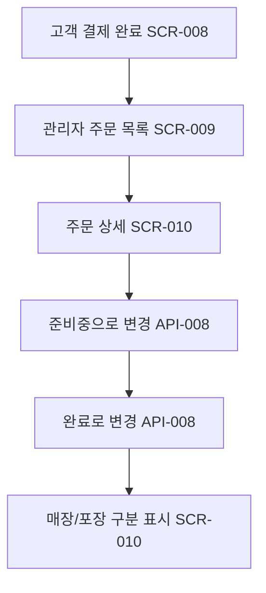

# 관리자의 주문 상태 관리

시작 조건: 고객이 결제를 완료함
종료 조건: 주문 상태가 완료로 변경되고 관리자 화면에 반영됨
기본 흐름: 주문 접수 → 관리자 주문 목록에 노출 → 주문 상세 확인 → 준비중으로 상태 변경 → 조리 완료 후 완료로 변경
예외 흐름: 없음
관련 테스트: TC-014
관련 화면: SCR-009, SCR-010
기능계층: 기본기능
관련 요구사항: LMIS-ORDER-001, LMIS-ORDER-002
관련 API: API-007 GET /api/admin/orders, API-008 PATCH /api/admin/orders/{orderId}/status
단계: LMIS
비고: Week 6(SCR-009~011) MVP에서는 관리자 인증 없이 바로 접근한다.
사용자 유형: 관리자
상태: 초안
시나리오 ID: SC-008
시나리오 유형: 관리자
우선순위: 상
Related to 테스트 시나리오 데이터베이스 (↔ 시나리오): 관리자 주문 목록 조회 및 상태 변경 검증 (../../09%20%ED%85%8C%EC%8A%A4%ED%8A%B8%20%EC%98%A4%EB%A5%98%20%EA%B4%80%EB%A6%AC/%ED%85%8C%EC%8A%A4%ED%8A%B8%20%EC%8B%9C%EB%82%98%EB%A6%AC%EC%98%A4%20%EB%8D%B0%EC%9D%B4%ED%84%B0%EB%B2%A0%EC%9D%B4%EC%8A%A4/%EA%B4%80%EB%A6%AC%EC%9E%90%20%EC%A3%BC%EB%AC%B8%20%EB%AA%A9%EB%A1%9D%20%EC%A1%B0%ED%9A%8C%20%EB%B0%8F%20%EC%83%81%ED%83%9C%20%EB%B3%80%EA%B2%BD%20%EA%B2%80%EC%A6%9D.md)
↔ API: 관리자 주문 목록/상세 조회 (../../06%20API%20%EB%AA%85%EC%84%B8/API%20%EB%AA%85%EC%84%B8%20%EB%8D%B0%EC%9D%B4%ED%84%B0%EB%B2%A0%EC%9D%B4%EC%8A%A4/%EA%B4%80%EB%A6%AC%EC%9E%90%20%EC%A3%BC%EB%AC%B8%20%EB%AA%A9%EB%A1%9D%20%EC%83%81%EC%84%B8%20%EC%A1%B0%ED%9A%8C.md), 관리자 주문 상태 변경 (../../06%20API%20%EB%AA%85%EC%84%B8/API%20%EB%AA%85%EC%84%B8%20%EB%8D%B0%EC%9D%B4%ED%84%B0%EB%B2%A0%EC%9D%B4%EC%8A%A4/%EA%B4%80%EB%A6%AC%EC%9E%90%20%EC%A3%BC%EB%AC%B8%20%EC%83%81%ED%83%9C%20%EB%B3%80%EA%B2%BD.md)
↔ 요구사항: 관리자 주문 목록 조회 (../../02%20%EC%9A%94%EA%B5%AC%EC%82%AC%ED%95%AD%20%EC%A0%95%EC%9D%98/%EC%9A%94%EA%B5%AC%EC%82%AC%ED%95%AD%20%EB%AA%A9%EB%A1%9D%20%EB%8D%B0%EC%9D%B4%ED%84%B0%EB%B2%A0%EC%9D%B4%EC%8A%A4/%EA%B4%80%EB%A6%AC%EC%9E%90%20%EC%A3%BC%EB%AC%B8%20%EB%AA%A9%EB%A1%9D%20%EC%A1%B0%ED%9A%8C.md), 관리자 주문 상세 조회 (../../02%20%EC%9A%94%EA%B5%AC%EC%82%AC%ED%95%AD%20%EC%A0%95%EC%9D%98/%EC%9A%94%EA%B5%AC%EC%82%AC%ED%95%AD%20%EB%AA%A9%EB%A1%9D%20%EB%8D%B0%EC%9D%B4%ED%84%B0%EB%B2%A0%EC%9D%B4%EC%8A%A4/%EA%B4%80%EB%A6%AC%EC%9E%90%20%EC%A3%BC%EB%AC%B8%20%EC%83%81%EC%84%B8%20%EC%A1%B0%ED%9A%8C.md), 관리자 로그인 (../../02%20%EC%9A%94%EA%B5%AC%EC%82%AC%ED%95%AD%20%EC%A0%95%EC%9D%98/%EC%9A%94%EA%B5%AC%EC%82%AC%ED%95%AD%20%EB%AA%A9%EB%A1%9D%20%EB%8D%B0%EC%9D%B4%ED%84%B0%EB%B2%A0%EC%9D%B4%EC%8A%A4/%EA%B4%80%EB%A6%AC%EC%9E%90%20%EB%A1%9C%EA%B7%B8%EC%9D%B8.md)

