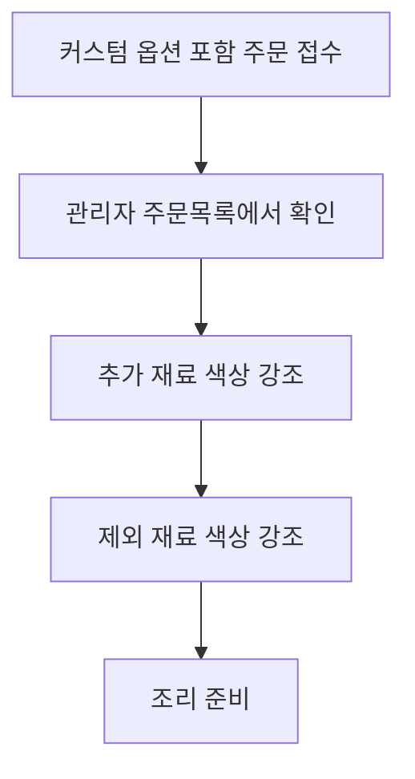

# 관리자의 주문서 추가/제외 재료 확인 (LMIS-ORDER-006)

시작 조건: 커스텀 옵션이 포함된 주문이 접수된 상황
종료 조건: 관리자가 선택 옵션과 제외 재료를 구분해 조리 준비할 수 있음
기본 흐름: 커스텀 옵션이 포함된 주문 생성 → 관리자 주문 목록에서 해당 주문 선택 → 주문 상세에서 선택 옵션과 제외 재료 확인 → 조리 준비
예외 흐름: 없음
관련 화면: 관리자 주문 상세 화면
기능계층: 옵션기능
관련 요구사항: LMIS-ORDER-006
관련 API: API-007 GET /api/admin/orders
비고: order_item_option과 item_exclusion 데이터 확인 시나리오
사용자 유형: 관리자
상태: 초안
시나리오 ID: SC-022
시나리오 유형: 관리자
우선순위: 중

