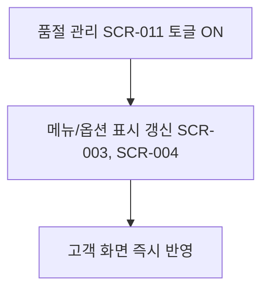

# 관리자의 판매 항목 품절 처리 (LMIS-MENU-001)

시작 조건: 재료 또는 메뉴 구성 항목 소진으로 품절 발생
종료 조건: 키오스크 화면에 판매 항목 품절 상태가 반영됨
기본 흐름: 관리자 품절 관리 화면 진입(Week 6 SCR-011에서는 인증 없이 바로 접근) → 품절 처리할 메뉴/재료 선택 → 품절 토글 ON → 관련 메뉴 목록/메뉴 상세/옵션 선택 화면에 즉시 반영
예외 흐름: 같은 재료가 기본 구성과 추가 토핑에 모두 쓰이면 메뉴/상세/옵션 품절 상태에 함께 반영됨
관련 화면: SCR-011, SCR-003, SCR-004
기능계층: 옵션기능
관련 요구사항: LMIS-MENU-001
관련 API: API-009 PATCH /api/admin/sold-out-items
단계: LMIS
사용자 유형: 관리자
상태: 초안
시나리오 ID: SC-007
시나리오 유형: 관리자
우선순위: 상
Related to 테스트 시나리오 데이터베이스 (↔ 시나리오): 관리자 품절 처리가 관련 메뉴 전체에 즉시 반영되는지 검증 (../../09%20%ED%85%8C%EC%8A%A4%ED%8A%B8%20%EC%98%A4%EB%A5%98%20%EA%B4%80%EB%A6%AC/%ED%85%8C%EC%8A%A4%ED%8A%B8%20%EC%8B%9C%EB%82%98%EB%A6%AC%EC%98%A4%20%EB%8D%B0%EC%9D%B4%ED%84%B0%EB%B2%A0%EC%9D%B4%EC%8A%A4/%EA%B4%80%EB%A6%AC%EC%9E%90%20%ED%92%88%EC%A0%88%20%EC%B2%98%EB%A6%AC%EA%B0%80%20%EA%B4%80%EB%A0%A8%20%EB%A9%94%EB%89%B4%20%EC%A0%84%EC%B2%B4%EC%97%90%20%EC%A6%89%EC%8B%9C%20%EB%B0%98%EC%98%81%EB%90%98%EB%8A%94%EC%A7%80%20%EA%B2%80%EC%A6%9D.md)
↔ API: 판매 항목 품절 상태 변경 (../../06%20API%20%EB%AA%85%EC%84%B8/API%20%EB%AA%85%EC%84%B8%20%EB%8D%B0%EC%9D%B4%ED%84%B0%EB%B2%A0%EC%9D%B4%EC%8A%A4/%ED%8C%90%EB%A7%A4%20%ED%95%AD%EB%AA%A9%20%ED%92%88%EC%A0%88%20%EC%83%81%ED%83%9C%20%EB%B3%80%EA%B2%BD.md), 관리자 판매 항목 목록 조회 (../../06%20API%20%EB%AA%85%EC%84%B8/API%20%EB%AA%85%EC%84%B8%20%EB%8D%B0%EC%9D%B4%ED%84%B0%EB%B2%A0%EC%9D%B4%EC%8A%A4/%EA%B4%80%EB%A6%AC%EC%9E%90%20%ED%8C%90%EB%A7%A4%20%ED%95%AD%EB%AA%A9%20%EB%AA%A9%EB%A1%9D%20%EC%A1%B0%ED%9A%8C.md)
↔ 요구사항: 판매 항목 품절 처리 (../../02%20%EC%9A%94%EA%B5%AC%EC%82%AC%ED%95%AD%20%EC%A0%95%EC%9D%98/%EC%9A%94%EA%B5%AC%EC%82%AC%ED%95%AD%20%EB%AA%A9%EB%A1%9D%20%EB%8D%B0%EC%9D%B4%ED%84%B0%EB%B2%A0%EC%9D%B4%EC%8A%A4/%ED%8C%90%EB%A7%A4%20%ED%95%AD%EB%AA%A9%20%ED%92%88%EC%A0%88%20%EC%B2%98%EB%A6%AC.md), 품절 상태 고객 화면 반영 (../../02%20%EC%9A%94%EA%B5%AC%EC%82%AC%ED%95%AD%20%EC%A0%95%EC%9D%98/%EC%9A%94%EA%B5%AC%EC%82%AC%ED%95%AD%20%EB%AA%A9%EB%A1%9D%20%EB%8D%B0%EC%9D%B4%ED%84%B0%EB%B2%A0%EC%9D%B4%EC%8A%A4/%ED%92%88%EC%A0%88%20%EC%83%81%ED%83%9C%20%EA%B3%A0%EA%B0%9D%20%ED%99%94%EB%A9%B4%20%EB%B0%98%EC%98%81.md)

