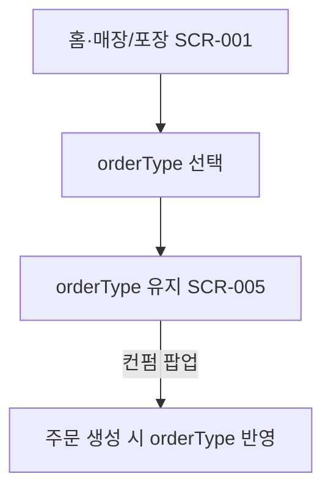

# 매장/포장 여부 선택

시작 조건: 홈 화면에서 주문시작 버튼 클릭
종료 조건: 주문에 orderType(EAT_IN/TAKE_OUT) 구분값이 저장되어 장바구니로 이동
기본 흐름: 홈(SCR-001)에서 매장(먹고가기)/포장 선택 → 선택값(orderType)을 장바구니·주문확인(SCR-005)까지 유지 → 컨펌 팝업 후 주문 생성 시 orderType 반영
예외 흐름: 선택 없이 다음 단계로 진행 불가(필수 선택)
관련 테스트: TC-001
관련 화면: SCR-001, SCR-005
기능계층: 기본기능
관련 요구사항: FWD-ORDER-001
관련 API: 없음 (선택값은 API-005 주문 생성 요청의 orderType으로 전달)
단계: FWD
비고: 2026-07-06: SCR-002→001 병합. 매장/포장 선택은 SCR-001 한 화면.
사용자 유형: 손님
상태: 초안
시나리오 ID: SC-014
시나리오 유형: 주문
우선순위: 상
Related to 테스트 시나리오 데이터베이스 (↔ 시나리오): 먹고가기/포장 선택 및 orderType 유지 검증 (../../09%20%ED%85%8C%EC%8A%A4%ED%8A%B8%20%EC%98%A4%EB%A5%98%20%EA%B4%80%EB%A6%AC/%ED%85%8C%EC%8A%A4%ED%8A%B8%20%EC%8B%9C%EB%82%98%EB%A6%AC%EC%98%A4%20%EB%8D%B0%EC%9D%B4%ED%84%B0%EB%B2%A0%EC%9D%B4%EC%8A%A4/%EB%A8%B9%EA%B3%A0%EA%B0%80%EA%B8%B0%20%ED%8F%AC%EC%9E%A5%20%EC%84%A0%ED%83%9D%20%EB%B0%8F%20orderType%20%EC%9C%A0%EC%A7%80%20%EA%B2%80%EC%A6%9D%2039451ef04f0b81aebdc8d7bc3b49eb30.md)
↔ API: 주문 생성 (../../06%20API%20%EB%AA%85%EC%84%B8/API%20%EB%AA%85%EC%84%B8%20%EB%8D%B0%EC%9D%B4%ED%84%B0%EB%B2%A0%EC%9D%B4%EC%8A%A4/%EC%A3%BC%EB%AC%B8%20%EC%83%9D%EC%84%B1%2030b51ef04f0b8358af2f01c096421506.md)
↔ 요구사항: 매장/포장 구분 표시 (../../02%20%EC%9A%94%EA%B5%AC%EC%82%AC%ED%95%AD%20%EC%A0%95%EC%9D%98/%EC%9A%94%EA%B5%AC%EC%82%AC%ED%95%AD%20%EB%AA%A9%EB%A1%9D%20%EB%8D%B0%EC%9D%B4%ED%84%B0%EB%B2%A0%EC%9D%B4%EC%8A%A4/%EB%A7%A4%EC%9E%A5%20%ED%8F%AC%EC%9E%A5%20%EA%B5%AC%EB%B6%84%20%ED%91%9C%EC%8B%9C%2039151ef04f0b81e89b5bc8ddbe19579a.md)

