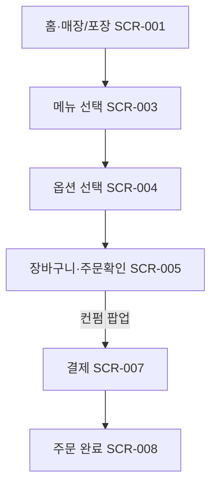

# 신규 고객의 기본 주문 흐름

시작 조건: ASAK 키오스크 화면 진입(처음 방문 고객)
종료 조건: 결제 완료 후 주문번호가 화면에 표시됨
기본 흐름: 홈(매장·포장 SCR-001) → 카테고리·메뉴 선택 → 옵션 선택 → 장바구니·주문확인(SCR-005, 컨펌 팝업) → 결제(SCR-007) → 주문 완료(SCR-008)
예외 흐름: 옵션이 헷갈려 이전 단계로 돌아가도 선택 내용이 유지됨 (사용자가 지적한 키오스크 취소 시 초기화 문제 개선)
관련 화면: SCR-001, SCR-003, SCR-004, SCR-005, SCR-007, SCR-008
기능계층: 기본기능
관련 요구사항: FWD-UI-001,FWD-MENU-001,FWD-MENU-002,FWD-CART-001,FWD-MENU-003,FWD-PAY-001,FWD-PAY-002
관련 API: GET /api/menus, GET /api/menus/{id}/options, POST /api/orders
단계: FWD
비고: 2026-07-06: SCR-002→001, SCR-006→005 병합. 고객 UI 6단계.
사용자 유형: 손님
상태: 초안
시나리오 ID: SC-001
시나리오 유형: 주문
우선순위: 상
↔ API: 메뉴 목록 조회 (../../06%20API%20%EB%AA%85%EC%84%B8/API%20%EB%AA%85%EC%84%B8%20%EB%8D%B0%EC%9D%B4%ED%84%B0%EB%B2%A0%EC%9D%B4%EC%8A%A4/%EB%A9%94%EB%89%B4%20%EB%AA%A9%EB%A1%9D%20%EC%A1%B0%ED%9A%8C%2004851ef04f0b831abbe601a5cd258ac9.md), 메뉴 상세 조회 (../../06%20API%20%EB%AA%85%EC%84%B8/API%20%EB%AA%85%EC%84%B8%20%EB%8D%B0%EC%9D%B4%ED%84%B0%EB%B2%A0%EC%9D%B4%EC%8A%A4/%EB%A9%94%EB%89%B4%20%EC%83%81%EC%84%B8%20%EC%A1%B0%ED%9A%8C%2039251ef04f0b81b6a23bd0da22f3632e.md), 메뉴 옵션 조회 (../../06%20API%20%EB%AA%85%EC%84%B8/API%20%EB%AA%85%EC%84%B8%20%EB%8D%B0%EC%9D%B4%ED%84%B0%EB%B2%A0%EC%9D%B4%EC%8A%A4/%EB%A9%94%EB%89%B4%20%EC%98%B5%EC%85%98%20%EC%A1%B0%ED%9A%8C%2039151ef04f0b816583b6f7d373600582.md), 주문 생성 (../../06%20API%20%EB%AA%85%EC%84%B8/API%20%EB%AA%85%EC%84%B8%20%EB%8D%B0%EC%9D%B4%ED%84%B0%EB%B2%A0%EC%9D%B4%EC%8A%A4/%EC%A3%BC%EB%AC%B8%20%EC%83%9D%EC%84%B1%2030b51ef04f0b8358af2f01c096421506.md)
↔ 요구사항: 접근성을 고려한 UI 제공 (../../02%20%EC%9A%94%EA%B5%AC%EC%82%AC%ED%95%AD%20%EC%A0%95%EC%9D%98/%EC%9A%94%EA%B5%AC%EC%82%AC%ED%95%AD%20%EB%AA%A9%EB%A1%9D%20%EB%8D%B0%EC%9D%B4%ED%84%B0%EB%B2%A0%EC%9D%B4%EC%8A%A4/%EC%A0%91%EA%B7%BC%EC%84%B1%EC%9D%84%20%EA%B3%A0%EB%A0%A4%ED%95%9C%20UI%20%EC%A0%9C%EA%B3%B5%2039151ef04f0b81249e6deded5ece01bc.md), 키오스크 메뉴 목록 조회 (../../02%20%EC%9A%94%EA%B5%AC%EC%82%AC%ED%95%AD%20%EC%A0%95%EC%9D%98/%EC%9A%94%EA%B5%AC%EC%82%AC%ED%95%AD%20%EB%AA%A9%EB%A1%9D%20%EB%8D%B0%EC%9D%B4%ED%84%B0%EB%B2%A0%EC%9D%B4%EC%8A%A4/%ED%82%A4%EC%98%A4%EC%8A%A4%ED%81%AC%20%EB%A9%94%EB%89%B4%20%EB%AA%A9%EB%A1%9D%20%EC%A1%B0%ED%9A%8C%205bf51ef04f0b82b0b48a818e2a24decf.md), 드레싱 별도포장 추가 옵션 (../../02%20%EC%9A%94%EA%B5%AC%EC%82%AC%ED%95%AD%20%EC%A0%95%EC%9D%98/%EC%9A%94%EA%B5%AC%EC%82%AC%ED%95%AD%20%EB%AA%A9%EB%A1%9D%20%EB%8D%B0%EC%9D%B4%ED%84%B0%EB%B2%A0%EC%9D%B4%EC%8A%A4/%EB%93%9C%EB%A0%88%EC%8B%B1%20%EB%B3%84%EB%8F%84%ED%8F%AC%EC%9E%A5%20%EC%B6%94%EA%B0%80%20%EC%98%B5%EC%85%98%2039151ef04f0b816fb249d1f73e0a0181.md), 선택 옵션 텍스트 요약 표시 (../../02%20%EC%9A%94%EA%B5%AC%EC%82%AC%ED%95%AD%20%EC%A0%95%EC%9D%98/%EC%9A%94%EA%B5%AC%EC%82%AC%ED%95%AD%20%EB%AA%A9%EB%A1%9D%20%EB%8D%B0%EC%9D%B4%ED%84%B0%EB%B2%A0%EC%9D%B4%EC%8A%A4/%EC%84%A0%ED%83%9D%20%EC%98%B5%EC%85%98%20%ED%85%8D%EC%8A%A4%ED%8A%B8%20%EC%9A%94%EC%95%BD%20%ED%91%9C%EC%8B%9C%2039151ef04f0b81dbbda0ce087e82d555.md), 메뉴 대표 이미지 제공 (../../02%20%EC%9A%94%EA%B5%AC%EC%82%AC%ED%95%AD%20%EC%A0%95%EC%9D%98/%EC%9A%94%EA%B5%AC%EC%82%AC%ED%95%AD%20%EB%AA%A9%EB%A1%9D%20%EB%8D%B0%EC%9D%B4%ED%84%B0%EB%B2%A0%EC%9D%B4%EC%8A%A4/%EB%A9%94%EB%89%B4%20%EB%8C%80%ED%91%9C%20%EC%9D%B4%EB%AF%B8%EC%A7%80%20%EC%A0%9C%EA%B3%B5%2039151ef04f0b81648e6fee1f06f083c4.md), 결제 수단 노출 (../../02%20%EC%9A%94%EA%B5%AC%EC%82%AC%ED%95%AD%20%EC%A0%95%EC%9D%98/%EC%9A%94%EA%B5%AC%EC%82%AC%ED%95%AD%20%EB%AA%A9%EB%A1%9D%20%EB%8D%B0%EC%9D%B4%ED%84%B0%EB%B2%A0%EC%9D%B4%EC%8A%A4/%EA%B2%B0%EC%A0%9C%20%EC%88%98%EB%8B%A8%20%EB%85%B8%EC%B6%9C%2039151ef04f0b815a895ec22a681480d2.md), 결제 성공/실패 처리 (../../02%20%EC%9A%94%EA%B5%AC%EC%82%AC%ED%95%AD%20%EC%A0%95%EC%9D%98/%EC%9A%94%EA%B5%AC%EC%82%AC%ED%95%AD%20%EB%AA%A9%EB%A1%9D%20%EB%8D%B0%EC%9D%B4%ED%84%B0%EB%B2%A0%EC%9D%B4%EC%8A%A4/%EA%B2%B0%EC%A0%9C%20%EC%84%B1%EA%B3%B5%20%EC%8B%A4%ED%8C%A8%20%EC%B2%98%EB%A6%AC%2039151ef04f0b818dbe40fc1496384d37.md)

