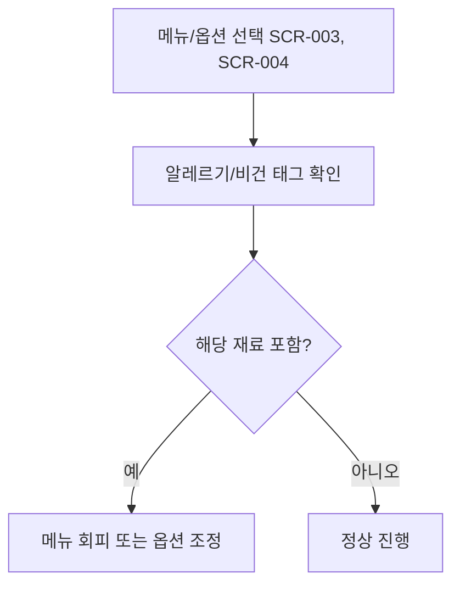

# 알레르기/비건 태그 확인 후 주문 (FWD-MENU-008)

시작 조건: 견과류 알레르기가 있는 고객이 메뉴 탐색 중
종료 조건: 고객이 안전하게 메뉴를 선택하거나 회피함
기본 흐름: 알레르기/비건 태그 확인 → 해당 재료 포함 여부 인지 → 태그 기준으로 메뉴 선택/회피
예외 흐름: 태그 미표시 재료가 있을 경우 고객이 직접 문의하도록 안내 문구 필요
관련 화면: SCR-003, SCR-004
기능계층: 옵션기능
관련 요구사항: FWD-MENU-008
관련 API: GET /menus/{id}/options
단계: FWD
사용자 유형: 손님
상태: 초안
시나리오 ID: SC-010
시나리오 유형: 주문
우선순위: 중
↔ API: 메뉴 옵션 조회 (../../06%20API%20%EB%AA%85%EC%84%B8/API%20%EB%AA%85%EC%84%B8%20%EB%8D%B0%EC%9D%B4%ED%84%B0%EB%B2%A0%EC%9D%B4%EC%8A%A4/%EB%A9%94%EB%89%B4%20%EC%98%B5%EC%85%98%20%EC%A1%B0%ED%9A%8C.md)
↔ 요구사항: 알레르기/비건 태그 확인 (../../02%20%EC%9A%94%EA%B5%AC%EC%82%AC%ED%95%AD%20%EC%A0%95%EC%9D%98/%EC%9A%94%EA%B5%AC%EC%82%AC%ED%95%AD%20%EB%AA%A9%EB%A1%9D%20%EB%8D%B0%EC%9D%B4%ED%84%B0%EB%B2%A0%EC%9D%B4%EC%8A%A4/%EC%95%8C%EB%A0%88%EB%A5%B4%EA%B8%B0%20%EB%B9%84%EA%B1%B4%20%ED%83%9C%EA%B7%B8%20%ED%99%95%EC%9D%B8.md), 알레르기/비건 태그 표시 (../../02%20%EC%9A%94%EA%B5%AC%EC%82%AC%ED%95%AD%20%EC%A0%95%EC%9D%98/%EC%9A%94%EA%B5%AC%EC%82%AC%ED%95%AD%20%EB%AA%A9%EB%A1%9D%20%EB%8D%B0%EC%9D%B4%ED%84%B0%EB%B2%A0%EC%9D%B4%EC%8A%A4/%EC%95%8C%EB%A0%88%EB%A5%B4%EA%B8%B0%20%EB%B9%84%EA%B1%B4%20%ED%83%9C%EA%B7%B8%20%ED%91%9C%EC%8B%9C.md)

