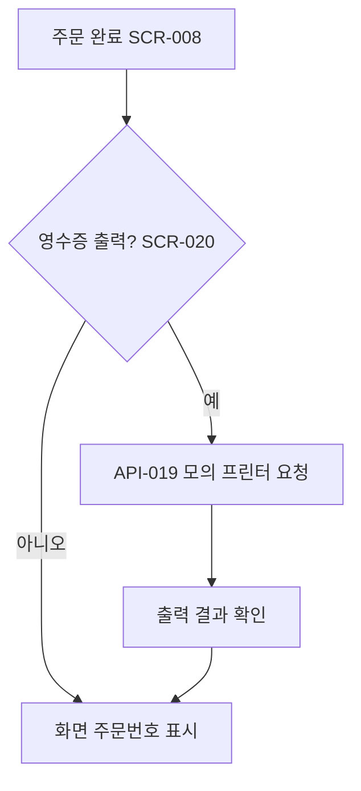

# 영수증 출력 여부 선택

시작 조건: 결제 승인 완료 직후
종료 조건: 영수증 출력 완료 또는 화면 주문번호 표시
기본 흐름: 결제 완료 화면에서 영수증 출력 여부 선택 → 출력 선택 시 모의 프린터 요청 → 미선택 시 화면 주문번호로 대체
예외 흐름: 프린터 오류 시 화면 주문번호로 자동 대체
관련 화면: SCR-008, SCR-020
기능계층: 추가기능
관련 요구사항: RTOS-DEVICE-001
관련 API: POST /api/orders/{orderId}/receipt-print
단계: RTOS
사용자 유형: 손님
상태: 초안
시나리오 ID: SC-015
시나리오 유형: 영수증
우선순위: 중
Related to 테스트 시나리오 데이터베이스 (↔ 시나리오): 영수증 출력 여부 선택 및 모의 프린터 요청 (../../09%20%ED%85%8C%EC%8A%A4%ED%8A%B8%20%EC%98%A4%EB%A5%98%20%EA%B4%80%EB%A6%AC/%ED%85%8C%EC%8A%A4%ED%8A%B8%20%EC%8B%9C%EB%82%98%EB%A6%AC%EC%98%A4%20%EB%8D%B0%EC%9D%B4%ED%84%B0%EB%B2%A0%EC%9D%B4%EC%8A%A4/%EC%98%81%EC%88%98%EC%A6%9D%20%EC%B6%9C%EB%A0%A5%20%EC%97%AC%EB%B6%80%20%EC%84%A0%ED%83%9D%20%EB%B0%8F%20%EB%AA%A8%EC%9D%98%20%ED%94%84%EB%A6%B0%ED%84%B0%20%EC%9A%94%EC%B2%AD.md)
↔ API: 영수증 출력 요청 (../../06%20API%20%EB%AA%85%EC%84%B8/API%20%EB%AA%85%EC%84%B8%20%EB%8D%B0%EC%9D%B4%ED%84%B0%EB%B2%A0%EC%9D%B4%EC%8A%A4/%EC%98%81%EC%88%98%EC%A6%9D%20%EC%B6%9C%EB%A0%A5%20%EC%9A%94%EC%B2%AD%20(API-019).md)
↔ 요구사항: 영수증 출력 처리 (../../02%20%EC%9A%94%EA%B5%AC%EC%82%AC%ED%95%AD%20%EC%A0%95%EC%9D%98/%EC%9A%94%EA%B5%AC%EC%82%AC%ED%95%AD%20%EB%AA%A9%EB%A1%9D%20%EB%8D%B0%EC%9D%B4%ED%84%B0%EB%B2%A0%EC%9D%B4%EC%8A%A4/%EC%98%81%EC%88%98%EC%A6%9D%20%EC%B6%9C%EB%A0%A5%20%EC%B2%98%EB%A6%AC.md)

