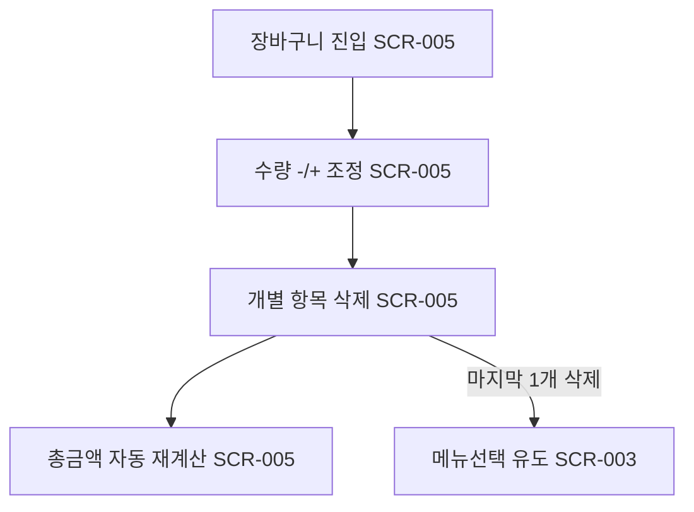

# 장바구니 수정(수량변경/삭제)

시작 조건: 장바구니에 1개 이상 메뉴가 담겨있음
종료 조건: 수정된 내용이 즉시 반영됨
기본 흐름: 장바구니 진입 → 담은 항목 수량 -/+ 조정 → 특정 항목 삭제 → 총금액 자동 재계산
예외 흐름: 마지막 1개 삭제 시 장바구니 빈 상태로 메뉴선택 화면으로 유도
관련 화면: SCR-005, SCR-003
기능계층: 기본기능
관련 요구사항: FWD-CART-002
관련 API: 없음(프론트 상태 처리)
단계: FWD
사용자 유형: 손님
상태: 초안
시나리오 ID: SC-009
시나리오 유형: 주문
우선순위: 상
↔ API: 장바구니 검증 (../../06%20API%20%EB%AA%85%EC%84%B8/API%20%EB%AA%85%EC%84%B8%20%EB%8D%B0%EC%9D%B4%ED%84%B0%EB%B2%A0%EC%9D%B4%EC%8A%A4/%EC%9E%A5%EB%B0%94%EA%B5%AC%EB%8B%88%20%EA%B2%80%EC%A6%9D.md)
↔ 요구사항: 장바구니 수량 변경/삭제 (../../02%20%EC%9A%94%EA%B5%AC%EC%82%AC%ED%95%AD%20%EC%A0%95%EC%9D%98/%EC%9A%94%EA%B5%AC%EC%82%AC%ED%95%AD%20%EB%AA%A9%EB%A1%9D%20%EB%8D%B0%EC%9D%B4%ED%84%B0%EB%B2%A0%EC%9D%B4%EC%8A%A4/%EC%9E%A5%EB%B0%94%EA%B5%AC%EB%8B%88%20%EC%88%98%EB%9F%89%20%EB%B3%80%EA%B2%BD%20%EC%82%AD%EC%A0%9C.md)

