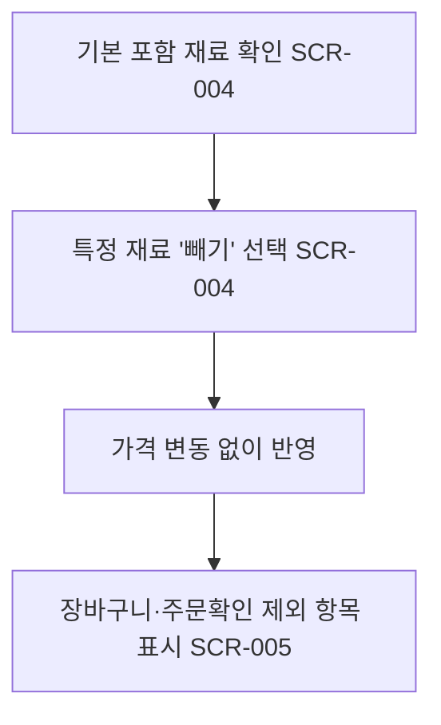

# 재료 제외(-) 옵션으로 커스텀 주문

시작 조건: 특정 재료를 못 먹는 고객이 옵션선택 단계 진입
종료 조건: 장바구니/주문서에 제외 재료가 명시됨
기본 흐름: 기본 포함 재료 중 특정 항목 "빼기" 선택 → 가격 변동 없이 장바구니에 반영 → 주문서에 제외 항목 표시
예외 흐름: 없음(가격 차감 로직 없음을 명확히 확인, 선생님 피드백 6번 반영)
관련 화면: SCR-004, SCR-005
기능계층: 옵션기능
관련 요구사항: FWD-MENU-007
관련 API: GET /menus/{id}/options, POST /orders
단계: FWD
비고: 2026-07-06: SCR-006→005 병합
사용자 유형: 손님
상태: 초안
시나리오 ID: SC-011
시나리오 유형: 주문
우선순위: 중
↔ API: 메뉴 옵션 조회 (../../06%20API%20%EB%AA%85%EC%84%B8/API%20%EB%AA%85%EC%84%B8%20%EB%8D%B0%EC%9D%B4%ED%84%B0%EB%B2%A0%EC%9D%B4%EC%8A%A4/%EB%A9%94%EB%89%B4%20%EC%98%B5%EC%85%98%20%EC%A1%B0%ED%9A%8C.md), 주문 생성 (../../06%20API%20%EB%AA%85%EC%84%B8/API%20%EB%AA%85%EC%84%B8%20%EB%8D%B0%EC%9D%B4%ED%84%B0%EB%B2%A0%EC%9D%B4%EC%8A%A4/%EC%A3%BC%EB%AC%B8%20%EC%83%9D%EC%84%B1.md)
↔ 요구사항: 재료 제외 옵션 (../../02%20%EC%9A%94%EA%B5%AC%EC%82%AC%ED%95%AD%20%EC%A0%95%EC%9D%98/%EC%9A%94%EA%B5%AC%EC%82%AC%ED%95%AD%20%EB%AA%A9%EB%A1%9D%20%EB%8D%B0%EC%9D%B4%ED%84%B0%EB%B2%A0%EC%9D%B4%EC%8A%A4/%EC%9E%AC%EB%A3%8C%20%EC%A0%9C%EC%99%B8%20%EC%98%B5%EC%85%98.md)

