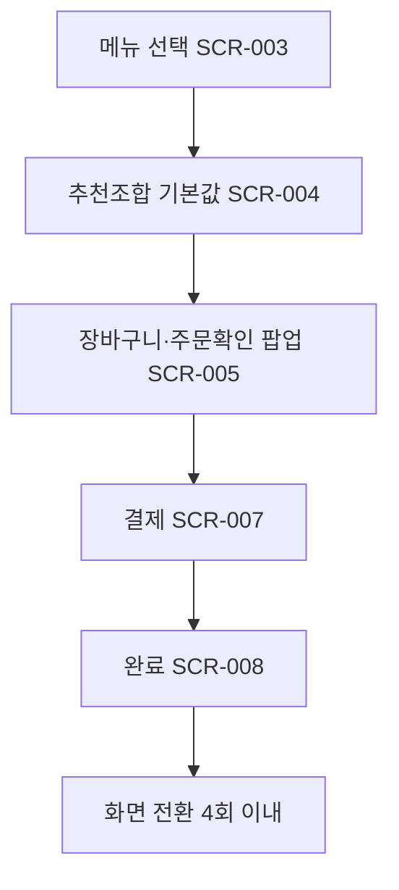

# 재방문 고객의 빠른 주문(속도 중심)

시작 조건: 재방문 고객이 키오스크 사용 시작
종료 조건: 결제 완료 및 주문번호 표시, 화면 전환 4회 이내 목표 (2026-07-06: SCR-002·006 병합, 주문확인은 SCR-005 컨펌 팝업)
기본 흐름: 메뉴 선택 → 추천조합 기본값 → 장바구니·주문확인(SCR-005, 컨펌 팝업) → 결제(SCR-007) → 완료(SCR-008)
예외 흐름: 없음
관련 테스트: TC-002
관련 화면: SCR-003, SCR-004, SCR-005, SCR-007, SCR-008
기능계층: 기본기능
관련 요구사항: FWD-UI-001,FWD-CART-001,FWD-PAY-001,FWD-UI-002
관련 API: GET /api/menus, POST /api/orders
단계: FWD
비고: 2026-07-06: SCR-006→005 병합
사용자 유형: 손님
상태: 초안
시나리오 ID: SC-002
시나리오 유형: 주문
우선순위: 상
Related to 테스트 시나리오 데이터베이스 (↔ 시나리오): 화면 전환 5회 이내 주문 완료 흐름 검증 (../../09%20%ED%85%8C%EC%8A%A4%ED%8A%B8%20%EC%98%A4%EB%A5%98%20%EA%B4%80%EB%A6%AC/%ED%85%8C%EC%8A%A4%ED%8A%B8%20%EC%8B%9C%EB%82%98%EB%A6%AC%EC%98%A4%20%EB%8D%B0%EC%9D%B4%ED%84%B0%EB%B2%A0%EC%9D%B4%EC%8A%A4/%ED%99%94%EB%A9%B4%20%EC%A0%84%ED%99%98%205%ED%9A%8C%20%EC%9D%B4%EB%82%B4%20%EC%A3%BC%EB%AC%B8%20%EC%99%84%EB%A3%8C%20%ED%9D%90%EB%A6%84%20%EA%B2%80%EC%A6%9D%2039151ef04f0b8195992adfe6659fea59.md)
↔ API: 메뉴 목록 조회 (../../06%20API%20%EB%AA%85%EC%84%B8/API%20%EB%AA%85%EC%84%B8%20%EB%8D%B0%EC%9D%B4%ED%84%B0%EB%B2%A0%EC%9D%B4%EC%8A%A4/%EB%A9%94%EB%89%B4%20%EB%AA%A9%EB%A1%9D%20%EC%A1%B0%ED%9A%8C%2004851ef04f0b831abbe601a5cd258ac9.md), 주문 생성 (../../06%20API%20%EB%AA%85%EC%84%B8/API%20%EB%AA%85%EC%84%B8%20%EB%8D%B0%EC%9D%B4%ED%84%B0%EB%B2%A0%EC%9D%B4%EC%8A%A4/%EC%A3%BC%EB%AC%B8%20%EC%83%9D%EC%84%B1%2030b51ef04f0b8358af2f01c096421506.md)
↔ 요구사항: 접근성을 고려한 UI 제공 (../../02%20%EC%9A%94%EA%B5%AC%EC%82%AC%ED%95%AD%20%EC%A0%95%EC%9D%98/%EC%9A%94%EA%B5%AC%EC%82%AC%ED%95%AD%20%EB%AA%A9%EB%A1%9D%20%EB%8D%B0%EC%9D%B4%ED%84%B0%EB%B2%A0%EC%9D%B4%EC%8A%A4/%EC%A0%91%EA%B7%BC%EC%84%B1%EC%9D%84%20%EA%B3%A0%EB%A0%A4%ED%95%9C%20UI%20%EC%A0%9C%EA%B3%B5%2039151ef04f0b81249e6deded5ece01bc.md), 선택 옵션 텍스트 요약 표시 (../../02%20%EC%9A%94%EA%B5%AC%EC%82%AC%ED%95%AD%20%EC%A0%95%EC%9D%98/%EC%9A%94%EA%B5%AC%EC%82%AC%ED%95%AD%20%EB%AA%A9%EB%A1%9D%20%EB%8D%B0%EC%9D%B4%ED%84%B0%EB%B2%A0%EC%9D%B4%EC%8A%A4/%EC%84%A0%ED%83%9D%20%EC%98%B5%EC%85%98%20%ED%85%8D%EC%8A%A4%ED%8A%B8%20%EC%9A%94%EC%95%BD%20%ED%91%9C%EC%8B%9C%2039151ef04f0b81dbbda0ce087e82d555.md), 결제 수단 노출 (../../02%20%EC%9A%94%EA%B5%AC%EC%82%AC%ED%95%AD%20%EC%A0%95%EC%9D%98/%EC%9A%94%EA%B5%AC%EC%82%AC%ED%95%AD%20%EB%AA%A9%EB%A1%9D%20%EB%8D%B0%EC%9D%B4%ED%84%B0%EB%B2%A0%EC%9D%B4%EC%8A%A4/%EA%B2%B0%EC%A0%9C%20%EC%88%98%EB%8B%A8%20%EB%85%B8%EC%B6%9C%2039151ef04f0b815a895ec22a681480d2.md), 키오스크 시작 화면 및 빠른 주문 UX (../../02%20%EC%9A%94%EA%B5%AC%EC%82%AC%ED%95%AD%20%EC%A0%95%EC%9D%98/%EC%9A%94%EA%B5%AC%EC%82%AC%ED%95%AD%20%EB%AA%A9%EB%A1%9D%20%EB%8D%B0%EC%9D%B4%ED%84%B0%EB%B2%A0%EC%9D%B4%EC%8A%A4/%ED%82%A4%EC%98%A4%EC%8A%A4%ED%81%AC%20%EC%8B%9C%EC%9E%91%20%ED%99%94%EB%A9%B4%20%EB%B0%8F%20%EB%B9%A0%EB%A5%B8%20%EC%A3%BC%EB%AC%B8%20UX%2039451ef04f0b81c99a25d7de8b5db893.md)

