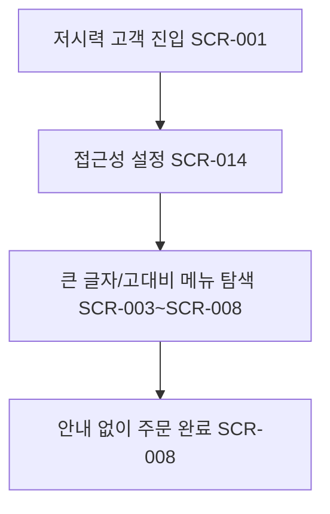

# 접근성 옵션으로 저시력 고객 주문 (FWD-UI-001)

시작 조건: 저시력 고객이 키오스크 이용 시작
종료 조건: 안내 없이 주문 완료(성공기준 첫방문고객 기준과 동일)
기본 흐름: 저시력 고객이 초기화면 진입 → 글자크기 확대 옵션 인지 → 큰 글자/높은 대비로 메뉴 탐색 → 주문 완료
예외 흐름: 없음
관련 화면: SCR-014
기능계층: 추가기능
관련 요구사항: FWD-UI-004
관련 API: API-017
단계: FWD
사용자 유형: 손님
상태: 초안
시나리오 ID: SC-013
시나리오 유형: 주문
우선순위: 중
↔ API: 접근성 설정 조회 (../../06%20API%20%EB%AA%85%EC%84%B8/API%20%EB%AA%85%EC%84%B8%20%EB%8D%B0%EC%9D%B4%ED%84%B0%EB%B2%A0%EC%9D%B4%EC%8A%A4/%EC%A0%91%EA%B7%BC%EC%84%B1%20%EC%84%A4%EC%A0%95%20%EC%A1%B0%ED%9A%8C%2039251ef04f0b81eca9c1e4cbd4909f80.md)
↔ 요구사항: 접근성 UI 옵션 (../../02%20%EC%9A%94%EA%B5%AC%EC%82%AC%ED%95%AD%20%EC%A0%95%EC%9D%98/%EC%9A%94%EA%B5%AC%EC%82%AC%ED%95%AD%20%EB%AA%A9%EB%A1%9D%20%EB%8D%B0%EC%9D%B4%ED%84%B0%EB%B2%A0%EC%9D%B4%EC%8A%A4/%EC%A0%91%EA%B7%BC%EC%84%B1%20UI%20%EC%98%B5%EC%85%98%2039451ef04f0b811e8aaad5aa6310c97e.md)

