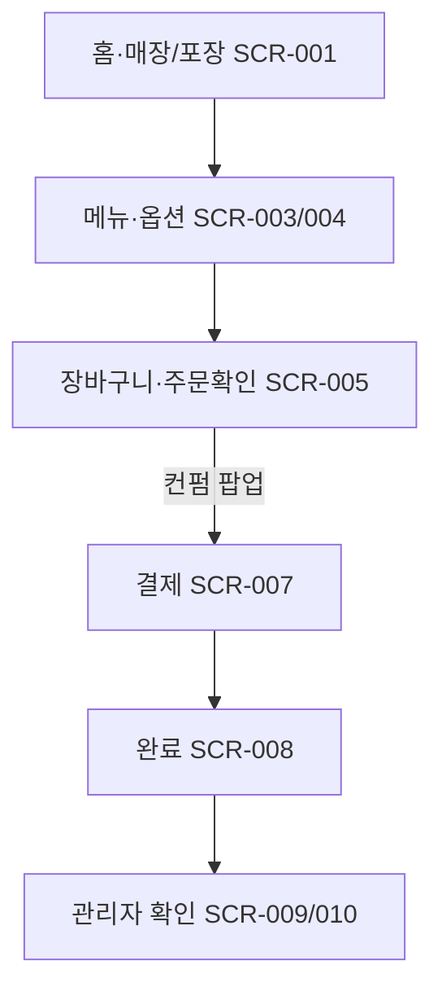

# 최종 통합 리허설에서 주문-결제-관리자 확인

시작 조건: Week 5 MVP(8/1) 또는 최종 발표(9/2) 전 전체 데모 환경이 준비되어 있음
종료 조건: 고객 주문 완료와 관리자 주문 확인/상태 변경까지 한 번에 시연 가능
기본 흐름: 1. 고객이 홈(매장·포장 SCR-001)에서 주문을 시작한다. 2. 메뉴를 선택하고 옵션을 구성한다. 3. 장바구니·주문확인(SCR-005, 컨펌 팝업)을 거쳐 결제한다. 4. 주문 완료 화면을 확인한다. 5. 관리자가 주문 목록/상세에서 주문 상태와 선택 옵션/제외 재료를 확인한다.
예외 흐름: 결제 실패, 품절 항목 포함, 필수 옵션 미선택, 관리자 상태 변경 실패 시 해당 화면과 API 오류 응답을 기준으로 재시도 또는 오류 안내를 확인한다.
관련 테스트: TC-001, TC-002, TC-003, TC-004, TC-014
관련 화면: SCR-001~SCR-011
기능계층: 기본기능
관련 요구사항: FWD-ORDER-001, FWD-CART-001, FWD-PAY-002, DEV-ORDER-001, KSD-PAY-001, LMIS-ORDER-001, LMIS-ORDER-002
관련 API: API-001~API-009
단계: KSD
비고: 2026-07-06: SCR-002→001, SCR-006→005 병합. 고객 UI 6단계.
사용자 유형: 시스템
상태: 확정
시나리오 ID: SC-024
시나리오 유형: 주문
우선순위: 상

