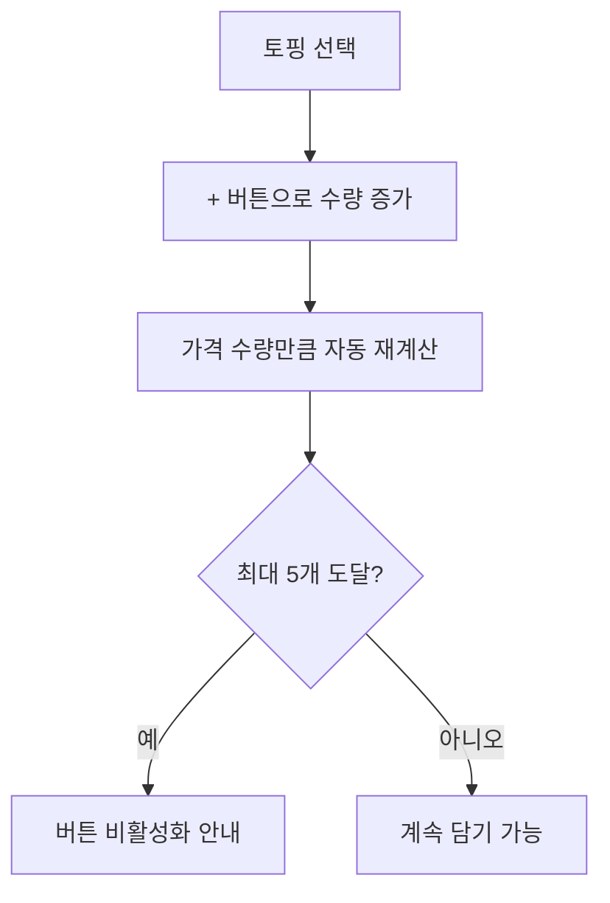

# 토핑 개별 수량 조절 주문

시작 조건: 특정 토핑(예: 에그)을 더 많이 원하는 고객이 토핑선택 단계 진입
종료 조건: 선택한 수량만큼 장바구니에 가격이 반영됨
기본 흐름: 토핑 목록에서 특정 토핑 + 버튼으로 수량 증가 → 가격이 수량만큼 배수로 자동 재계산 → 같은 토핑을 최대 5개까지 중복 담을 수 있음
예외 흐름: 최대치 도달 시 + 버튼 비활성화 및 안내
관련 화면: 옵션선택
기능계층: 옵션기능
관련 요구사항: FWD-MENU-007
관련 API: API-004 GET /api/menus/{id}/options, API-005 POST /api/orders
단계: FWD
사용자 유형: 손님
상태: 초안
시나리오 ID: SC-021
시나리오 유형: 주문
우선순위: 중

