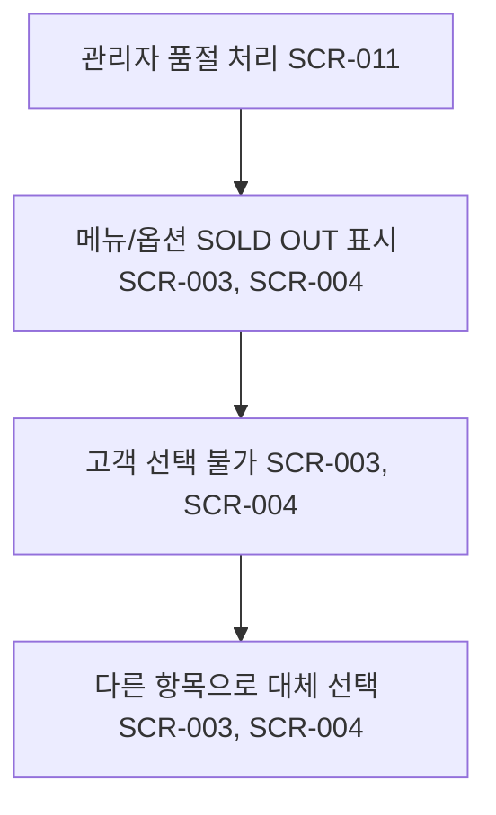

# 품절 판매 항목이 포함된 상황에서의 주문

시작 조건: 관리자가 특정 재료 또는 옵션 항목을 품절 처리한 상태
종료 조건: 고객이 품절되지 않은 항목으로 주문 진행
기본 흐름: 품절된 판매 항목은 회색 처리된 채 SOLD OUT 표시됨 → 선택 불가 → 고객이 다른 항목으로 대체 선택
예외 흐름: 핵심 재료 또는 베이스 재료가 품절된 경우 해당 메뉴 또는 관련 카테고리 메뉴가 품절 표시됨
관련 화면: SCR-003, SCR-004, SCR-011
기능계층: 옵션기능
관련 요구사항: LMIS-MENU-001
관련 API: API-004 GET /api/menus/{id}/options
단계: FWD
사용자 유형: 손님
상태: 초안
시나리오 ID: SC-003
시나리오 유형: 주문
우선순위: 상
Related to 테스트 시나리오 데이터베이스 (↔ 시나리오): 품절 판매 항목이 정상적으로 비활성화되는지 확인 (../../09%20%ED%85%8C%EC%8A%A4%ED%8A%B8%20%EC%98%A4%EB%A5%98%20%EA%B4%80%EB%A6%AC/%ED%85%8C%EC%8A%A4%ED%8A%B8%20%EC%8B%9C%EB%82%98%EB%A6%AC%EC%98%A4%20%EB%8D%B0%EC%9D%B4%ED%84%B0%EB%B2%A0%EC%9D%B4%EC%8A%A4/%ED%92%88%EC%A0%88%20%ED%8C%90%EB%A7%A4%20%ED%95%AD%EB%AA%A9%EC%9D%B4%20%EC%A0%95%EC%83%81%EC%A0%81%EC%9C%BC%EB%A1%9C%20%EB%B9%84%ED%99%9C%EC%84%B1%ED%99%94%EB%90%98%EB%8A%94%EC%A7%80%20%ED%99%95%EC%9D%B8.md)
↔ API: 메뉴 옵션 조회 (../../06%20API%20%EB%AA%85%EC%84%B8/API%20%EB%AA%85%EC%84%B8%20%EB%8D%B0%EC%9D%B4%ED%84%B0%EB%B2%A0%EC%9D%B4%EC%8A%A4/%EB%A9%94%EB%89%B4%20%EC%98%B5%EC%85%98%20%EC%A1%B0%ED%9A%8C.md), 판매 항목 품절 상태 변경 (../../06%20API%20%EB%AA%85%EC%84%B8/API%20%EB%AA%85%EC%84%B8%20%EB%8D%B0%EC%9D%B4%ED%84%B0%EB%B2%A0%EC%9D%B4%EC%8A%A4/%ED%8C%90%EB%A7%A4%20%ED%95%AD%EB%AA%A9%20%ED%92%88%EC%A0%88%20%EC%83%81%ED%83%9C%20%EB%B3%80%EA%B2%BD.md)
↔ 요구사항: 판매 항목 품절 처리 (../../02%20%EC%9A%94%EA%B5%AC%EC%82%AC%ED%95%AD%20%EC%A0%95%EC%9D%98/%EC%9A%94%EA%B5%AC%EC%82%AC%ED%95%AD%20%EB%AA%A9%EB%A1%9D%20%EB%8D%B0%EC%9D%B4%ED%84%B0%EB%B2%A0%EC%9D%B4%EC%8A%A4/%ED%8C%90%EB%A7%A4%20%ED%95%AD%EB%AA%A9%20%ED%92%88%EC%A0%88%20%EC%B2%98%EB%A6%AC.md), 품절 상태 고객 화면 반영 (../../02%20%EC%9A%94%EA%B5%AC%EC%82%AC%ED%95%AD%20%EC%A0%95%EC%9D%98/%EC%9A%94%EA%B5%AC%EC%82%AC%ED%95%AD%20%EB%AA%A9%EB%A1%9D%20%EB%8D%B0%EC%9D%B4%ED%84%B0%EB%B2%A0%EC%9D%B4%EC%8A%A4/%ED%92%88%EC%A0%88%20%EC%83%81%ED%83%9C%20%EA%B3%A0%EA%B0%9D%20%ED%99%94%EB%A9%B4%20%EB%B0%98%EC%98%81.md)

