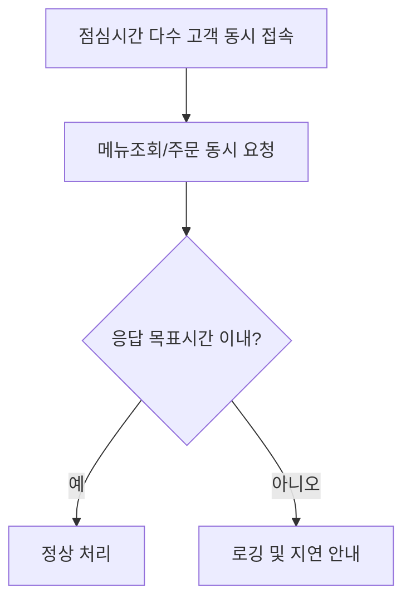

# 피크타임 다중 주문 동시처리 (DEV-SYS-001)

시작 조건: 점심시간대 다수 고객 동시 접근 가정
종료 조건: 동시 요청이 목표 응답시간 내에 처리됨
기본 흐름: 동일 시간대에 여러 고객이 동시에 메뉴 조회/주문 진행 → 응답 지연 없이 처리
예외 흐름: 부하 증가 시 응답 지연이 발생하면 로딩 인디케이터로 안내
관련 화면: 전체 시스템
기능계층: 추가기능
관련 요구사항: DEV-SYS-001
관련 API: GET /api/menus, POST /api/orders
단계: KSD
사용자 유형: 시스템
상태: 초안
시나리오 ID: SC-019
시나리오 유형: 주문
우선순위: 중

