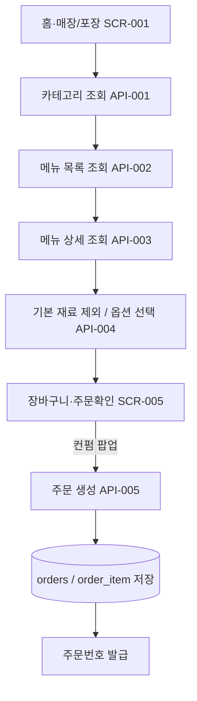

# 식당 키오스크 주문 흐름

## Mermaid 흐름도

> 2026-07-06: SCR-002→001, SCR-006→005 병합. 고객 UI 6단계.
>

## 연결 화면

- SCR-001 홈 (매장·포장) — SCR-002 병합됨
- SCR-003 메뉴 선택
- SCR-004 메뉴 상세 / 옵션 선택
- SCR-005 장바구니·주문확인 — SCR-006 병합됨

## 연결 API

- API-001 GET /api/categories
- API-002 GET /api/menus
- API-003 GET /api/menus/{menuId}
- API-004 GET /api/menus/{menuId}/options
- API-005 POST /api/orders

## 데이터 처리 기준

- 기본 재료 제외는 `excludedIngredientIds`로 전달하고 `item_exclusion`에 저장합니다.
- 추가 토핑/드레싱/베이스 선택은 `optionItems(optionItemId, quantity)`로 전달하고 `order_item_option`에 저장합니다.
- 같은 재료가 기본 구성과 추가 토핑에 모두 있어도 기본 포함분과 추가 선택분은 분리해서 계산합니다.
- CORE/BASE 재료 품절 메뉴는 주문 불가, DEFAULT 재료 품절은 품절 뱃지 표시 후 주문 가능으로 처리합니다.