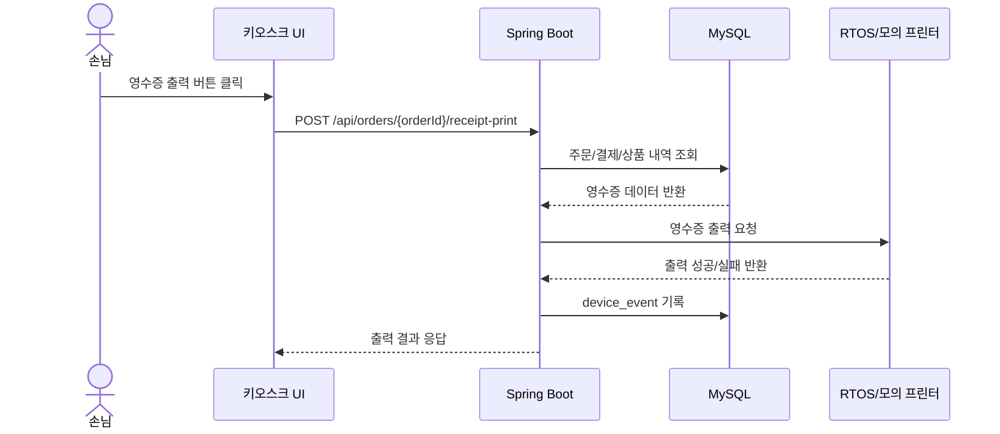

# 영수증 출력 흐름

## Mermaid 시퀀스 다이어그램

```mermaid
sequenceDiagram
    actor Customer as 손님
    participant Kiosk as 키오스크 UI
    participant API as Spring Boot
    participant DB as MySQL
    participant Printer as RTOS/모의 프린터

    Customer->>Kiosk: 영수증 출력 버튼 클릭
    Kiosk->>API: POST /api/orders/{orderId}/receipt-print
    API->>DB: 주문/결제/상품 내역 조회
    DB-->>API: 영수증 데이터 반환
    API->>Printer: 영수증 출력 요청
    Printer-->>API: 출력 성공/실패 반환
    API->>DB: device_event 기록
    API-->>Kiosk: 출력 결과 응답
```