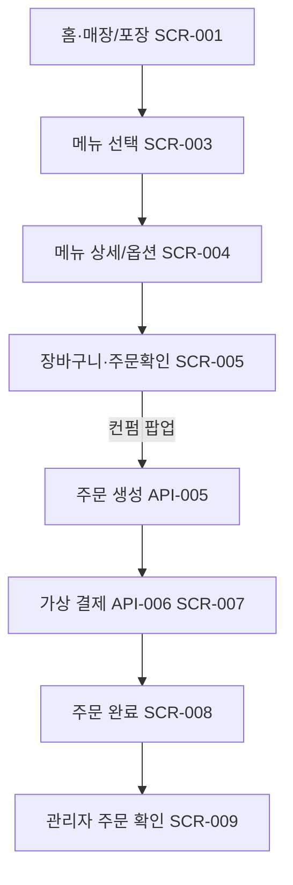

# 전체 주문 결제 흐름

## Mermaid 통합 흐름도

> 2026-07-06: SCR-002→001, SCR-006→005 병합. 고객 UI 6단계.
> 

## 연결 화면

- SCR-001 홈 (매장·포장) — SCR-002 병합됨
- SCR-003 메뉴 선택
- SCR-004 메뉴 상세 / 옵션 선택
- SCR-005 장바구니·주문확인 — SCR-006 병합됨 (컨펌 팝업)
- SCR-007 결제
- SCR-008 주문 완료
- SCR-009 관리자 주문 관리

## 연결 API

- API-001 GET /api/categories
- API-002 GET /api/menus
- API-003 GET /api/menus/{menuId}
- API-004 GET /api/menus/{menuId}/options
- API-005 POST /api/orders
- API-006 POST /api/payments
- API-007 GET /api/admin/orders

## 최종 검증 기준

- 고객이 메뉴를 선택하고, 기본 재료 제외와 추가 옵션 수량을 반영해 주문을 생성할 수 있어야 합니다.
- 가상 결제 완료 후 주문번호가 표시되어야 합니다.
- 관리자 화면에서 생성된 주문을 확인하고 주문 상태를 변경할 수 있어야 합니다.
- 영수증 출력, QR/바코드, 장치 이벤트 저장은 Week 5 MVP 범위에서 제외합니다.