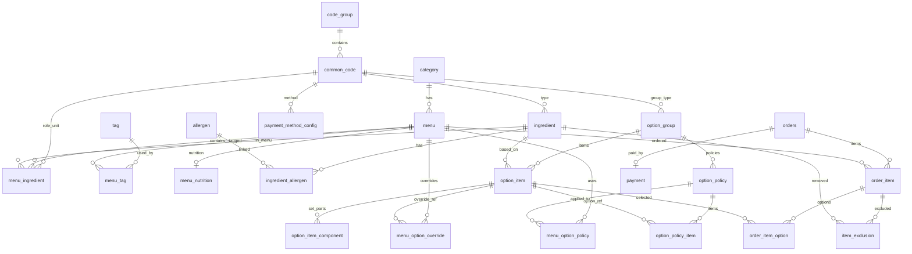
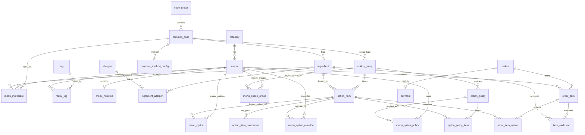

# 05. DB 설계

```markdown
# 05. DB 설계

## 현재 기준

이 문서는 현재 `asak_db` MySQL 서버에 반영된 ASAK 데이터 구조 기준입니다.

- DB 엔진: MySQL 계열
- 기준 seed: `asak-data/seed/manifest.json`
- 스키마/seed 적재 스크립트: `asak-data/scripts/load_seed_mysql.py`
- 옵션 정책 테이블 적재 스크립트: `asak-data/scripts/apply_option_policy_mysql.py`
- 관리자 매출 View 생성 스크립트: `asak-data/scripts/create_sales_views_mysql.py`
- 정규 운영 테이블: 24개
- 옵션 정책 확장: 4개 테이블
- legacy 백업 테이블: 2개
- 관리자 통계 View: 4개

기존 `menu_option`, `menu_option_group`은 원본 데이터가 너무 커서 정규 운영 테이블에서는 제거했습니다. 원본은 `menu_option_legacy_20260710`, `menu_option_group_legacy_20260710`에 백업되어 있고, 새 조회/설계에서는 `option_policy`, `option_policy_item`, `menu_option_policy`, `menu_option_override`를 사용합니다.

## ERD



## 데이터 현황

현재 원격 DB 검증 기준 row count입니다.

| 구분 | 테이블 | 건수 | 비고 |
| --- | --- | ---: | --- |
| 카탈로그 | `category` | 6 | 메뉴 카테고리 |
| 공통 코드 | `code_group` | 10 | 코드 그룹 |
| 공통 코드 | `common_code` | 35 | 주문/결제/취소/환불/옵션/재료/단위 코드 |
| 메뉴 | `menu` | 84 | 판매 메뉴 |
| 메뉴 | `menu_nutrition` | 84 | 메뉴별 영양 정보 |
| 메뉴 | `tag` | 3 | BEST, NEW, LOW_SUGAR |
| 메뉴 | `menu_tag` | 21 | 메뉴-태그 연결 |
| 재료 | `ingredient` | 90 | 재료 마스터 |
| 재료 | `allergen` | 14 | 알레르기 마스터 |
| 재료 | `ingredient_allergen` | 108 | 재료-알레르기 연결 |
| 재료 | `menu_ingredient` | 578 | 메뉴 기본 재료 |
| 옵션 | `option_group` | 7 | 옵션 그룹 마스터 |
| 옵션 | `option_item` | 157 | 옵션 선택 항목 |
| 옵션 | `option_item_component` | 0 | 세트/복합 옵션 구성 |
| 옵션 정책 | `option_policy` | 82 | 재사용 옵션 정책 |
| 옵션 정책 | `option_policy_item` | 734 | 정책별 옵션 항목 |
| 옵션 정책 | `menu_option_policy` | 467 | 메뉴-정책 연결 |
| 옵션 정책 | `menu_option_override` | 0 | 메뉴별 예외 설정 |
| 결제 설정 | `payment_method_config` | 1 | 결제수단 노출 설정 |
| 주문 | `orders` | 0 | 주문 헤더 |
| 주문 | `order_item` | 0 | 주문 메뉴 |
| 주문 | `order_item_option` | 0 | 주문 옵션 |
| 주문 | `item_exclusion` | 0 | 제외 재료 |
| 결제 | `payment` | 0 | 결제 내역 |
| 백업 | `menu_option_group_legacy_20260710` | 467 | 기존 메뉴별 옵션 그룹 백업 |
| 백업 | `menu_option_legacy_20260710` | 9,166 | 기존 메뉴별 옵션 항목 백업 |
| View | `vw_sales_daily` | 0 | 관리자 일별 매출 조회 |
| View | `vw_sales_hourly` | 0 | 관리자 시간대별 매출 조회 |
| View | `vw_top_menu_daily` | 0 | 관리자 일별 인기 메뉴 조회 |
| View | `vw_top_menu_hourly` | 0 | 관리자 시간대별 인기 메뉴 조회 |

## 설계 방향

### 1. 메뉴/재료/알레르기

메뉴, 재료, 알레르기는 각각 마스터 테이블로 분리합니다.

- `menu`는 판매 메뉴의 기본 정보만 가진다.
- `menu_nutrition`은 영양 정보 요약을 가진다.
- `ingredient`는 재료 마스터다.
- `allergen`은 알레르기 마스터다.
- `menu_ingredient`, `ingredient_allergen`은 N:M 연결 테이블이다.

`base_kcal`, `allergy_text`, `default_dressing`처럼 계산 또는 조합으로 얻을 수 있는 값은 메뉴 테이블에 직접 저장하지 않습니다.

### 2. 공통 코드

상태, 유형, 단위처럼 확장 가능한 선택값은 `code_group`, `common_code`로 관리합니다.

현재 사용 중인 주요 코드 그룹:

- `ORDER_STATUS`
- `PAYMENT_STATUS`
- `ORDER_TYPE`
- `PAYMENT_METHOD`
- `OPTION_GROUP_TYPE`
- `INGREDIENT_TYPE`
- `MENU_INGREDIENT_ROLE`
- `UNIT_TYPE`
- `TAG_TYPE`
- `DATA_SOURCE`

단순 참/거짓 값은 공통 코드로 분리하지 않고 boolean 컬럼으로 둡니다.

예:

- `is_active`
- `is_sold_out`
- `is_required`
- `is_default`
- `can_remove`
- `is_recommended`

### 3. 옵션 구조

옵션은 세 층으로 나눕니다.

1. `option_group`: 드레싱 선택, 토핑 추가, 베이스 선택 같은 옵션 그룹
2. `option_item`: 각 그룹 안의 실제 선택 항목
3. `option_policy`: 여러 메뉴가 공유하는 옵션 노출/기본/추천 정책

기존 구조에서는 `menu_option`에 메뉴별 옵션 항목을 모두 펼쳐 저장했습니다. 이 방식은 구현이 단순하지만 공통 옵션 정책이 많은 경우 데이터가 크게 늘어납니다.

현재는 정책 테이블을 추가해 다음처럼 압축합니다.

- 기존 `menu_option`: 9,166건, 현재 `menu_option_legacy_20260710`에 백업
- 신규 `option_policy_item`: 734건
- 신규 `menu_option_policy`: 467건

즉, 실제 옵션 항목과 메뉴별 연결은 유지하면서, 공통 정책은 재사용 가능한 단위로 분리했습니다.

### 4. legacy 백업 테이블과 신규 정책 테이블

`menu_option_group`, `menu_option`은 정규 운영 테이블에서 제거했습니다. 원본 데이터는 복구와 비교 검증을 위해 다음 백업 테이블에 보관합니다.

- `menu_option_group_legacy_20260710`: 기존 메뉴별 옵션 그룹 467건
- `menu_option_legacy_20260710`: 기존 메뉴별 옵션 항목 9,166건

신규 설계에서는 다음 테이블을 우선 사용합니다.

- `option_policy`: 옵션 그룹 단위의 재사용 정책
- `option_policy_item`: 정책 안에 포함되는 옵션 항목과 기본/추천/정렬 설정
- `menu_option_policy`: 메뉴가 어떤 옵션 정책을 사용하는지 연결
- `menu_option_override`: 특정 메뉴에서만 다른 예외 설정

`menu_option_override`는 현재 데이터가 없습니다. 이후 메뉴별 예외가 생길 때만 사용합니다.

## 테이블 목록

### 정규 운영 24개 테이블

```text
category
code_group
common_code

tag
menu
menu_tag
menu_nutrition

ingredient
allergen
ingredient_allergen
menu_ingredient

option_group
option_item
option_item_component

payment_method_config

orders
order_item
order_item_option
item_exclusion
payment
```

### 옵션 정책 확장 4개 테이블

```text
option_policy
option_policy_item
menu_option_policy
menu_option_override
```

### legacy 백업 2개 테이블

```text
menu_option_group_legacy_20260710
menu_option_legacy_20260710
```

### 관리자 통계 View 4개

```text
vw_sales_daily
vw_sales_hourly
vw_top_menu_daily
vw_top_menu_hourly
```

## 테이블 상세

### 1. category

메뉴 카테고리 마스터입니다.

| 컬럼 | 타입 | 제약 | 설명 |
| --- | --- | --- | --- |
| `id` | BIGINT | PK, AUTO_INCREMENT | 카테고리 ID |
| `name` | VARCHAR(50) | NOT NULL, UNIQUE | 카테고리명 |
| `sort_order` | INT | NOT NULL, DEFAULT 0 | 노출 순서 |
| `is_active` | BOOLEAN | NOT NULL, DEFAULT true | 사용 여부 |

### 2. code_group

공통 코드 그룹입니다.

| 컬럼 | 타입 | 제약 | 설명 |
| --- | --- | --- | --- |
| `id` | BIGINT | PK, AUTO_INCREMENT | 코드 그룹 ID |
| `group_code` | VARCHAR(50) | NOT NULL, UNIQUE | 코드 그룹 코드 |
| `name` | VARCHAR(50) | NOT NULL | 코드 그룹명 |

### 3. common_code

공통 코드 상세입니다.

| 컬럼 | 타입 | 제약 | 설명 |
| --- | --- | --- | --- |
| `id` | BIGINT | PK, AUTO_INCREMENT | 코드 ID |
| `code_group_id` | BIGINT | FK, NOT NULL | `code_group.id` |
| `code` | VARCHAR(50) | NOT NULL | 코드값 |
| `name` | VARCHAR(50) | NOT NULL | 표시명 |
| `sort_order` | INT | NOT NULL, DEFAULT 0 | 정렬 순서 |
| `is_active` | BOOLEAN | NOT NULL, DEFAULT true | 사용 여부 |

제약:

- UNIQUE (`code_group_id`, `code`)

### 4. tag

메뉴 태그 마스터입니다.

| 컬럼 | 타입 | 제약 | 설명 |
| --- | --- | --- | --- |
| `id` | BIGINT | PK, AUTO_INCREMENT | 태그 ID |
| `code` | VARCHAR(50) | NOT NULL, UNIQUE | BEST, NEW, LOW_SUGAR 등 |
| `name` | VARCHAR(50) | NOT NULL | 표시명 |
| `color_hex` | VARCHAR(20) | NULL | 태그 색상 |
| `is_active` | BOOLEAN | NOT NULL, DEFAULT true | 사용 여부 |

### 5. menu

판매 메뉴 마스터입니다.

| 컬럼 | 타입 | 제약 | 설명 |
| --- | --- | --- | --- |
| `id` | BIGINT | PK, AUTO_INCREMENT | 메뉴 ID |
| `category_id` | BIGINT | FK, NOT NULL | `category.id` |
| `name` | VARCHAR(100) | NOT NULL | 메뉴명 |
| `price` | INT | NOT NULL, DEFAULT 0 | 기본 판매가 |
| `image_url` | TEXT | NULL | 메뉴 이미지 URL |
| `description` | TEXT | NULL | 메뉴 설명 |
| `is_sold_out` | BOOLEAN | NOT NULL, DEFAULT false | 메뉴 품절 여부 |
| `created_at` | TIMESTAMP | NOT NULL, DEFAULT CURRENT_TIMESTAMP | 생성일시 |
| `updated_at` | TIMESTAMP | NOT NULL, DEFAULT CURRENT_TIMESTAMP ON UPDATE CURRENT_TIMESTAMP | 수정일시 |

### 6. menu_tag

메뉴와 태그 연결 테이블입니다.

| 컬럼 | 타입 | 제약 | 설명 |
| --- | --- | --- | --- |
| `id` | BIGINT | PK, AUTO_INCREMENT | 연결 ID |
| `menu_id` | BIGINT | FK, NOT NULL | `menu.id` |
| `tag_id` | BIGINT | FK, NOT NULL | `tag.id` |

제약:

- UNIQUE (`menu_id`, `tag_id`)

### 7. menu_nutrition

메뉴별 영양 정보 요약입니다.

| 컬럼 | 타입 | 제약 | 설명 |
| --- | --- | --- | --- |
| `id` | BIGINT | PK, AUTO_INCREMENT | 영양 정보 ID |
| `menu_id` | BIGINT | FK, NOT NULL, UNIQUE | `menu.id` |
| `kcal` | DECIMAL(8,2) | NULL | 칼로리 |
| `protein_g` | DECIMAL(8,2) | NULL | 단백질 |
| `carb_g` | DECIMAL(8,2) | NULL | 탄수화물 |
| `fat_g` | DECIMAL(8,2) | NULL | 지방 |
| `sodium_mg` | DECIMAL(8,2) | NULL | 나트륨 |
| `source_id` | BIGINT | FK, NULL | 데이터 출처 코드 |

### 8. ingredient

재료 마스터입니다.

| 컬럼 | 타입 | 제약 | 설명 |
| --- | --- | --- | --- |
| `id` | BIGINT | PK, AUTO_INCREMENT | 재료 ID |
| `name` | VARCHAR(100) | NOT NULL, UNIQUE | 재료명 |
| `type_id` | BIGINT | FK, NOT NULL | 재료 유형 코드 |
| `kcal` | DECIMAL(8,2) | NULL | 기준 칼로리 |
| `protein_g` | DECIMAL(8,2) | NULL | 기준 단백질 |
| `is_sold_out` | BOOLEAN | NOT NULL, DEFAULT false | 재료 품절 여부 |

### 9. allergen

알레르기 마스터입니다.

| 컬럼 | 타입 | 제약 | 설명 |
| --- | --- | --- | --- |
| `id` | BIGINT | PK, AUTO_INCREMENT | 알레르기 ID |
| `name` | VARCHAR(50) | NOT NULL, UNIQUE | 알레르기명 |

### 10. ingredient_allergen

재료와 알레르기 연결 테이블입니다.

| 컬럼 | 타입 | 제약 | 설명 |
| --- | --- | --- | --- |
| `id` | BIGINT | PK, AUTO_INCREMENT | 연결 ID |
| `ingredient_id` | BIGINT | FK, NOT NULL | `ingredient.id` |
| `allergen_id` | BIGINT | FK, NOT NULL | `allergen.id` |

제약:

- UNIQUE (`ingredient_id`, `allergen_id`)

### 11. menu_ingredient

메뉴 기본 재료 연결 테이블입니다.

| 컬럼 | 타입 | 제약 | 설명 |
| --- | --- | --- | --- |
| `id` | BIGINT | PK, AUTO_INCREMENT | 연결 ID |
| `menu_id` | BIGINT | FK, NOT NULL | `menu.id` |
| `ingredient_id` | BIGINT | FK, NOT NULL | `ingredient.id` |
| `role_id` | BIGINT | FK, NOT NULL | 재료 역할 코드 |
| `quantity` | DECIMAL(8,2) | NULL | 기본 제공량 |
| `unit_id` | BIGINT | FK, NULL | 단위 코드 |
| `is_default` | BOOLEAN | NOT NULL, DEFAULT true | 기본 포함 여부 |
| `can_remove` | BOOLEAN | NOT NULL, DEFAULT true | 고객 제외 가능 여부 |
| `sort_order` | INT | NOT NULL, DEFAULT 0 | 표시 순서 |

제약:

- UNIQUE (`menu_id`, `ingredient_id`, `role_id`)

### 12. option_group

옵션 그룹 마스터입니다.

| 컬럼 | 타입 | 제약 | 설명 |
| --- | --- | --- | --- |
| `id` | BIGINT | PK, AUTO_INCREMENT | 옵션 그룹 ID |
| `name` | VARCHAR(100) | NOT NULL | 옵션 그룹명 |
| `group_type_id` | BIGINT | FK, NOT NULL | 옵션 그룹 유형 코드 |
| `min_select` | INT | NOT NULL, DEFAULT 0 | 최소 선택 수 |
| `max_select` | INT | NOT NULL, DEFAULT 1 | 최대 선택 수 |

### 13. option_item

옵션 선택 항목 마스터입니다.

| 컬럼 | 타입 | 제약 | 설명 |
| --- | --- | --- | --- |
| `id` | BIGINT | PK, AUTO_INCREMENT | 옵션 항목 ID |
| `option_group_id` | BIGINT | FK, NOT NULL | `option_group.id` |
| `ingredient_id` | BIGINT | FK, NULL | 재료 기반 옵션일 때 `ingredient.id` |
| `name` | VARCHAR(100) | NOT NULL | 옵션 항목명 |
| `extra_price` | INT | NOT NULL, DEFAULT 0 | 추가 금액 |
| `original_price` | INT | NULL | 할인 전 금액 |
| `amount` | DECIMAL(8,2) | NULL | 제공량 |
| `unit_id` | BIGINT | FK, NULL | 단위 코드 |
| `icon_url` | TEXT | NULL | 아이콘 URL |
| `color_hex` | VARCHAR(20) | NULL | 표시 색상 |
| `is_sold_out` | BOOLEAN | NOT NULL, DEFAULT false | 옵션 항목 품절 여부 |
| `created_at` | TIMESTAMP | NOT NULL, DEFAULT CURRENT_TIMESTAMP | 생성일시 |
| `updated_at` | TIMESTAMP | NOT NULL, DEFAULT CURRENT_TIMESTAMP ON UPDATE CURRENT_TIMESTAMP | 수정일시 |

### 14. option_item_component

세트/복합 옵션 구성 테이블입니다.

| 컬럼 | 타입 | 제약 | 설명 |
| --- | --- | --- | --- |
| `id` | BIGINT | PK, AUTO_INCREMENT | 구성 ID |
| `option_item_id` | BIGINT | FK, NOT NULL | `option_item.id` |
| `ingredient_id` | BIGINT | FK, NULL | 구성 재료 |
| `name` | VARCHAR(100) | NOT NULL | 구성명 |
| `quantity` | DECIMAL(8,2) | NULL | 구성 수량 |
| `unit_id` | BIGINT | FK, NULL | 단위 코드 |
| `sort_order` | INT | NOT NULL, DEFAULT 0 | 표시 순서 |

### 15. menu_option_group_legacy_20260710

기존 `menu_option_group` 원본 백업 테이블입니다. 신규 구현에서는 사용하지 않고, 복구/검증 용도로만 보관합니다.

| 컬럼 | 타입 | 제약 | 설명 |
| --- | --- | --- | --- |
| `id` | BIGINT | PK, AUTO_INCREMENT | 연결 ID |
| `menu_id` | BIGINT | FK, NOT NULL | `menu.id` |
| `option_group_id` | BIGINT | FK, NOT NULL | `option_group.id` |
| `sort_order` | INT | NOT NULL, DEFAULT 0 | 표시 순서 |
| `is_required` | BOOLEAN | NOT NULL, DEFAULT false | 필수 여부 |

제약:

- UNIQUE (`menu_id`, `option_group_id`)

### 16. menu_option_legacy_20260710

기존 `menu_option` 원본 백업 테이블입니다. 신규 구현에서는 사용하지 않고, 복구/검증 용도로만 보관합니다.

| 컬럼 | 타입 | 제약 | 설명 |
| --- | --- | --- | --- |
| `id` | BIGINT | PK, AUTO_INCREMENT | 설정 ID |
| `menu_id` | BIGINT | FK, NOT NULL | `menu.id` |
| `option_item_id` | BIGINT | FK, NOT NULL | `option_item.id` |
| `is_recommended` | BOOLEAN | NOT NULL, DEFAULT false | 추천 옵션 여부 |
| `is_default` | BOOLEAN | NOT NULL, DEFAULT false | 기본 선택 여부 |
| `sort_order` | INT | NOT NULL, DEFAULT 0 | 표시 순서 |
| `is_active` | BOOLEAN | NOT NULL, DEFAULT true | 노출 여부 |

제약:

- UNIQUE (`menu_id`, `option_item_id`)

### 17. option_policy

재사용 가능한 옵션 정책 마스터입니다. 옵션 그룹 단위로 정책을 정의합니다.

| 컬럼 | 타입 | 제약 | 설명 |
| --- | --- | --- | --- |
| `id` | BIGINT | PK, AUTO_INCREMENT | 정책 ID |
| `policy_key` | CHAR(64) | NOT NULL, UNIQUE | 정책 구성 해시 |
| `name` | VARCHAR(120) | NOT NULL | 정책명 |
| `option_group_id` | BIGINT | FK, NOT NULL | `option_group.id` |
| `sort_order` | INT | NOT NULL, DEFAULT 0 | 정책 표시 순서 |
| `is_required` | BOOLEAN | NOT NULL, DEFAULT false | 필수 여부 |
| `min_select` | INT | NOT NULL, DEFAULT 0 | 최소 선택 수 |
| `max_select` | INT | NOT NULL, DEFAULT 1 | 최대 선택 수 |
| `item_count` | INT | NOT NULL, DEFAULT 0 | 정책 항목 수 |
| `menu_count` | INT | NOT NULL, DEFAULT 0 | 이 정책을 쓰는 메뉴 수 |
| `is_active` | BOOLEAN | NOT NULL, DEFAULT true | 사용 여부 |
| `created_at` | TIMESTAMP | NOT NULL, DEFAULT CURRENT_TIMESTAMP | 생성일시 |
| `updated_at` | TIMESTAMP | NOT NULL, DEFAULT CURRENT_TIMESTAMP ON UPDATE CURRENT_TIMESTAMP | 수정일시 |

### 18. option_policy_item

정책 안의 옵션 항목 설정입니다.

| 컬럼 | 타입 | 제약 | 설명 |
| --- | --- | --- | --- |
| `id` | BIGINT | PK, AUTO_INCREMENT | 정책 항목 ID |
| `policy_id` | BIGINT | FK, NOT NULL | `option_policy.id` |
| `option_item_id` | BIGINT | FK, NOT NULL | `option_item.id` |
| `is_recommended` | BOOLEAN | NOT NULL, DEFAULT false | 추천 옵션 여부 |
| `is_default` | BOOLEAN | NOT NULL, DEFAULT false | 기본 선택 여부 |
| `sort_order` | INT | NOT NULL, DEFAULT 0 | 표시 순서 |
| `is_active` | BOOLEAN | NOT NULL, DEFAULT true | 노출 여부 |

제약:

- UNIQUE (`policy_id`, `option_item_id`)

### 19. menu_option_policy

메뉴와 옵션 정책 연결 테이블입니다.

| 컬럼 | 타입 | 제약 | 설명 |
| --- | --- | --- | --- |
| `id` | BIGINT | PK, AUTO_INCREMENT | 연결 ID |
| `menu_id` | BIGINT | FK, NOT NULL | `menu.id` |
| `policy_id` | BIGINT | FK, NOT NULL | `option_policy.id` |
| `sort_order` | INT | NOT NULL, DEFAULT 0 | 메뉴 내 정책 표시 순서 |
| `is_required` | BOOLEAN | NOT NULL, DEFAULT false | 해당 메뉴에서 필수 여부 |
| `priority` | INT | NOT NULL, DEFAULT 0 | 정책 적용 우선순위 |

제약:

- UNIQUE (`menu_id`, `policy_id`)

### 20. menu_option_override

메뉴별 옵션 예외 설정 테이블입니다.

| 컬럼 | 타입 | 제약 | 설명 |
| --- | --- | --- | --- |
| `id` | BIGINT | PK, AUTO_INCREMENT | 예외 ID |
| `menu_id` | BIGINT | FK, NOT NULL | `menu.id` |
| `option_item_id` | BIGINT | FK, NOT NULL | `option_item.id` |
| `is_recommended` | BOOLEAN | NULL | 추천 여부 override |
| `is_default` | BOOLEAN | NULL | 기본 선택 여부 override |
| `sort_order` | INT | NULL | 정렬 override |
| `is_active` | BOOLEAN | NULL | 노출 여부 override |
| `note` | VARCHAR(255) | NULL | 예외 사유 |

제약:

- UNIQUE (`menu_id`, `option_item_id`)

### 21. payment_method_config

결제 수단 노출 설정입니다.

| 컬럼 | 타입 | 제약 | 설명 |
| --- | --- | --- | --- |
| `id` | BIGINT | PK, AUTO_INCREMENT | 설정 ID |
| `method_id` | BIGINT | FK, NOT NULL, UNIQUE | 결제수단 코드 |
| `name` | VARCHAR(50) | NOT NULL | 표시명 |
| `is_active` | BOOLEAN | NOT NULL, DEFAULT true | 노출 여부 |
| `sort_order` | INT | NOT NULL, DEFAULT 0 | 노출 순서 |

### 22. orders

주문 헤더입니다.

| 컬럼 | 타입 | 제약 | 설명 |
| --- | --- | --- | --- |
| `id` | BIGINT | PK, AUTO_INCREMENT | 주문 ID |
| `order_no` | VARCHAR(50) | NOT NULL, UNIQUE | 주문 번호 |
| `order_type_id` | BIGINT | FK, NOT NULL | 주문 유형 코드 |
| `status_id` | BIGINT | FK, NOT NULL | 주문 상태 코드 |
| `total_price` | INT | NOT NULL, DEFAULT 0 | 주문 총액 |
| `created_at` | TIMESTAMP | NOT NULL, DEFAULT CURRENT_TIMESTAMP | 주문 생성일시 |

### 23. order_item

주문 메뉴 단위입니다.

| 컬럼 | 타입 | 제약 | 설명 |
| --- | --- | --- | --- |
| `id` | BIGINT | PK, AUTO_INCREMENT | 주문 상세 ID |
| `order_id` | BIGINT | FK, NOT NULL | `orders.id` |
| `menu_id` | BIGINT | FK, NOT NULL | `menu.id` |
| `quantity` | INT | NOT NULL, DEFAULT 1 | 메뉴 수량 |
| `price` | INT | NOT NULL, DEFAULT 0 | 주문 시점 메뉴 단가 |

### 24. order_item_option

주문 메뉴별 선택 옵션입니다.

| 컬럼 | 타입 | 제약 | 설명 |
| --- | --- | --- | --- |
| `id` | BIGINT | PK, AUTO_INCREMENT | 주문 옵션 ID |
| `order_item_id` | BIGINT | FK, NOT NULL | `order_item.id` |
| `option_item_id` | BIGINT | FK, NOT NULL | `option_item.id` |
| `quantity` | INT | NOT NULL, DEFAULT 1 | 옵션 수량 |
| `price` | INT | NOT NULL, DEFAULT 0 | 주문 시점 옵션 단가 |

제약:

- UNIQUE (`order_item_id`, `option_item_id`)

### 25. item_exclusion

주문 메뉴에서 제외한 기본 재료입니다.

| 컬럼 | 타입 | 제약 | 설명 |
| --- | --- | --- | --- |
| `id` | BIGINT | PK, AUTO_INCREMENT | 제외 ID |
| `order_item_id` | BIGINT | FK, NOT NULL | `order_item.id` |
| `ingredient_id` | BIGINT | FK, NOT NULL | 제외한 재료 |

제약:

- UNIQUE (`order_item_id`, `ingredient_id`)

### 26. payment

결제 내역입니다.

| 컬럼 | 타입 | 제약 | 설명 |
| --- | --- | --- | --- |
| `id` | BIGINT | PK, AUTO_INCREMENT | 결제 ID |
| `order_id` | BIGINT | FK, NOT NULL, UNIQUE | `orders.id` |
| `method_id` | BIGINT | FK, NOT NULL | 결제 수단 코드 |
| `status_id` | BIGINT | FK, NOT NULL | 결제 상태 코드 |
| `amount` | INT | NOT NULL, DEFAULT 0 | 결제 금액 |
| `paid_at` | TIMESTAMP | NULL | 결제 승인 시각 |

## 옵션 조회 기준

신규 API에서는 메뉴 옵션을 다음 순서로 조회하는 것을 권장합니다.

1. `menu_option_policy`에서 메뉴에 연결된 정책을 조회한다.
2. `option_policy`에서 정책의 옵션 그룹, 필수 여부, 선택 범위를 조회한다.
3. `option_policy_item`과 `option_item`을 조인해 실제 선택 항목을 조회한다.
4. `menu_option_override`가 있으면 해당 메뉴의 예외값을 덮어쓴다.

예시:

```sql
SELECT
    mop.menu_id,
    op.id AS policy_id,
    op.option_group_id,
    op.is_required,
    op.min_select,
    op.max_select,
    opi.option_item_id,
    oi.name AS option_item_name,
    oi.extra_price,
    COALESCE(moo.is_recommended, opi.is_recommended) AS is_recommended,
    COALESCE(moo.is_default, opi.is_default) AS is_default,
    COALESCE(moo.sort_order, opi.sort_order) AS sort_order,
    COALESCE(moo.is_active, opi.is_active) AS is_active
FROM menu_option_policy mop
JOIN option_policy op ON op.id = mop.policy_id
JOIN option_policy_item opi ON opi.policy_id = op.id
JOIN option_item oi ON oi.id = opi.option_item_id
LEFT JOIN menu_option_override moo
    ON moo.menu_id = mop.menu_id
   AND moo.option_item_id = opi.option_item_id
WHERE mop.menu_id = ?
ORDER BY mop.sort_order, sort_order, oi.id;
```

## 관리자 통계 View

관리자 매출 화면은 별도 매출 테이블을 두지 않고 주문/결제 원천 데이터에서 View로 조회합니다. 현재 주문 데이터가 없어서 View row count는 0이지만, 주문/결제가 쌓이면 자동으로 집계됩니다.

취소/환불 기준:

- 주문 취소: `orders.status_id`가 `common_code.code = 'CANCELED'`
- 결제 취소/환불: `payment.status_id`가 `common_code.code IN ('CANCELED', 'REFUNDED')`
- 순매출: 승인 결제 금액 - 취소/환불 금액
- 고객수: MVP 기준 주문 1건을 고객 1명으로 간주

### 1. vw_sales_daily

관리자 일별 매출 조회 View입니다.

기준 테이블:

- `orders`
- `payment`
- `common_code`

| 컬럼 | 설명 |
| --- | --- |
| `sales_date` | 매출 일자 |
| `order_count` | 승인 주문 수 |
| `customer_count` | 고객 수, MVP 기준 주문 수와 동일 |
| `canceled_order_count` | 취소/환불 주문 수 |
| `gross_sales_amount` | 승인 결제 금액 |
| `canceled_amount` | 취소/환불 금액 |
| `net_sales_amount` | 순매출 |

### 2. vw_sales_hourly

관리자 시간대별 매출 조회 View입니다.

기준 테이블:

- `orders`
- `payment`
- `common_code`

| 컬럼 | 설명 |
| --- | --- |
| `sales_date` | 매출 일자 |
| `sales_hour` | 매출 시간대, 0~23 |
| `order_count` | 승인 주문 수 |
| `customer_count` | 고객 수, MVP 기준 주문 수와 동일 |
| `canceled_order_count` | 취소/환불 주문 수 |
| `gross_sales_amount` | 승인 결제 금액 |
| `canceled_amount` | 취소/환불 금액 |
| `net_sales_amount` | 순매출 |

### 3. vw_top_menu_daily

관리자 일별 인기 메뉴 조회 View입니다. 취소 주문은 제외하고 승인 결제 주문만 집계합니다.

기준 테이블:

- `orders`
- `order_item`
- `menu`
- `payment`
- `common_code`

| 컬럼 | 설명 |
| --- | --- |
| `sales_date` | 매출 일자 |
| `menu_id` | 메뉴 ID |
| `menu_name` | 메뉴명 |
| `quantity` | 판매 수량 |
| `order_count` | 해당 메뉴가 포함된 주문 수 |
| `sales_amount` | 메뉴 판매 금액 |

### 4. vw_top_menu_hourly

관리자 시간대별 인기 메뉴 조회 View입니다. 취소 주문은 제외하고 승인 결제 주문만 집계합니다.

기준 테이블:

- `orders`
- `order_item`
- `menu`
- `payment`
- `common_code`

| 컬럼 | 설명 |
| --- | --- |
| `sales_date` | 매출 일자 |
| `sales_hour` | 매출 시간대, 0~23 |
| `menu_id` | 메뉴 ID |
| `menu_name` | 메뉴명 |
| `quantity` | 판매 수량 |
| `order_count` | 해당 메뉴가 포함된 주문 수 |
| `sales_amount` | 메뉴 판매 금액 |

## 적재 방법

### 1. 기본 22개 테이블 생성 및 seed 적재

```powershell
python asak-data/scripts/load_seed_mysql.py `
  --host nam3324.synology.me `
  --port 33338 `
  --user asakasak `
  --password ******** `
  --database asak_db `
  --replace
```

### 2. 옵션 정책 4개 테이블 생성 및 정책 적재

```powershell
python asak-data/scripts/apply_option_policy_mysql.py `
  --host nam3324.synology.me `
  --port 33338 `
  --user asakasak `
  --password ******** `
  --database asak_db `
  --replace
```

### 3. 관리자 매출 통계 View 생성

```powershell
python asak-data/scripts/create_sales_views_mysql.py
```

## 확장 후보

아래 테이블은 현재 정규 운영 테이블에 포함하지 않습니다. 향후 관리자 인증, 프로모션, 멤버십 범위가 확정되면 별도 설계합니다.

| 후보 테이블 | 역할 | 관련 범위 |
| --- | --- | --- |
| `admin` | 관리자 계정 | 관리자 인증 |
| `role` | 관리자 권한 | 관리자 인증/권한 |
| `promotion` | 세트/묶음 할인 정책 | 할인/프로모션 |
| `membership` | 고객 멤버십/적립 | 멤버십 |

## 결론

현재 DB는 메뉴 주문 흐름에 필요한 핵심 범위를 3NF 중심으로 구성합니다. 메뉴/재료/알레르기/옵션/주문/결제는 분리하고, 실제 메뉴별 옵션 중복은 옵션 정책 테이블로 압축했습니다.

기존 `menu_option` 기반 조회는 정규 운영 DB에서 사용하지 않습니다. 신규 구현은 `option_policy`, `option_policy_item`, `menu_option_policy` 기반 조회를 사용합니다.

```

## 현재 기준

이 문서는 현재 `asak_db` MySQL 서버에 반영된 ASAK 데이터 구조 기준입니다.

- DB 엔진: MySQL 계열
- 기준 seed: `asak-data/seed/manifest.json`
- 스키마/seed 적재 스크립트: `asak-data/scripts/load_seed_mysql.py`
- 옵션 정책 테이블 적재 스크립트: `asak-data/scripts/apply_option_policy_mysql.py`
- 기본 스키마: 22개 테이블
- 옵션 정책 확장: 4개 테이블
- 현재 총 테이블: 26개

기존 `menu_option`, `menu_option_group`은 호환용으로 유지합니다. 새 조회/설계에서는 `option_policy`, `option_policy_item`, `menu_option_policy`, `menu_option_override`를 우선 사용합니다.

## ERD



## 데이터 현황

현재 원격 DB 검증 기준 row count입니다.

| 구분 | 테이블 | 건수 | 비고 |
| --- | --- | --- | --- |
| 카탈로그 | `category` | 6 | 메뉴 카테고리 |
| 공통 코드 | `code_group` | 10 | 코드 그룹 |
| 공통 코드 | `common_code` | 32 | 주문/결제/옵션/재료/단위 코드 |
| 메뉴 | `menu` | 84 | 판매 메뉴 |
| 메뉴 | `menu_nutrition` | 84 | 메뉴별 영양 정보 |
| 메뉴 | `tag` | 3 | BEST, NEW, LOW_SUGAR |
| 메뉴 | `menu_tag` | 21 | 메뉴-태그 연결 |
| 재료 | `ingredient` | 90 | 재료 마스터 |
| 재료 | `allergen` | 14 | 알레르기 마스터 |
| 재료 | `ingredient_allergen` | 108 | 재료-알레르기 연결 |
| 재료 | `menu_ingredient` | 578 | 메뉴 기본 재료 |
| 옵션 | `option_group` | 7 | 옵션 그룹 마스터 |
| 옵션 | `option_item` | 157 | 옵션 선택 항목 |
| 옵션 | `option_item_component` | 0 | 세트/복합 옵션 구성 |
| 기존 옵션 호환 | `menu_option_group` | 467 | 메뉴별 옵션 그룹 연결 |
| 기존 옵션 호환 | `menu_option` | 9,166 | 메뉴별 옵션 항목 설정 |
| 옵션 정책 | `option_policy` | 82 | 재사용 옵션 정책 |
| 옵션 정책 | `option_policy_item` | 734 | 정책별 옵션 항목 |
| 옵션 정책 | `menu_option_policy` | 467 | 메뉴-정책 연결 |
| 옵션 정책 | `menu_option_override` | 0 | 메뉴별 예외 설정 |
| 결제 설정 | `payment_method_config` | 1 | 결제수단 노출 설정 |
| 주문 | `orders` | 0 | 주문 헤더 |
| 주문 | `order_item` | 0 | 주문 메뉴 |
| 주문 | `order_item_option` | 0 | 주문 옵션 |
| 주문 | `item_exclusion` | 0 | 제외 재료 |
| 결제 | `payment` | 0 | 결제 내역 |

## 설계 방향

### 1. 메뉴/재료/알레르기

메뉴, 재료, 알레르기는 각각 마스터 테이블로 분리합니다.

- `menu`는 판매 메뉴의 기본 정보만 가진다.
- `menu_nutrition`은 영양 정보 요약을 가진다.
- `ingredient`는 재료 마스터다.
- `allergen`은 알레르기 마스터다.
- `menu_ingredient`, `ingredient_allergen`은 N:M 연결 테이블이다.

`base_kcal`, `allergy_text`, `default_dressing`처럼 계산 또는 조합으로 얻을 수 있는 값은 메뉴 테이블에 직접 저장하지 않습니다.

### 2. 공통 코드

상태, 유형, 단위처럼 확장 가능한 선택값은 `code_group`, `common_code`로 관리합니다.

현재 사용 중인 주요 코드 그룹:

- `ORDER_STATUS`
- `PAYMENT_STATUS`
- `ORDER_TYPE`
- `PAYMENT_METHOD`
- `OPTION_GROUP_TYPE`
- `INGREDIENT_TYPE`
- `MENU_INGREDIENT_ROLE`
- `UNIT_TYPE`
- `TAG_TYPE`
- `DATA_SOURCE`

단순 참/거짓 값은 공통 코드로 분리하지 않고 boolean 컬럼으로 둡니다.

예:

- `is_active`
- `is_sold_out`
- `is_required`
- `is_default`
- `can_remove`
- `is_recommended`

### 3. 옵션 구조

옵션은 세 층으로 나눕니다.

1. `option_group`: 드레싱 선택, 토핑 추가, 베이스 선택 같은 옵션 그룹
2. `option_item`: 각 그룹 안의 실제 선택 항목
3. `option_policy`: 여러 메뉴가 공유하는 옵션 노출/기본/추천 정책

기존 구조에서는 `menu_option`에 메뉴별 옵션 항목을 모두 펼쳐 저장했습니다. 이 방식은 구현이 단순하지만 공통 옵션 정책이 많은 경우 데이터가 크게 늘어납니다.

현재는 정책 테이블을 추가해 다음처럼 압축합니다.

- 기존 `menu_option`: 9,166건
- 신규 `option_policy_item`: 734건
- 신규 `menu_option_policy`: 467건

즉, 실제 옵션 항목과 메뉴별 연결은 유지하면서, 공통 정책은 재사용 가능한 단위로 분리했습니다.

### 4. 호환 테이블과 신규 정책 테이블

`menu_option_group`, `menu_option`은 기존 API와 조회 호환을 위해 유지합니다.

신규 설계에서는 다음 테이블을 우선 사용합니다.

- `option_policy`: 옵션 그룹 단위의 재사용 정책
- `option_policy_item`: 정책 안에 포함되는 옵션 항목과 기본/추천/정렬 설정
- `menu_option_policy`: 메뉴가 어떤 옵션 정책을 사용하는지 연결
- `menu_option_override`: 특정 메뉴에서만 다른 예외 설정

`menu_option_override`는 현재 데이터가 없습니다. 이후 메뉴별 예외가 생길 때만 사용합니다.

## 테이블 목록

### 기본 22개 테이블

```
category
code_group
common_code

tag
menu
menu_tag
menu_nutrition

ingredient
allergen
ingredient_allergen
menu_ingredient

option_group
option_item
option_item_component
menu_option_group
menu_option

payment_method_config

orders
order_item
order_item_option
item_exclusion
payment
```

### 옵션 정책 확장 4개 테이블

```
option_policy
option_policy_item
menu_option_policy
menu_option_override
```

## 테이블 상세

### 1. category

메뉴 카테고리 마스터입니다.

| 컬럼 | 타입 | 제약 | 설명 |
| --- | --- | --- | --- |
| `id` | BIGINT | PK, AUTO_INCREMENT | 카테고리 ID |
| `name` | VARCHAR(50) | NOT NULL, UNIQUE | 카테고리명 |
| `sort_order` | INT | NOT NULL, DEFAULT 0 | 노출 순서 |
| `is_active` | BOOLEAN | NOT NULL, DEFAULT true | 사용 여부 |

### 2. code_group

공통 코드 그룹입니다.

| 컬럼 | 타입 | 제약 | 설명 |
| --- | --- | --- | --- |
| `id` | BIGINT | PK, AUTO_INCREMENT | 코드 그룹 ID |
| `group_code` | VARCHAR(50) | NOT NULL, UNIQUE | 코드 그룹 코드 |
| `name` | VARCHAR(50) | NOT NULL | 코드 그룹명 |

### 3. common_code

공통 코드 상세입니다.

| 컬럼 | 타입 | 제약 | 설명 |
| --- | --- | --- | --- |
| `id` | BIGINT | PK, AUTO_INCREMENT | 코드 ID |
| `code_group_id` | BIGINT | FK, NOT NULL | `code_group.id` |
| `code` | VARCHAR(50) | NOT NULL | 코드값 |
| `name` | VARCHAR(50) | NOT NULL | 표시명 |
| `sort_order` | INT | NOT NULL, DEFAULT 0 | 정렬 순서 |
| `is_active` | BOOLEAN | NOT NULL, DEFAULT true | 사용 여부 |

제약:

- UNIQUE (`code_group_id`, `code`)

### 4. tag

메뉴 태그 마스터입니다.

| 컬럼 | 타입 | 제약 | 설명 |
| --- | --- | --- | --- |
| `id` | BIGINT | PK, AUTO_INCREMENT | 태그 ID |
| `code` | VARCHAR(50) | NOT NULL, UNIQUE | BEST, NEW, LOW_SUGAR 등 |
| `name` | VARCHAR(50) | NOT NULL | 표시명 |
| `color_hex` | VARCHAR(20) | NULL | 태그 색상 |
| `is_active` | BOOLEAN | NOT NULL, DEFAULT true | 사용 여부 |

### 5. menu

판매 메뉴 마스터입니다.

| 컬럼 | 타입 | 제약 | 설명 |
| --- | --- | --- | --- |
| `id` | BIGINT | PK, AUTO_INCREMENT | 메뉴 ID |
| `category_id` | BIGINT | FK, NOT NULL | `category.id` |
| `name` | VARCHAR(100) | NOT NULL | 메뉴명 |
| `price` | INT | NOT NULL, DEFAULT 0 | 기본 판매가 |
| `image_url` | TEXT | NULL | 메뉴 이미지 URL |
| `description` | TEXT | NULL | 메뉴 설명 |
| `is_sold_out` | BOOLEAN | NOT NULL, DEFAULT false | 메뉴 품절 여부 |
| `created_at` | TIMESTAMP | NOT NULL, DEFAULT CURRENT_TIMESTAMP | 생성일시 |
| `updated_at` | TIMESTAMP | NOT NULL, DEFAULT CURRENT_TIMESTAMP ON UPDATE CURRENT_TIMESTAMP | 수정일시 |

### 6. menu_tag

메뉴와 태그 연결 테이블입니다.

| 컬럼 | 타입 | 제약 | 설명 |
| --- | --- | --- | --- |
| `id` | BIGINT | PK, AUTO_INCREMENT | 연결 ID |
| `menu_id` | BIGINT | FK, NOT NULL | `menu.id` |
| `tag_id` | BIGINT | FK, NOT NULL | `tag.id` |

제약:

- UNIQUE (`menu_id`, `tag_id`)

### 7. menu_nutrition

메뉴별 영양 정보 요약입니다.

| 컬럼 | 타입 | 제약 | 설명 |
| --- | --- | --- | --- |
| `id` | BIGINT | PK, AUTO_INCREMENT | 영양 정보 ID |
| `menu_id` | BIGINT | FK, NOT NULL, UNIQUE | `menu.id` |
| `kcal` | DECIMAL(8,2) | NULL | 칼로리 |
| `protein_g` | DECIMAL(8,2) | NULL | 단백질 |
| `carb_g` | DECIMAL(8,2) | NULL | 탄수화물 |
| `fat_g` | DECIMAL(8,2) | NULL | 지방 |
| `sodium_mg` | DECIMAL(8,2) | NULL | 나트륨 |
| `source_id` | BIGINT | FK, NULL | 데이터 출처 코드 |

### 8. ingredient

재료 마스터입니다.

| 컬럼 | 타입 | 제약 | 설명 |
| --- | --- | --- | --- |
| `id` | BIGINT | PK, AUTO_INCREMENT | 재료 ID |
| `name` | VARCHAR(100) | NOT NULL, UNIQUE | 재료명 |
| `type_id` | BIGINT | FK, NOT NULL | 재료 유형 코드 |
| `kcal` | DECIMAL(8,2) | NULL | 기준 칼로리 |
| `protein_g` | DECIMAL(8,2) | NULL | 기준 단백질 |
| `is_sold_out` | BOOLEAN | NOT NULL, DEFAULT false | 재료 품절 여부 |

### 9. allergen

알레르기 마스터입니다.

| 컬럼 | 타입 | 제약 | 설명 |
| --- | --- | --- | --- |
| `id` | BIGINT | PK, AUTO_INCREMENT | 알레르기 ID |
| `name` | VARCHAR(50) | NOT NULL, UNIQUE | 알레르기명 |

### 10. ingredient_allergen

재료와 알레르기 연결 테이블입니다.

| 컬럼 | 타입 | 제약 | 설명 |
| --- | --- | --- | --- |
| `id` | BIGINT | PK, AUTO_INCREMENT | 연결 ID |
| `ingredient_id` | BIGINT | FK, NOT NULL | `ingredient.id` |
| `allergen_id` | BIGINT | FK, NOT NULL | `allergen.id` |

제약:

- UNIQUE (`ingredient_id`, `allergen_id`)

### 11. menu_ingredient

메뉴 기본 재료 연결 테이블입니다.

| 컬럼 | 타입 | 제약 | 설명 |
| --- | --- | --- | --- |
| `id` | BIGINT | PK, AUTO_INCREMENT | 연결 ID |
| `menu_id` | BIGINT | FK, NOT NULL | `menu.id` |
| `ingredient_id` | BIGINT | FK, NOT NULL | `ingredient.id` |
| `role_id` | BIGINT | FK, NOT NULL | 재료 역할 코드 |
| `quantity` | DECIMAL(8,2) | NULL | 기본 제공량 |
| `unit_id` | BIGINT | FK, NULL | 단위 코드 |
| `is_default` | BOOLEAN | NOT NULL, DEFAULT true | 기본 포함 여부 |
| `can_remove` | BOOLEAN | NOT NULL, DEFAULT true | 고객 제외 가능 여부 |
| `sort_order` | INT | NOT NULL, DEFAULT 0 | 표시 순서 |

제약:

- UNIQUE (`menu_id`, `ingredient_id`, `role_id`)

### 12. option_group

옵션 그룹 마스터입니다.

| 컬럼 | 타입 | 제약 | 설명 |
| --- | --- | --- | --- |
| `id` | BIGINT | PK, AUTO_INCREMENT | 옵션 그룹 ID |
| `name` | VARCHAR(100) | NOT NULL | 옵션 그룹명 |
| `group_type_id` | BIGINT | FK, NOT NULL | 옵션 그룹 유형 코드 |
| `min_select` | INT | NOT NULL, DEFAULT 0 | 최소 선택 수 |
| `max_select` | INT | NOT NULL, DEFAULT 1 | 최대 선택 수 |

### 13. option_item

옵션 선택 항목 마스터입니다.

| 컬럼 | 타입 | 제약 | 설명 |
| --- | --- | --- | --- |
| `id` | BIGINT | PK, AUTO_INCREMENT | 옵션 항목 ID |
| `option_group_id` | BIGINT | FK, NOT NULL | `option_group.id` |
| `ingredient_id` | BIGINT | FK, NULL | 재료 기반 옵션일 때 `ingredient.id` |
| `name` | VARCHAR(100) | NOT NULL | 옵션 항목명 |
| `extra_price` | INT | NOT NULL, DEFAULT 0 | 추가 금액 |
| `original_price` | INT | NULL | 할인 전 금액 |
| `amount` | DECIMAL(8,2) | NULL | 제공량 |
| `unit_id` | BIGINT | FK, NULL | 단위 코드 |
| `icon_url` | TEXT | NULL | 아이콘 URL |
| `color_hex` | VARCHAR(20) | NULL | 표시 색상 |
| `is_sold_out` | BOOLEAN | NOT NULL, DEFAULT false | 옵션 항목 품절 여부 |
| `created_at` | TIMESTAMP | NOT NULL, DEFAULT CURRENT_TIMESTAMP | 생성일시 |
| `updated_at` | TIMESTAMP | NOT NULL, DEFAULT CURRENT_TIMESTAMP ON UPDATE CURRENT_TIMESTAMP | 수정일시 |

### 14. option_item_component

세트/복합 옵션 구성 테이블입니다.

| 컬럼 | 타입 | 제약 | 설명 |
| --- | --- | --- | --- |
| `id` | BIGINT | PK, AUTO_INCREMENT | 구성 ID |
| `option_item_id` | BIGINT | FK, NOT NULL | `option_item.id` |
| `ingredient_id` | BIGINT | FK, NULL | 구성 재료 |
| `name` | VARCHAR(100) | NOT NULL | 구성명 |
| `quantity` | DECIMAL(8,2) | NULL | 구성 수량 |
| `unit_id` | BIGINT | FK, NULL | 단위 코드 |
| `sort_order` | INT | NOT NULL, DEFAULT 0 | 표시 순서 |

### 15. menu_option_group

기존 호환용 메뉴-옵션그룹 연결 테이블입니다.

| 컬럼 | 타입 | 제약 | 설명 |
| --- | --- | --- | --- |
| `id` | BIGINT | PK, AUTO_INCREMENT | 연결 ID |
| `menu_id` | BIGINT | FK, NOT NULL | `menu.id` |
| `option_group_id` | BIGINT | FK, NOT NULL | `option_group.id` |
| `sort_order` | INT | NOT NULL, DEFAULT 0 | 표시 순서 |
| `is_required` | BOOLEAN | NOT NULL, DEFAULT false | 필수 여부 |

제약:

- UNIQUE (`menu_id`, `option_group_id`)

### 16. menu_option

기존 호환용 메뉴별 옵션 항목 설정 테이블입니다.

| 컬럼 | 타입 | 제약 | 설명 |
| --- | --- | --- | --- |
| `id` | BIGINT | PK, AUTO_INCREMENT | 설정 ID |
| `menu_id` | BIGINT | FK, NOT NULL | `menu.id` |
| `option_item_id` | BIGINT | FK, NOT NULL | `option_item.id` |
| `is_recommended` | BOOLEAN | NOT NULL, DEFAULT false | 추천 옵션 여부 |
| `is_default` | BOOLEAN | NOT NULL, DEFAULT false | 기본 선택 여부 |
| `sort_order` | INT | NOT NULL, DEFAULT 0 | 표시 순서 |
| `is_active` | BOOLEAN | NOT NULL, DEFAULT true | 노출 여부 |

제약:

- UNIQUE (`menu_id`, `option_item_id`)

### 17. option_policy

재사용 가능한 옵션 정책 마스터입니다. 옵션 그룹 단위로 정책을 정의합니다.

| 컬럼 | 타입 | 제약 | 설명 |
| --- | --- | --- | --- |
| `id` | BIGINT | PK, AUTO_INCREMENT | 정책 ID |
| `policy_key` | CHAR(64) | NOT NULL, UNIQUE | 정책 구성 해시 |
| `name` | VARCHAR(120) | NOT NULL | 정책명 |
| `option_group_id` | BIGINT | FK, NOT NULL | `option_group.id` |
| `sort_order` | INT | NOT NULL, DEFAULT 0 | 정책 표시 순서 |
| `is_required` | BOOLEAN | NOT NULL, DEFAULT false | 필수 여부 |
| `min_select` | INT | NOT NULL, DEFAULT 0 | 최소 선택 수 |
| `max_select` | INT | NOT NULL, DEFAULT 1 | 최대 선택 수 |
| `item_count` | INT | NOT NULL, DEFAULT 0 | 정책 항목 수 |
| `menu_count` | INT | NOT NULL, DEFAULT 0 | 이 정책을 쓰는 메뉴 수 |
| `is_active` | BOOLEAN | NOT NULL, DEFAULT true | 사용 여부 |
| `created_at` | TIMESTAMP | NOT NULL, DEFAULT CURRENT_TIMESTAMP | 생성일시 |
| `updated_at` | TIMESTAMP | NOT NULL, DEFAULT CURRENT_TIMESTAMP ON UPDATE CURRENT_TIMESTAMP | 수정일시 |

### 18. option_policy_item

정책 안의 옵션 항목 설정입니다.

| 컬럼 | 타입 | 제약 | 설명 |
| --- | --- | --- | --- |
| `id` | BIGINT | PK, AUTO_INCREMENT | 정책 항목 ID |
| `policy_id` | BIGINT | FK, NOT NULL | `option_policy.id` |
| `option_item_id` | BIGINT | FK, NOT NULL | `option_item.id` |
| `is_recommended` | BOOLEAN | NOT NULL, DEFAULT false | 추천 옵션 여부 |
| `is_default` | BOOLEAN | NOT NULL, DEFAULT false | 기본 선택 여부 |
| `sort_order` | INT | NOT NULL, DEFAULT 0 | 표시 순서 |
| `is_active` | BOOLEAN | NOT NULL, DEFAULT true | 노출 여부 |

제약:

- UNIQUE (`policy_id`, `option_item_id`)

### 19. menu_option_policy

메뉴와 옵션 정책 연결 테이블입니다.

| 컬럼 | 타입 | 제약 | 설명 |
| --- | --- | --- | --- |
| `id` | BIGINT | PK, AUTO_INCREMENT | 연결 ID |
| `menu_id` | BIGINT | FK, NOT NULL | `menu.id` |
| `policy_id` | BIGINT | FK, NOT NULL | `option_policy.id` |
| `sort_order` | INT | NOT NULL, DEFAULT 0 | 메뉴 내 정책 표시 순서 |
| `is_required` | BOOLEAN | NOT NULL, DEFAULT false | 해당 메뉴에서 필수 여부 |
| `priority` | INT | NOT NULL, DEFAULT 0 | 정책 적용 우선순위 |

제약:

- UNIQUE (`menu_id`, `policy_id`)

### 20. menu_option_override

메뉴별 옵션 예외 설정 테이블입니다.

| 컬럼 | 타입 | 제약 | 설명 |
| --- | --- | --- | --- |
| `id` | BIGINT | PK, AUTO_INCREMENT | 예외 ID |
| `menu_id` | BIGINT | FK, NOT NULL | `menu.id` |
| `option_item_id` | BIGINT | FK, NOT NULL | `option_item.id` |
| `is_recommended` | BOOLEAN | NULL | 추천 여부 override |
| `is_default` | BOOLEAN | NULL | 기본 선택 여부 override |
| `sort_order` | INT | NULL | 정렬 override |
| `is_active` | BOOLEAN | NULL | 노출 여부 override |
| `note` | VARCHAR(255) | NULL | 예외 사유 |

제약:

- UNIQUE (`menu_id`, `option_item_id`)

### 21. payment_method_config

결제 수단 노출 설정입니다.

| 컬럼 | 타입 | 제약 | 설명 |
| --- | --- | --- | --- |
| `id` | BIGINT | PK, AUTO_INCREMENT | 설정 ID |
| `method_id` | BIGINT | FK, NOT NULL, UNIQUE | 결제수단 코드 |
| `name` | VARCHAR(50) | NOT NULL | 표시명 |
| `is_active` | BOOLEAN | NOT NULL, DEFAULT true | 노출 여부 |
| `sort_order` | INT | NOT NULL, DEFAULT 0 | 노출 순서 |

### 22. orders

주문 헤더입니다.

| 컬럼 | 타입 | 제약 | 설명 |
| --- | --- | --- | --- |
| `id` | BIGINT | PK, AUTO_INCREMENT | 주문 ID |
| `order_no` | VARCHAR(50) | NOT NULL, UNIQUE | 주문 번호 |
| `order_type_id` | BIGINT | FK, NOT NULL | 주문 유형 코드 |
| `status_id` | BIGINT | FK, NOT NULL | 주문 상태 코드 |
| `total_price` | INT | NOT NULL, DEFAULT 0 | 주문 총액 |
| `created_at` | TIMESTAMP | NOT NULL, DEFAULT CURRENT_TIMESTAMP | 주문 생성일시 |

### 23. order_item

주문 메뉴 단위입니다.

| 컬럼 | 타입 | 제약 | 설명 |
| --- | --- | --- | --- |
| `id` | BIGINT | PK, AUTO_INCREMENT | 주문 상세 ID |
| `order_id` | BIGINT | FK, NOT NULL | `orders.id` |
| `menu_id` | BIGINT | FK, NOT NULL | `menu.id` |
| `quantity` | INT | NOT NULL, DEFAULT 1 | 메뉴 수량 |
| `price` | INT | NOT NULL, DEFAULT 0 | 주문 시점 메뉴 단가 |

### 24. order_item_option

주문 메뉴별 선택 옵션입니다.

| 컬럼 | 타입 | 제약 | 설명 |
| --- | --- | --- | --- |
| `id` | BIGINT | PK, AUTO_INCREMENT | 주문 옵션 ID |
| `order_item_id` | BIGINT | FK, NOT NULL | `order_item.id` |
| `option_item_id` | BIGINT | FK, NOT NULL | `option_item.id` |
| `quantity` | INT | NOT NULL, DEFAULT 1 | 옵션 수량 |
| `price` | INT | NOT NULL, DEFAULT 0 | 주문 시점 옵션 단가 |

제약:

- UNIQUE (`order_item_id`, `option_item_id`)

### 25. item_exclusion

주문 메뉴에서 제외한 기본 재료입니다.

| 컬럼 | 타입 | 제약 | 설명 |
| --- | --- | --- | --- |
| `id` | BIGINT | PK, AUTO_INCREMENT | 제외 ID |
| `order_item_id` | BIGINT | FK, NOT NULL | `order_item.id` |
| `ingredient_id` | BIGINT | FK, NOT NULL | 제외한 재료 |

제약:

- UNIQUE (`order_item_id`, `ingredient_id`)

### 26. payment

결제 내역입니다.

| 컬럼 | 타입 | 제약 | 설명 |
| --- | --- | --- | --- |
| `id` | BIGINT | PK, AUTO_INCREMENT | 결제 ID |
| `order_id` | BIGINT | FK, NOT NULL, UNIQUE | `orders.id` |
| `method_id` | BIGINT | FK, NOT NULL | 결제 수단 코드 |
| `status_id` | BIGINT | FK, NOT NULL | 결제 상태 코드 |
| `amount` | INT | NOT NULL, DEFAULT 0 | 결제 금액 |
| `paid_at` | TIMESTAMP | NULL | 결제 승인 시각 |

## 옵션 조회 기준

신규 API에서는 메뉴 옵션을 다음 순서로 조회하는 것을 권장합니다.

1. `menu_option_policy`에서 메뉴에 연결된 정책을 조회한다.
2. `option_policy`에서 정책의 옵션 그룹, 필수 여부, 선택 범위를 조회한다.
3. `option_policy_item`과 `option_item`을 조인해 실제 선택 항목을 조회한다.
4. `menu_option_override`가 있으면 해당 메뉴의 예외값을 덮어쓴다.

예시:

```sql
SELECT
    mop.menu_id,
    op.id AS policy_id,
    op.option_group_id,
    op.is_required,
    op.min_select,
    op.max_select,
    opi.option_item_id,
    oi.name AS option_item_name,
    oi.extra_price,
    COALESCE(moo.is_recommended, opi.is_recommended) AS is_recommended,
    COALESCE(moo.is_default, opi.is_default) AS is_default,
    COALESCE(moo.sort_order, opi.sort_order) AS sort_order,
    COALESCE(moo.is_active, opi.is_active) AS is_active
FROM menu_option_policy mop
JOIN option_policy op ON op.id = mop.policy_id
JOIN option_policy_item opi ON opi.policy_id = op.id
JOIN option_item oi ON oi.id = opi.option_item_id
LEFT JOIN menu_option_override moo
    ON moo.menu_id = mop.menu_id
   AND moo.option_item_id = opi.option_item_id
WHERE mop.menu_id = ?
ORDER BY mop.sort_order, sort_order, oi.id;
```

## 적재 방법

### 1. 기본 22개 테이블 생성 및 seed 적재

```powershell
python asak-data/scripts/load_seed_mysql.py `
  --host nam3324.synology.me `
  --port 33338 `
  --user asakasak `
  --password ******** `
  --database asak_db `
  --replace
```

### 2. 옵션 정책 4개 테이블 생성 및 정책 적재

```powershell
python asak-data/scripts/apply_option_policy_mysql.py `
  --host nam3324.synology.me `
  --port 33338 `
  --user asakasak `
  --password ******** `
  --database asak_db `
  --replace
```

## 확장 후보

아래 테이블은 현재 26개 정식 테이블에 포함하지 않습니다. 향후 관리자 인증, 프로모션, 멤버십 범위가 확정되면 별도 설계합니다.

| 후보 테이블 | 역할 | 관련 범위 |
| --- | --- | --- |
| `admin` | 관리자 계정 | 관리자 인증 |
| `role` | 관리자 권한 | 관리자 인증/권한 |
| `promotion` | 세트/묶음 할인 정책 | 할인/프로모션 |
| `membership` | 고객 멤버십/적립 | 멤버십 |

## 결론

현재 DB는 메뉴 주문 흐름에 필요한 핵심 범위를 3NF 중심으로 구성합니다. 메뉴/재료/알레르기/옵션/주문/결제는 분리하고, 실제 메뉴별 옵션 중복은 옵션 정책 테이블로 압축했습니다.

기존 `menu_option` 기반 조회는 당분간 유지할 수 있지만, 신규 구현은 `option_policy` 기반 조회를 우선 사용합니다.

---

구버전

[05. DB 설계](05%20DB%20%EC%84%A4%EA%B3%84/05%20DB%20%EC%84%A4%EA%B3%84%201d951ef04f0b83019b4281f04c7b12cc.md)