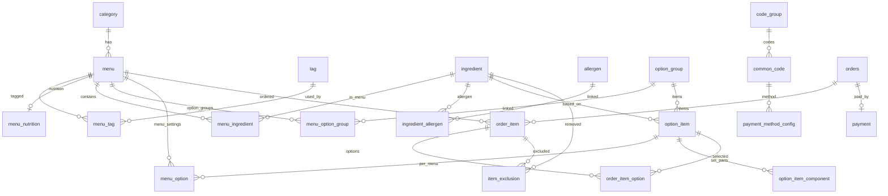

# 05. DB 설계

---

---

# ERD (Mermaid erDiagram)

> seed 17테이블(MVP) + 주문 5테이블(MVP 다음, 점선) · `asak-data/seed/manifest.json` 기준
> 



> **주문 그룹** (`orders`, `order_item`, `order_item_option`, `item_exclusion`, `payment`): DDL·시드는 Week 5 MVP API-005/006 구현 시 추가. 위 다이어그램은 설계 관계만 표현.
> 

---

# 시드 데이터 현황 (manifest v2, 2026-07-03)

> **Source of truth**: `asak-data/seed/manifest.json` · `backend/src/main/resources/seed/` 동기화본
> 

| 엔티티 | 건수 | 비고 |
| --- | --- | --- |
| category | 6 | 신메뉴·샌드위치·샐러디·볼·랩·프로틴·기타 |
| menu | 84 | 이미지 84 PNG 포함 |
| menu_option | 9,166 | 메뉴별 옵션 설정 (추천/기본 포함) |
| menu_option_group | 467 |  |
| option_item | 157 |  |
| ingredient | 90 |  |
| allergen | 14 |  |
| menu_ingredient | 578 |  |
| code_group / common_code | 10 / 32 | 상태·유형 공통코드 |

<aside>
📌

**주문 테이블 (MVP 다음 단계)**: 현재 시드에는 `orders`, `order_item`, `order_item_option`, `item_exclusion`, `payment` **5개 테이블 데이터가 미포함**입니다. DB 설계(22개)에는 정의되어 있으나, Week 5 MVP API(API-005~006) 구현 시 DDL + 시드 또는 런타임 생성으로 추가합니다.

</aside>

---

# DB 엔진 구분

| 용도 | 엔진 | 위치 | 설명 |
| --- | --- | --- | --- |
| 키오스크 앱 (ASAK) | **MySQL** | Spring Boot + JPA | 3NF 22테이블 · 시드 JSON → MySQL 적재 |
| 1차 크롤링·리서치 | **PostgreSQL** | `data-pipeline/phase1/db/` | brand/store/platform/price_history 등 **매장·수집 데이터** — ASAK 앱 DB와 **별도 스키마** |

> 크롤링 DB는 매장별 가격·플랫폼 ID·수집 시각을 관리합니다. ASAK 키오스크 DB는 이 구조를 **참고만** 하고, 주문 흐름에 필요한 범위만 3NF로 재구성합니다 (상단 "DB 설계 기준" 참고).
> 

ERD, 테이블 정의서, 상태값, SQL 파일을 관리합니다.

> 프로젝트 서비스명은 실제 브랜드명 대신 **ASAK(아삭)** 으로 표기합니다.
> 

> 지금 DB는 크롤링 DB의 구조를 그대로 가져오지 않고, **키오스크 주문 시스템에 필요한 범위만 3차 정규화 기준으로 재구성**합니다.
> 

# DB 설계 기준

## 현재 판단

크롤링 DB와 ASAK DB의 방향은 비슷합니다. 
둘 다 메뉴, 카테고리, 재료, 알레르기, 옵션그룹, 옵션항목을 분리하고 N:M 관계는 연결 테이블로 처리합니다.

다만 크롤링 DB는 `brand / platform / store / store_menu_item / price_history`처럼 
실제 매장·플랫폼별 수집 데이터를 관리하는 구조이고, ASAK은 9주 프로젝트 기준 
키오스크 주문 흐름 완성이 목적입니다. 
따라서 매장별 가격이력, 외부 플랫폼 ID, 수집 시각, 공식 카탈로그/매장 SKU 분리는 제외합니다.

## 3차 정규화 반영 원칙

- 반복되는 상태값, 유형값, 단위값, 결제수단처럼 확장 가능한 
선택값은 `code_group`, `common_code`로 분리합니다.
- 단순 참/거짓으로 끝나는 값은 공통코드로 분리하지 않고 Boolean 컬럼으로 둡니다. 
예: `is_active`, `is_sold_out`, `is_required`, `is_default`, `can_remove`.
- 메뉴와 태그, 메뉴와 재료, 재료와 알레르기, 메뉴와 옵션그룹은 모두 연결 테이블로 분리합니다.
- 추천 드레싱처럼 메뉴마다 달라지는 옵션 설정은 `option_item`이 아니라 `menu_option`으로 분리합니다.
- 메뉴 알레르기 텍스트, 기본 칼로리, 기본 드레싱처럼 계산·파생 가능한 값은 직접 저장하지 않습니다.
- 주문 시점 가격은 주문 기록 보존을 위해 `order_item.price`, `order_item_option.price`에 
스냅샷으로 저장할 수 있습니다.

# 3NF 테이블 목록

```
category
code_group
common_code

tag
menu
menu_tag
menu_nutrition

ingredient
allergen
ingredient_allergen
menu_ingredient

option_group
menu_option_group
menu_option
option_item
option_item_component

payment_method_config

orders
order_item
order_item_option
item_exclusion
payment
```

총 22개 테이블입니다. Week 5 MVP에서는 MVP 필수 17개를 우선 구현하고, `tag`, `menu_tag`, `menu_nutrition`, `option_item_component`, `payment_method_config`는 확장 대비 테이블로 둡니다.

> SQL 작성 시에는 FK 생성 순서를 고려해 `option_group` → `option_item` → `menu_option_group` → `menu_option` 순서로 생성합니다. 문서 번호는 개념 설명 흐름 기준입니다.
> 

# 테이블 상세

## 1. category — 메뉴 카테고리

| 컬럼명 | 타입 | 제약조건 | 설명 |
| --- | --- | --- | --- |
| id | BIGINT | PK, AUTO_INCREMENT | 카테고리 ID |
| name | VARCHAR(50) | NOT NULL, UNIQUE 권장 | 카테고리명 |
| sort_order | INT | NOT NULL, DEFAULT 0 | 노출 순서 |
| is_active | BOOLEAN | NOT NULL, DEFAULT true | 사용 여부 |

## 2. code_group — 공통 코드 그룹

| 컬럼명 | 타입 | 제약조건 | 설명 |
| --- | --- | --- | --- |
| id | BIGINT | PK, AUTO_INCREMENT | 코드그룹 ID |
| group_code | VARCHAR(50) | NOT NULL, UNIQUE | 코드그룹 코드 |
| name | VARCHAR(50) | NOT NULL | 코드그룹명 |

## 3. common_code — 공통 코드

| 컬럼명 | 타입 | 제약조건 | 설명 |
| --- | --- | --- | --- |
| id | BIGINT | PK, AUTO_INCREMENT | 코드 ID |
| code_group_id | BIGINT | FK, NOT NULL | `code_group.id` |
| code | VARCHAR(50) | NOT NULL, UNIQUE(code_group_id, code) | API/프론트 코드값 |
| name | VARCHAR(50) | NOT NULL | 표시명 |
| sort_order | INT | NOT NULL, DEFAULT 0 | 정렬 순서 |
| is_active | BOOLEAN | NOT NULL, DEFAULT true | 사용 여부 |

사용 예시: `ORDER_STATUS`, `PAYMENT_STATUS`, `ORDER_TYPE`, `PAYMENT_METHOD`, `OPTION_GROUP_TYPE`, `INGREDIENT_TYPE`, `MENU_INGREDIENT_ROLE`, `UNIT_TYPE`, `TAG_TYPE`.

## 4. tag — 메뉴 태그 마스터

| 컬럼명 | 타입 | 제약조건 | 설명 |
| --- | --- | --- | --- |
| id | BIGINT | PK, AUTO_INCREMENT | 태그 ID |
| code | VARCHAR(50) | NOT NULL, UNIQUE | BEST, NEW, LOW_SUGAR 등 |
| name | VARCHAR(50) | NOT NULL | 표시명 |
| color_hex | VARCHAR(20) | NULL | 태그 색상 |
| is_active | BOOLEAN | NOT NULL, DEFAULT true | 사용 여부 |

## 5. menu — 판매 메뉴

| 컬럼명 | 타입 | 제약조건 | 설명 |
| --- | --- | --- | --- |
| id | BIGINT | PK, AUTO_INCREMENT | 메뉴 ID |
| category_id | BIGINT | FK, NOT NULL | `category.id` |
| name | VARCHAR(100) | NOT NULL | ASAK 메뉴명 |
| price | INT | NOT NULL, DEFAULT 0 | 기본 판매가 |
| image_url | TEXT | NULL | 메뉴 이미지 |
| description | TEXT | NULL | 메뉴 설명 |
| is_sold_out | BOOLEAN | NOT NULL, DEFAULT false | 메뉴 직접 품절 여부 |
| created_at | TIMESTAMP | NOT NULL, DEFAULT CURRENT_TIMESTAMP | 생성일시 |
| updated_at | TIMESTAMP | NOT NULL, DEFAULT CURRENT_TIMESTAMP ON UPDATE CURRENT_TIMESTAMP | 수정일시 |

`base_kcal`, `allergy_text`, `default_dressing`은 파생값이므로 저장하지 않습니다.

## 6. menu_tag — 메뉴별 태그 연결

| 컬럼명 | 타입 | 제약조건 | 설명 |
| --- | --- | --- | --- |
| id | BIGINT | PK, AUTO_INCREMENT | 연결 ID |
| menu_id | BIGINT | FK, NOT NULL, UNIQUE(menu_id, tag_id) | `menu.id` |
| tag_id | BIGINT | FK, NOT NULL, UNIQUE(menu_id, tag_id) | `tag.id` |

## 7. menu_nutrition — 메뉴 영양정보 요약

| 컬럼명 | 타입 | 제약조건 | 설명 |
| --- | --- | --- | --- |
| id | BIGINT | PK, AUTO_INCREMENT | 영양정보 ID |
| menu_id | BIGINT | FK, NOT NULL, UNIQUE 권장 | `menu.id` |
| kcal | DECIMAL(8,2) | NULL | 기준 칼로리 |
| protein_g | DECIMAL(8,2) | NULL | 단백질 |
| carb_g | DECIMAL(8,2) | NULL | 탄수화물 |
| fat_g | DECIMAL(8,2) | NULL | 지방 |
| sodium_mg | DECIMAL(8,2) | NULL | 나트륨 |
| source_id | BIGINT | FK, NULL | 데이터 출처 코드, `common_code.id` |

## 8. ingredient — 재료 마스터

| 컬럼명 | 타입 | 제약조건 | 설명 |
| --- | --- | --- | --- |
| id | BIGINT | PK, AUTO_INCREMENT | 재료 ID |
| name | VARCHAR(100) | NOT NULL, UNIQUE | 재료명 |
| type_id | BIGINT | FK, NOT NULL | 재료 유형 코드, `common_code.id` |
| kcal | DECIMAL(8,2) | NULL | 기준 칼로리 |
| protein_g | DECIMAL(8,2) | NULL | 기준 단백질 |
| is_sold_out | BOOLEAN | NOT NULL, DEFAULT false | 재료 품절 여부 |

재료 유형 예시: `VEGGIE`, `PROTEIN`, `DRESSING`, `BASE`, `SIDE`, `BEVERAGE`.

## 9. allergen — 알레르기 마스터

| 컬럼명 | 타입 | 제약조건 | 설명 |
| --- | --- | --- | --- |
| id | BIGINT | PK, AUTO_INCREMENT | 알레르기 ID |
| name | VARCHAR(50) | NOT NULL, UNIQUE | 알레르기명 |

## 10. ingredient_allergen — 재료별 알레르기 연결

| 컬럼명 | 타입 | 제약조건 | 설명 |
| --- | --- | --- | --- |
| id | BIGINT | PK, AUTO_INCREMENT | 연결 ID |
| ingredient_id | BIGINT | FK, NOT NULL, UNIQUE(ingredient_id, allergen_id) | `ingredient.id` |
| allergen_id | BIGINT | FK, NOT NULL, UNIQUE(ingredient_id, allergen_id) | `allergen.id` |

## 11. menu_ingredient — 메뉴 기본 재료 연결

| 컬럼명 | 타입 | 제약조건 | 설명 |
| --- | --- | --- | --- |
| id | BIGINT | PK, AUTO_INCREMENT | 연결 ID |
| menu_id | BIGINT | FK, NOT NULL, UNIQUE(menu_id, ingredient_id, role_id) 권장 | `menu.id` |
| ingredient_id | BIGINT | FK, NOT NULL, UNIQUE(menu_id, ingredient_id, role_id) 권장 | `ingredient.id` |
| role_id | BIGINT | FK, NOT NULL, UNIQUE(menu_id, ingredient_id, role_id) 권장 | 재료 역할 코드 |
| quantity | DECIMAL(8,2) | NULL | 기본 제공량 |
| unit_id | BIGINT | FK, NULL | 단위 코드 |
| is_default | BOOLEAN | NOT NULL, DEFAULT true | 기본 포함 여부 |
| can_remove | BOOLEAN | NOT NULL, DEFAULT true | 고객 제외 가능 여부 |
| sort_order | INT | NOT NULL, DEFAULT 0 | 표시 순서 |

재료 역할: `CORE` 핵심 재료, `BASE` 베이스 재료, `DEFAULT` 일반 기본 재료.

## 12. option_group — 옵션 그룹 마스터

| 컬럼명 | 타입 | 제약조건 | 설명 |
| --- | --- | --- | --- |
| id | BIGINT | PK, AUTO_INCREMENT | 옵션그룹 ID |
| name | VARCHAR(100) | NOT NULL | 옵션그룹명 |
| group_type_id | BIGINT | FK, NOT NULL | 옵션그룹 유형 코드 |
| min_select | INT | NOT NULL, DEFAULT 0 | 최소 선택 수 |
| max_select | INT | NOT NULL, DEFAULT 1 | 최대 선택 수 |

단일/다중 선택 여부는 별도 코드로 저장하지 않고 `min_select`, `max_select`로 판단합니다.

## 13. menu_option_group — 메뉴별 옵션그룹 연결

| 컬럼명 | 타입 | 제약조건 | 설명 |
| --- | --- | --- | --- |
| id | BIGINT | PK, AUTO_INCREMENT | 연결 ID |
| menu_id | BIGINT | FK, NOT NULL, UNIQUE(menu_id, option_group_id) | `menu.id` |
| option_group_id | BIGINT | FK, NOT NULL, UNIQUE(menu_id, option_group_id) | `option_group.id` |
| sort_order | INT | NOT NULL, DEFAULT 0 | 메뉴 상세 내 표시 순서 |
| is_required | BOOLEAN | NOT NULL, DEFAULT false | 해당 메뉴에서 필수 여부 |

## 14. menu_option — 메뉴별 옵션항목 설정

| 컬럼명 | 타입 | 제약조건 | 설명 |
| --- | --- | --- | --- |
| id | BIGINT | PK, AUTO_INCREMENT | 메뉴별 옵션 설정 ID |
| menu_id | BIGINT | FK, NOT NULL, UNIQUE(menu_id, option_item_id) | `menu.id` |
| option_item_id | BIGINT | FK, NOT NULL, UNIQUE(menu_id, option_item_id) | `option_item.id` |
| is_recommended | BOOLEAN | NOT NULL, DEFAULT false | 해당 메뉴의 추천 옵션 여부 |
| is_default | BOOLEAN | NOT NULL, DEFAULT false | 해당 메뉴에서 기본 선택되는 옵션 여부 |
| sort_order | INT | NOT NULL, DEFAULT 0 | 해당 메뉴 안에서 옵션 표시 순서 |
| is_active | BOOLEAN | NOT NULL, DEFAULT true | 해당 메뉴에서 노출 여부 |

추천 드레싱은 메뉴마다 다르므로 `option_item`에 직접 저장하지 않습니다.

## 15. option_item — 옵션 선택 항목

| 컬럼명 | 타입 | 제약조건 | 설명 |
| --- | --- | --- | --- |
| id | BIGINT | PK, AUTO_INCREMENT | 옵션항목 ID |
| option_group_id | BIGINT | FK, NOT NULL | `option_group.id` |
| ingredient_id | BIGINT | FK, NULL | 재료 기반 옵션일 때 `ingredient.id` |
| name | VARCHAR(100) | NOT NULL | 옵션항목명 |
| extra_price | INT | NOT NULL, DEFAULT 0 | 실제 추가 금액 |
| original_price | INT | NULL | 할인 전 금액 |
| amount | DECIMAL(8,2) | NULL | 제공량 |
| unit_id | BIGINT | FK, NULL | 단위 코드 |
| icon_url | TEXT | NULL | 아이콘/이미지 URL |
| color_hex | VARCHAR(20) | NULL | 대표 색상 |
| is_sold_out | BOOLEAN | NOT NULL, DEFAULT false | 옵션항목 직접 품절 여부 |
| created_at | TIMESTAMP | NOT NULL, DEFAULT CURRENT_TIMESTAMP | 생성일시 |
| updated_at | TIMESTAMP | NOT NULL, DEFAULT CURRENT_TIMESTAMP ON UPDATE CURRENT_TIMESTAMP | 수정일시 |

옵션항목 자체가 재료가 아닌 세트/요청사항이면 `ingredient_id`는 NULL일 수 있습니다.

## 16. option_item_component — 세트 옵션 구성품

| 컬럼명 | 타입 | 제약조건 | 설명 |
| --- | --- | --- | --- |
| id | BIGINT | PK, AUTO_INCREMENT | 구성 ID |
| option_item_id | BIGINT | FK, NOT NULL | 세트 성격의 `option_item.id` |
| ingredient_id | BIGINT | FK, NULL | 구성 재료/사이드/음료 |
| name | VARCHAR(100) | NOT NULL | 구성품명 |
| quantity | DECIMAL(8,2) | NULL | 구성 수량 |
| unit_id | BIGINT | FK, NULL | 단위 코드 |
| sort_order | INT | NOT NULL, DEFAULT 0 | 표시 순서 |

ASAK 세트 주문은 사이드와 음료를 각각 선택하는 구조이므로 기본 구현은 `SET_SIDE`, `SET_DRINK` 옵션그룹을 메뉴에 연결합니다.

## 17. payment_method_config — 결제수단 설정

| 컬럼명 | 타입 | 제약조건 | 설명 |
| --- | --- | --- | --- |
| id | BIGINT | PK, AUTO_INCREMENT | 설정 ID |
| method_id | BIGINT | FK, NOT NULL, UNIQUE | 결제수단 코드, `common_code.id` |
| name | VARCHAR(50) | NOT NULL | 표시명 |
| is_active | BOOLEAN | NOT NULL, DEFAULT true | 노출 여부 |
| sort_order | INT | NOT NULL, DEFAULT 0 | 노출 순서 |

## 18. orders — 주문 헤더

| 컬럼명 | 타입 | 제약조건 | 설명 |
| --- | --- | --- | --- |
| id | BIGINT | PK, AUTO_INCREMENT | 주문 ID |
| order_no | VARCHAR(50) | NOT NULL, UNIQUE | 주문번호 |
| order_type_id | BIGINT | FK, NOT NULL | 주문유형 코드 |
| status_id | BIGINT | FK, NOT NULL | 주문상태 코드 |
| total_price | INT | NOT NULL, DEFAULT 0 | 주문 총액 |
| created_at | TIMESTAMP | NOT NULL, DEFAULT CURRENT_TIMESTAMP | 주문 생성일시 |

## 19. order_item — 주문 메뉴 단위

| 컬럼명 | 타입 | 제약조건 | 설명 |
| --- | --- | --- | --- |
| id | BIGINT | PK, AUTO_INCREMENT | 주문상세 ID |
| order_id | BIGINT | FK, NOT NULL | `orders.id` |
| menu_id | BIGINT | FK, NOT NULL | `menu.id` |
| quantity | INT | NOT NULL, DEFAULT 1 | 메뉴 수량 |
| price | INT | NOT NULL, DEFAULT 0 | 주문 시점 메뉴 단가 스냅샷 |

## 20. order_item_option — 주문상세별 선택 옵션

| 컬럼명 | 타입 | 제약조건 | 설명 |
| --- | --- | --- | --- |
| id | BIGINT | PK, AUTO_INCREMENT | 선택 옵션 ID |
| order_item_id | BIGINT | FK, NOT NULL, UNIQUE(order_item_id, option_item_id) 권장 | `order_item.id` |
| option_item_id | BIGINT | FK, NOT NULL, UNIQUE(order_item_id, option_item_id) 권장 | `option_item.id` |
| quantity | INT | NOT NULL, DEFAULT 1 | 옵션 수량 |
| price | INT | NOT NULL, DEFAULT 0 | 주문 시점 옵션 단가 스냅샷 |

`order_item_id`만 있으면 어떤 주문의 어떤 메뉴에 붙은 옵션인지 확인할 수 있습니다.

## 21. item_exclusion — 제외한 기본 재료

| 컬럼명 | 타입 | 제약조건 | 설명 |
| --- | --- | --- | --- |
| id | BIGINT | PK, AUTO_INCREMENT | 제외 기록 ID |
| order_item_id | BIGINT | FK, NOT NULL, UNIQUE(order_item_id, ingredient_id) | `order_item.id` |
| ingredient_id | BIGINT | FK, NOT NULL, UNIQUE(order_item_id, ingredient_id) | 제외한 기본 재료 |

## 22. payment — 결제 내역

| 컬럼명 | 타입 | 제약조건 | 설명 |
| --- | --- | --- | --- |
| id | BIGINT | PK, AUTO_INCREMENT | 결제 ID |
| order_id | BIGINT | FK, NOT NULL, UNIQUE 권장 | `orders.id` |
| method_id | BIGINT | FK, NOT NULL | 결제수단 코드 |
| status_id | BIGINT | FK, NOT NULL | 결제상태 코드 |
| amount | INT | NOT NULL, DEFAULT 0 | 결제 금액 |
| paid_at | TIMESTAMP | NULL | 결제 승인 시각 |

# 공통 코드 초기값

| 코드그룹 | 코드값 | 표시명 |
| --- | --- | --- |
| ORDER_STATUS | RECEIVED | 접수 |
| ORDER_STATUS | PREPARING | 준비중 |
| ORDER_STATUS | COMPLETED | 완료 |
| PAYMENT_STATUS | READY | 결제 대기 |
| PAYMENT_STATUS | APPROVED | 결제 승인 |
| PAYMENT_STATUS | FAILED | 결제 실패 |
| ORDER_TYPE | EAT_IN | 먹고가기 |
| ORDER_TYPE | TAKE_OUT | 포장 |
| PAYMENT_METHOD | CARD | 카드 |
| OPTION_GROUP_TYPE | TOPPING | 토핑 추가 |
| OPTION_GROUP_TYPE | DRESSING | 드레싱 선택 |
| OPTION_GROUP_TYPE | BASE | 베이스 선택/추가 |
| OPTION_GROUP_TYPE | SET_SIDE | 세트 사이드 선택 |
| OPTION_GROUP_TYPE | SET_DRINK | 세트 음료 선택 |
| OPTION_GROUP_TYPE | REQUEST | 빼기/요청사항 |
| INGREDIENT_TYPE | VEGGIE | 채소 |
| INGREDIENT_TYPE | PROTEIN | 단백질 |
| INGREDIENT_TYPE | DRESSING | 드레싱 |
| INGREDIENT_TYPE | BASE | 베이스 |
| INGREDIENT_TYPE | SIDE | 사이드 |
| INGREDIENT_TYPE | BEVERAGE | 음료 |
| MENU_INGREDIENT_ROLE | CORE | 핵심 재료 |
| MENU_INGREDIENT_ROLE | BASE | 베이스 재료 |
| MENU_INGREDIENT_ROLE | DEFAULT | 일반 기본 재료 |
| UNIT_TYPE | G | g |
| UNIT_TYPE | ML | ml |
| UNIT_TYPE | EA | 개 |
| TAG_TYPE | BEST | 베스트 |
| TAG_TYPE | NEW | 신규 |
| TAG_TYPE | LOW_SUGAR | 저당 |

# Week 5 MVP 구현 우선순위

## 반드시 구현

`category`, `code_group`, `common_code`, `menu`, `ingredient`, `allergen`, `ingredient_allergen`, `menu_ingredient`, `option_group`, `menu_option_group`, `menu_option`, `option_item`, `orders`, `order_item`, `order_item_option`, `item_exclusion`, `payment`

## 구조는 두되 Week 5 MVP에서 선택 구현

`tag`, `menu_tag`, `menu_nutrition`, `option_item_component`, `payment_method_config`

# 설계 결론

ASAK은 크롤링 DB의 좋은 정규화 방향을 따라가되, Week 5 MVP 범위를 넘기는 매장/플랫폼/수집 데이터는 제외합니다. 추천 드레싱, 세트 사이드/음료, 알레르기, 품절 기준은 실제 구현 시 흔들리지 않도록 각각 별도 테이블과 제약조건으로 분리합니다.

# 확장 후보 테이블 (22개 정식 테이블 외)

아래 테이블은 현재 22개 정식 테이블에 포함되지 않으며, 해당 기능이 실제로 확장될 때 함께 설계합니다.

| 테이블명 | 역할 | 관련 요구사항/API |
| --- | --- | --- |
| admin | 관리자 계정 정보(id, username, password, name 등) | LMIS-AUTH-001, API-HOLD-001 |
| role | 관리자 권한 구분(role_id 기반 권한 관리) | LMIS-AUTH-001, API-HOLD-001 |
| promotion | 세트/묶음 할인 정책 관리 | DEV-PAY-002 사이드메뉴 세트 할인 적용 |
| membership | 고객 번번심 적립 정보(스킠프 수, 최근 적립일) | LMIS-MEMBER-001, SC-006 |

> 관리자 인증과 세트 할인, 멤버십은 Week 5 MVP 필수 범위가 아니므로, 이 테이블들은 22개 정식 테이블 수에 포함하지 않습니다. 실제 확장 시점에 컬럼/제약조건을 확정합니다.
>