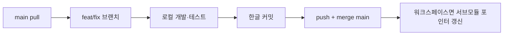

# ASAK Git 저장소 현황 (팀 클론·개발용)

> Status: **CURRENT**  
> 기준일: **2026-09-01**  
> 목적: 각 저장소의 원격 URL, 브랜치, 태그, 커밋 이력, GitHub Issues/PR을 한곳에 모아 **새 PC에서 클론 후 바로 개발**할 수 있게 한다.

---

## 1. 저장소 맵 (한눈에)

| 저장소 | GitHub | 기본 브랜치 | 최신 커밋 (2026-09-01) | 총 커밋 | 담당 |
| --- | --- | --- | --- | ---: | --- |
| **ASAK-workspace** | [hagenie128/ASAK-workspace](https://github.com/hagenie128/ASAK-workspace) | `main` | `ca8cadb` | 115 | 워크스페이스·IDE·서브모듈 포인터 |
| **ASAK** (문서) | [hagenie128/ASAK](https://github.com/hagenie128/ASAK) | `main` | `69eecc4` | 320 | WBS·QA·API 명세·워크로그 |
| **ASAK-back** | [nayeon0828/ASAK-backend](https://github.com/nayeon0828/ASAK-backend) | `main` | `a219483` | 251 | Spring Boot API |
| **ASAK-Admin** | [hagenie128/ASAK-Admin](https://github.com/hagenie128/ASAK-Admin) | `main` | `c6099f4` | 152 | 관리자 React PWA |
| **ASAK-Kiosk** | [hagenie128/ASAK-Kiosk](https://github.com/hagenie128/ASAK-Kiosk) | `main` | `349fd7f` | 252 | 키오스크 React PWA |
| **ASAK-skill** | [hagenie128/ASAK-skill](https://github.com/hagenie128/ASAK-skill) | `main` | `dddaf96` | 113 | Cursor/Codex 스킬·에이전트 |

> **주의:** 백엔드 원격 저장소 이름은 `ASAK-backend`이고, 로컬 폴더명은 `ASAK-back`이다.

---

## 2. 클론 방법

### A. 워크스페이스 전체 (권장 — 팀 리더·풀스택)

서브모듈까지 한 번에 받는다.

```powershell
git clone --recurse-submodules https://github.com/hagenie128/ASAK-workspace.git C:\ASAK-workspace
cd C:\ASAK-workspace
git submodule update --init --recursive
```

Cursor/VS Code에서는 `ASAK.code-workspace`를 연다.

### B. 담당 앱만 (프론트·백엔드 단독 개발)

```powershell
# 문서·WBS
git clone https://github.com/hagenie128/ASAK.git C:\ASAK-workspace\ASAK

# 백엔드
git clone https://github.com/nayeon0828/ASAK-backend.git C:\ASAK-workspace\ASAK-back

# 관리자
git clone https://github.com/hagenie128/ASAK-Admin.git C:\ASAK-workspace\ASAK-Admin

# 키오스크
git clone https://github.com/hagenie128/ASAK-Kiosk.git C:\ASAK-workspace\ASAK-Kiosk

# 스킬 (선택)
git clone https://github.com/hagenie128/ASAK-skill.git C:\ASAK-workspace\ASAK-skill
```

클론 후 [getting-started.md](getting-started.md)의 설치·실행 절차를 따른다.

### C. 클론 직후 확인

```powershell
git remote -v
git branch -a
git log -5 --oneline --decorate
git status
```

---

## 3. 브랜치 정책

| 규칙 | 설명 |
| --- | --- |
| 기본 브랜치 | **`main`** — 배포·시연·문서 정본 |
| 작업 브랜치 | `feat/`, `fix/`, `docs/`, `chore/` + 영문-kebab-case |
| 병합 | `--no-ff` merge commit (작업 이력 보존) |
| 금지 | `main`에 force push, 승인 없는 원격 변경 |

### 3-1. 원격 브랜치 현황 (2026-09-01)

| 저장소 | `main` 외 원격 브랜치 | 비고 |
| --- | --- | --- |
| ASAK-workspace | *(없음)* | `main`만 사용 |
| ASAK | *(없음)* | `main`만 사용 |
| ASAK-back | *(없음)* | `main`만 사용. 로컬에 `fix/mapper-formatter-restore` 잔존 가능 — 이미 `main`에 병합됨 |
| ASAK-Admin | *(없음)* | `main`만 사용 |
| ASAK-Kiosk | `origin/ny/api-connection` | **main에 병합 완료**. 원격에만 남은 옛 브랜치 |
| ASAK-skill | `origin/rescue/workspace-detached-20260731` | 2026-07 rescue용. **main 사용 권장** |

새 기능은 **항상 `main`에서 최신 pull 후** `feat/…` 브랜치를 만든다.

```powershell
git fetch origin --prune
git switch main
git pull --ff-only origin main
git switch -c feat/my-feature
```

---

## 4. 태그

| 저장소 | 태그 | 용도 |
| --- | --- | --- |
| ASAK-workspace | *(없음)* | — |
| ASAK | *(없음)* | — |
| ASAK-back | *(없음)* | — |
| ASAK-Admin | *(없음)* | — |
| ASAK-Kiosk | *(없음)* | — |
| ASAK-skill | **`v2.1.0`** | Agent Kit 스킬 번들 기준점 |

```powershell
# ASAK-skill 특정 태그 체크아웃 (필요 시)
cd C:\ASAK-workspace\ASAK-skill
git fetch --tags
git checkout v2.1.0
```

---

## 5. 커밋 작성자 · 이력 요약

### 5-1. 작성자 (전체 커밋 수 기준)

| GitHub ID / 이름 | ASAK-workspace | ASAK | ASAK-back | ASAK-Admin | ASAK-Kiosk | ASAK-skill |
| --- | ---: | ---: | ---: | ---: | ---: | ---: |
| **hagenie128** | 115 | 292 | 164 | 151 | 149 | 113 |
| **kimnayeon** | — | 17 | 86 | — | 94 | — |
| **nayeon0828** | — | — | 1 | — | — | — |
| **pyouji99@naver.com** | — | 7 | — | — | 5 | — |
| **Ha Genie · Developer** | — | — | — | 1 | 1 | — |

> 커밋은 **각 저장소 안에서** 만든다. 워크스페이스 루트 커밋은 서브모듈 포인터·IDE 설정만 포함한다.

### 5-2. 저장소별 첫·최근 커밋

| 저장소 | 첫 커밋 | 최근 `main` 커밋 |
| --- | --- | --- |
| ASAK-workspace | 2026-07-14 · hagenie128 | 2026-09-01 · 서브모듈·IDE 설정 |
| ASAK | 2026-07-01 · hagenie128 | 2026-09-01 · 졸업 MVP 시연 문서 |
| ASAK-back | 2026-07-22 · nayeon0828 | 2026-09-01 · spotless 포맷 + 품절 뷰 문서 |
| ASAK-Admin | 2026-07-14 · hagenie128 | 2026-09-01 · jsconfig 경로 별칭 |
| ASAK-Kiosk | 2026-07-01 · hagenie128 | 2026-09-01 · await 누락 수정 (kimnayeon) |
| ASAK-skill | 2026-07-14 · hagenie128 | 2026-08-19 · kebab-case 통일 |

### 5-3. 최근 `main` 이력 (2026-09-01 기준)

#### ASAK-workspace
```
ca8cadb merge: chore/submodule-back-format — ASAK-back 서브모듈 갱신
2ff286d merge: chore/submodule-and-ide-settings — 서브모듈·IDE 설정
ffe9acf Merge branch 'chore/workspace-submodule-sync'
```

#### ASAK (docs)
```
69eecc4 merge: docs/graduation-demo-mvp — 졸업 MVP 시연 문서 갱신
09bb55a merge: docs/admin-qa-wbs-graduation-mvp
53f651f merge: WBS·QA·API 명세 Hub 동기화
```

#### ASAK-back
```
a219483 merge: chore/spotless-format — spotless 포맷 정리
60dca8d merge: feat/soldout-catalog-scope — vw_soldout_catalog 운영 범위 반영
09dcf13 merge: fix/admin-api-http-status-mapper
```

#### ASAK-Admin
```
c6099f4 merge: chore/jsconfig-path-alias — jsconfig 경로 별칭
3ef6c90 merge: fix/payment-method-save-failure — 결제수단 baseline 복원
4f0c9cd feat: 품절 목록 조회 개선
```

#### ASAK-Kiosk
```
349fd7f fix: await 빠진 부분 추가 작업
052ca5e 영수증 출력 & 주문번호 출력 작업 백업 1차
4bb608c merge: 장바구니 검증 실패 시 품절·오류 안내 모달
```

---

## 6. GitHub Issues

| 저장소 | Open | Closed | 대표 이슈 |
| --- | ---: | ---: | --- |
| ASAK-workspace | 0 | 0 | — |
| ASAK | 0 | 0 | 문서는 PR 위주 |
| ASAK-back | 0 | 0 | — |
| **ASAK-Admin** | **1** | 1 | #4 [Admin] Figma 픽셀·카피 폴리시 잔여 QA |
| **ASAK-Kiosk** | **1** | 0 | #5 [WBS2-024~031] 키오스크 mock 주문·결제 상태 연결 및 QA |
| ASAK-skill | 0 | 0 | — |

이슈 조회:

```powershell
gh issue list -R hagenie128/ASAK-Admin --state all
gh issue list -R hagenie128/ASAK-Kiosk --state all
```

---

## 7. Pull Requests (병합 이력)

팀은 **로컬 `main` + merge commit**으로 작업한다. 아래는 GitHub PR 기록(참고용).

### ASAK (docs) — PR #1~#11 (전부 MERGED/CLOSED, 2026-07)

| # | 제목 | 브랜치 | 상태 |
| ---: | --- | --- | --- |
| 11 | docs: sync Admin status wiki, worklogs | `docs/admin-status-2026-07-23` | MERGED |
| 8 | docs: define ASAK frontend 80% execution plan | `docs/frontend-80-percent-plan` | MERGED |
| 5 | docs: audit DevCopilot baseline and WBS 2.0 | `docs/devcopilot-wbs-v2` | MERGED |

### ASAK-back — PR #1 (MERGED)

| # | 제목 | 브랜치 |
| ---: | --- | --- |
| 1 | common enums 상수 추가 | `festure/user/TC-001` |

### ASAK-Admin — PR #2~#6

| # | 제목 | 상태 |
| ---: | --- | --- |
| 6 | feat: 관리자 피드백 아이콘 표시 개선 | MERGED |
| 5 | feat(admin): mock Figma parity (sold-out, menu, payments) | MERGED |
| 2 | feat(admin): live order complete/cancel mock SCR-009 | MERGED |

### ASAK-Kiosk — PR #1~#6

| # | 제목 | 상태 |
| ---: | --- | --- |
| 6 | feat: 키오스크 피드백 아이콘·옵션 이미지 | MERGED |
| 4 | handoff/0718 to kiosk continue | MERGED |
| 1 | Kiosk order start scr001 | MERGED |

PR 조회:

```powershell
gh pr list -R hagenie128/ASAK-Kiosk --state all --limit 20
```

---

## 8. 팀원 개발 워크플로 (요약)



1. **담당 저장소**에서만 커밋한다 (`ASAK-back` 변경을 `ASAK-Admin` repo에 넣지 않음).
2. 커밋 메시지: `feat:`, `fix:`, `docs:`, `chore:` + **한글 설명**.
3. 백엔드: `.\gradlew.bat test` / 프론트: `npm run build` 통과 후 push.
4. 워크스페이스 담당자는 서브모듈 포인터 변경 후 `ASAK-workspace`에 별도 커밋.
5. `.env`, DB 비밀, 토큰은 **절대 커밋하지 않음**.

상세 절차: 워크스페이스 `.cursor/skills/asak-git-publish/SKILL.md` (깃반영 스킬).

---

## 9. 서브모듈 포인터 (workspace `main` 기준)

| 서브모듈 | 커밋 | 설명 |
| --- | --- | --- |
| `ASAK` | `69eecc4` | 졸업 MVP 문서 |
| `ASAK-Admin` | `c6099f4` | jsconfig |
| `ASAK-back` | `a219483` | 품절 뷰·spotless |
| `ASAK-Kiosk` | `349fd7f` | await 수정 |
| `ASAK-skill` | `dddaf96` | v2.1.0 근처 |

서브모듈만 최신화:

```powershell
cd C:\ASAK-workspace
git submodule update --remote --merge ASAK-back
# 또는 각 폴더에서 git pull origin main
```

---

## 10. 관련 문서

- [getting-started.md](getting-started.md) — 설치·실행
- [troubleshooting-backend.md](troubleshooting-backend.md) — 8080 포트·Gradle
- [../../wiki/wbs.md](../../wiki/wbs.md) — 작업 범위
- [../../wiki/graduation-demo-mvp-2026-09-02.md](../../wiki/graduation-demo-mvp-2026-09-02.md) — 종강 시연

---

## 부록: 로컬에서 전체 이력 조회 명령

```powershell
# 브랜치·태그
git branch -a
git tag -l

# 작성자별 커밋 수
git shortlog -sn --all

# 그래프 이력
git log --all --oneline --graph -30

# 특정 기간
git log --since="2026-08-01" --oneline --author="kimnayeon"
```

GitHub 웹: `https://github.com/<owner>/<repo>/commits/main`
