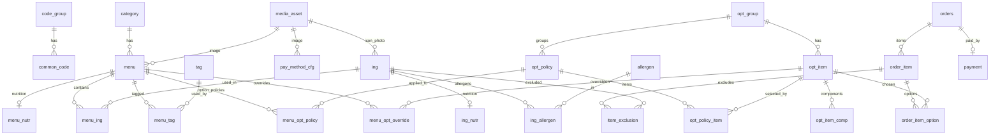

# ASAK DB 설계 테이블 정의서

> **2026-08-19 실측 동기화:** 운영 DB(`asak_db`)에서 `SHOW CREATE TABLE` 로 직접 읽어 갱신했다.
> 실제 테이블은 **26개**이며, 이전 판의 "22테이블"과 레거시 테이블 이름은 short-name 마이그레이션
> 이전 기준이라 실제와 달랐다. DDL 정본: `ASAK-back/docs/아삭_mysql.sql` ·
> 대조 내역: `ASAK-back/docs/2026-08-19_schema_doc_drift.md`
>
> **2026-08-18 Hub:** DB 탭은 원격 ERD를 오래된 스냅샷으로 덮지 않는다. 뷰 정본: [db-view-definition.md](db-view-definition.md). `device_event` 테이블은 코드/ERD에 없음.
> Notion 05. DB 설계 · MySQL 3NF · `asak-data/seed/manifest.json`

## ERD (요약)

실제 외래키 기준이다. `common_code` 참조(단위·역할·상태·타입 코드)는 거의 모든 테이블에
붙으므로 요약에서 생략했다.

## 26테이블 정의

`이전 이름`은 short-name 마이그레이션 전 명칭이다. 실제 DB의 외래키 제약 이름이 옛 이름을
그대로 보존하고 있어(예: `ing` 의 FK 가 `fk_ingredient_type`) 대응을 확인할 수 있었다.
문서·Notion·시드 manifest에서 옛 이름을 보면 이 표로 옮겨 읽는다.

| # | 테이블 | 설명 | 연계 REQ | 이전 이름 |
|---|--------|------|----------|-----------|
| 1 | `category` | 카테고리 마스터. `name` UNIQUE | FWD-MENU-001 | — |
| 2 | `code_group` | 공통코드 그룹. `group_code` UNIQUE | KSD-ARCH-001 | — |
| 3 | `common_code` | 공통코드 상세. `(code_grp_id, code)` UNIQUE | KSD-ARCH-001 | — |
| 4 | `tag` | 메뉴 태그 마스터. `code` UNIQUE | FWD-MENU-013 | — |
| 5 | `menu` | 판매 메뉴 마스터. `image_asset_id` FK, `deleted_at` soft delete | FWD-MENU-001 | — |
| 6 | `menu_tag` | 메뉴-태그 N:M. `(menu_id, tag_id)` UNIQUE | FWD-MENU-013 | — |
| 7 | `menu_nutr` | 메뉴 영양정보. `menu_id` UNIQUE (메뉴당 1행) | FWD-MENU-009 | `menu_nutrition` |
| 8 | `ing` | 재료 마스터. `name` UNIQUE, `icon_asset_id`·`photo_asset_id` FK | FWD-MENU-003 | `ingredient` |
| 9 | `ing_nutr` | 재료 영양정보. `ing_id` UNIQUE (재료당 1행) | — (미확인) | — (신규) |
| 10 | `allergen` | 알레르기 마스터. `name` UNIQUE | FWD-MENU-008 | — |
| 11 | `ing_allergen` | 재료-알레르기 N:M. `(ing_id, allergen_id)` UNIQUE | FWD-MENU-008 | `ingredient_allergen` |
| 12 | `menu_ing` | 메뉴 기본 재료. `(menu_id, ing_id, role_id)` UNIQUE | FWD-MENU-003 | `menu_ingredient` |
| 13 | `opt_group` | 옵션그룹 마스터 | FWD-MENU-003 | `option_group` |
| 14 | `opt_policy` | 옵션 정책. `policy_key` UNIQUE, 필수·최소·최대 선택 수 보유 | — (미확인) | — (신규) |
| 15 | `opt_policy_item` | 정책에 속한 옵션 항목. `(policy_id, opt_item_id)` UNIQUE | — (미확인) | — (신규) |
| 16 | `menu_opt_policy` | 메뉴-옵션정책 연결. `(menu_id, policy_id)` UNIQUE | FWD-MENU-003 | `menu_option_policy` |
| 17 | `menu_opt_override` | 메뉴별 옵션 항목 오버라이드. `(menu_id, opt_item_id)` UNIQUE | FWD-MENU-004 | — (신규) |
| 18 | `opt_item` | 옵션 선택 항목. `add_price` 추가금 | FWD-MENU-003 | `option_item` |
| 19 | `opt_item_comp` | 세트 옵션 구성품 | LMIS-MENU-006 | `option_item_component` |
| 20 | `media_asset` | 이미지 자산(Cloudinary 등). `(provider_id, public_id)` UNIQUE | — (미확인) | — (신규) |
| 21 | `pay_method_cfg` | 결제수단 설정. `method_id` UNIQUE, `image_asset_id` FK | FWD-PAY-001 | `payment_method_config` |
| 22 | `orders` | 주문 헤더. `order_no` UNIQUE, `canceled_at` 취소 시각 | FWD-ORDER-001 | — |
| 23 | `order_item` | 주문 메뉴 단위. `price` 는 옵션 포함 단가 | LMIS-ORDER-004 | — |
| 24 | `order_item_option` | 선택 옵션. `(order_item_id, opt_item_id)` UNIQUE | LMIS-ORDER-004 | — |
| 25 | `item_exclusion` | 제외 재료. `(order_item_id, ing_id)` UNIQUE | FWD-MENU-007 | — |
| 26 | `payment` | 결제 내역. `order_id` UNIQUE, `idempotency_key` UNIQUE | FWD-PAY-001 | — |

### 결제 멱등성 키

`payment.idempotency_key` 는 `VARCHAR(64) NOT NULL UNIQUE` 이고 **DB 기본값이 없다.**
결제 승인 요청마다 클라이언트가 UUID 를 만들어 보내고(`ApprovePaymentRequest.idempotencyKey`),
서버가 그대로 저장한다. 네트워크 단절 뒤 재시도가 와도 같은 키면 UNIQUE 제약이 중복 결제를 막는다.
같은 키인데 `order_id` 나 결제수단이 다르면 `IDEMPOTENCY_KEY_CONFLICT`(409) 로 거절한다
(`UserPayService.validateSameRequest`).

수동으로 `payment` 에 INSERT 할 때 이 컬럼을 빠뜨리면
`Field 'idempotency_key' doesn't have a default value` 로 실패한다.

### 이미지 자산 참조

이미지는 `media_asset` 한 곳에 모으고 각 테이블은 ID 만 참조한다.

| 참조 컬럼 | 대상 |
|---|---|
| `menu.image_asset_id` | 메뉴 대표 이미지 |
| `ing.icon_asset_id` | 재료 아이콘 |
| `ing.photo_asset_id` | 재료 사진 |
| `pay_method_cfg.image_asset_id` | 결제수단 이미지 |

`menu.image_url` 은 이관 확인용으로 당분간 유지한다. 배경과 전환 기준은
`ASAK-back/docs/MENU_IMAGE_ASSET_FLOW.md` 참고.

## 시드 manifest 수치 (v2)

아래는 `asak-data/seed/manifest.json` 기준이며 **레거시 테이블 이름과 시드 시점 건수**다.
운영 DB의 현재 행 수와는 다르다. 실제 건수가 필요하면 운영 DB를 직접 조회한다.

| 엔티티 | 건수 |
|--------|------|
| `category` | 6 |
| `code_group` | 10 |
| `common_code` | 32 |
| `tag` | 3 |
| `menu` | 84 |
| `menu_tag` | 21 |
| `menu_nutrition` | 84 |
| `ingredient` | 90 |
| `allergen` | 14 |
| `ingredient_allergen` | 108 |
| `menu_ingredient` | 578 |
| `option_group` | 7 |
| `menu_option_group` | 467 |
| `menu_option` | 9,166 |
| `option_item` | 157 |
| `option_item_component` | 0 |
| `payment_method_config` | 1 |

> 주문 5테이블(`orders`~`payment`)은 설계 포함·시드 미포함이었다. 현재는 운영 DB에 주문 데이터가 쌓여 있다.

### 결정 필요

시드 manifest 의 `menu_option`(9,166건)과 `menu_option_group`(467건)에 대응하는 현재 테이블이
무엇인지 확정하지 못했다. 옵션 구조는 `menu_opt_policy → opt_policy → opt_policy_item → opt_item`
경로로 재편됐고 `menu_opt_override` 가 추가됐으나, 두 레거시 테이블이 이 중 어디로 어떻게
나뉘었는지는 마이그레이션 기록을 찾지 못했다. 시드를 다시 만들 계획이 있으면 먼저 정리할 것.

`ing_nutr`, `opt_policy`, `opt_policy_item`, `menu_opt_override`, `media_asset` 5개는 연계 REQ 를
확인하지 못했다. 요구사항 정의서와 대조해 채워야 한다.

## MVP 우선순위

**필수**: `category`, `code_group`, `common_code`, `menu`, `ing`, `menu_ing`, `opt_group`,
`opt_policy`, `opt_policy_item`, `menu_opt_policy`, `opt_item`, `orders`, `order_item`,
`order_item_option`, `item_exclusion`, `payment`, `pay_method_cfg`

**확장**: `tag`, `menu_tag`, `menu_nutr`, `ing_nutr`, `ing_allergen`, `allergen`,
`opt_item_comp`, `menu_opt_override`, `media_asset`

## 컬럼·제약조건 정본

이 문서는 테이블 목록과 관계를 다룬다. 컬럼 타입, 기본값, 인덱스, 외래키 이름까지 정확한 정의는
`ASAK-back/docs/아삭_mysql.sql` 이 정본이다. 그 파일은 운영 DB 실측본이며
`ASAK-back/docs/tools/schema_sync.py` 로 재생성·검증할 수 있다.

외래키 제약 이름은 옛 테이블 이름을 쓰는 것이 많다(`fk_ingredient_type`,
`fk_payment_method_config_method` 등). `ALTER TABLE ... DROP FOREIGN KEY` 를 쓸 때는
테이블 이름에서 유추하지 말고 실측본의 이름을 확인한다.

## DB 뷰 (읽기 모델)

운영·API용 VIEW 목록·컬럼·품절/JSON 규칙은 **[db-view-definition.md](db-view-definition.md)** 참고.
DDL/주석 원본: `ASAK-back/docs/view.sql` · DevCopilot 동기화: `asak-data/scripts/sync_devcopilot_views.py`.
