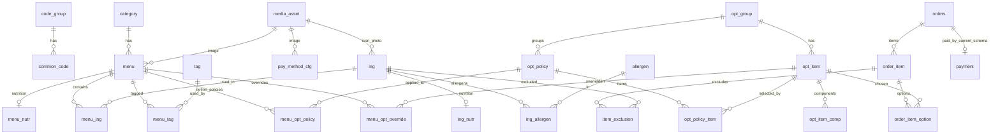

# ASAK DB 설계 테이블 정의서

> **2026-08-19 옵션 중복 정리:** `opt_item` 에 같은 그룹·같은 이름이 두 벌씩(42쌍) 있던 것을
> 하나로 합쳤다. 157행 → **115행**. 주문 이력은 남긴 id 로 이관해 잃지 않았고 주문 총액도 변하지
> 않았다. 재발을 막으려고 `UNIQUE (opt_group_id, name)` 을 걸었다.
> 경위와 검증: `ASAK-back/docs/duplicate-option-cleanup-plan-2026-08-19.md`
>
> **2026-08-19 실측 동기화:** 운영 DB(`asak_db`)에서 `SHOW CREATE TABLE` 로 직접 읽어 갱신했다.
> 실제 테이블은 **26개**이며, 이전 판의 "22테이블"과 레거시 테이블 이름은 short-name 마이그레이션
> 이전 기준이라 실제와 달랐다. DDL 정본: `ASAK-back/docs/아삭_mysql.sql` ·
> 대조 내역: `ASAK-back/docs/schema-doc-drift-2026-08-19.md`
>
> **2026-08-18 Hub:** DB 탭은 원격 ERD를 오래된 스냅샷으로 덮지 않는다. 뷰 정본: [db-view-definition.md](db-view-definition.md). `device_event` 테이블은 코드/ERD에 없음.
> Notion 05. DB 설계 · MySQL 3NF · `asak-data/seed/manifest.json`

## ERD (요약)

실제 외래키 기준이다. `common_code` 참조(단위·역할·상태·타입 코드)는 거의 모든 테이블에
붙으므로 요약에서 생략했다.



## 26테이블 정의

`이전 이름`은 short-name 마이그레이션 전 명칭이다. 실제 DB의 외래키 제약 이름이 옛 이름을
그대로 보존하고 있어(예: `ing` 의 FK 가 `fk_ingredient_type`) 대응을 확인할 수 있었다.
문서·Notion·시드 manifest에서 옛 이름을 보면 이 표로 옮겨 읽는다.

연계 REQ 는 2026-08-19 에 [requirements-definition.md](requirements-definition.md) 의 요구사항 내용과
대조해 다시 매핑했다. 이전 판은 재료·옵션 테이블 다섯 개가 모두 `FWD-MENU-003` 으로 묶여 있었는데
그 REQ 는 "메뉴 대표 이미지 제공"이라 해당 테이블과 무관했다. 근거가 약한 항목은 `후보:` 로 표시했고
확정하지 않았다.

| # | 테이블 | 설명 | 연계 REQ | 이전 이름 |
|---|--------|------|----------|-----------|
| 1 | `category` | 카테고리 마스터. `name` UNIQUE | FWD-MENU-006 | — |
| 2 | `code_group` | 공통코드 그룹. `group_code` UNIQUE | 후보: 없음 (재확인 필요) | — |
| 3 | `common_code` | 공통코드 상세. `(code_grp_id, code)` UNIQUE | 후보: 없음 (재확인 필요) | — |
| 4 | `tag` | 메뉴 태그 마스터. `code` UNIQUE | FWD-MENU-013 | — |
| 5 | `menu` | 판매 메뉴 마스터. `image_asset_id` FK, `deleted_at` soft delete | FWD-MENU-001 · LMIS-MENU-004 | — |
| 6 | `menu_tag` | 메뉴-태그 N:M. `(menu_id, tag_id)` UNIQUE | FWD-MENU-013 | — |
| 7 | `menu_nutr` | 메뉴 영양정보. `menu_id` UNIQUE (메뉴당 1행) | FWD-MENU-009 | `menu_nutrition` |
| 8 | `ing` | 재료 마스터. `name` UNIQUE, `icon_asset_id`·`photo_asset_id` FK. `sold_out` 보유 | FWD-MENU-007 · LMIS-MENU-001 | `ingredient` |
| 9 | `ing_nutr` | 재료 영양정보. `ing_id` UNIQUE (재료당 1행) | 후보: FWD-MENU-014 · FWD-MENU-009 | — (신규) |
| 10 | `allergen` | 알레르기 마스터. `name` UNIQUE | FWD-MENU-008 | — |
| 11 | `ing_allergen` | 재료-알레르기 N:M. `(ing_id, allergen_id)` UNIQUE | FWD-MENU-008 | `ingredient_allergen` |
| 12 | `menu_ing` | 메뉴 기본 재료. `(menu_id, ing_id, role_id)` UNIQUE. `can_remove` 로 제외 가능 여부 | FWD-MENU-007 | `menu_ingredient` |
| 13 | `opt_group` | 옵션그룹 마스터 | 후보: FWD-MENU-002 · FWD-MENU-010 | `option_group` |
| 14 | `opt_policy` | 옵션 정책. `policy_key` UNIQUE, 필수·최소·최대 선택 수 보유 | 후보: FWD-MENU-002 · FWD-MENU-010 | — (신규) |
| 15 | `opt_policy_item` | 정책에 속한 옵션 항목. `(policy_id, opt_item_id)` UNIQUE. `recommended` 기본값 | FWD-MENU-015 | `menu_option` 의 공통 기본값 부분 |
| 16 | `menu_opt_policy` | 메뉴-옵션정책 연결. `(menu_id, policy_id)` UNIQUE | 후보: FWD-MENU-002 · FWD-MENU-010 | `menu_option_policy` (시드의 `menu_option_group`) |
| 17 | `menu_opt_override` | 메뉴별 옵션 항목 오버라이드. `(menu_id, opt_item_id)` UNIQUE. `recommended` 예외값 | FWD-MENU-015 | `menu_option` 의 메뉴별 예외 부분 |
| 18 | `opt_item` | 옵션 선택 항목. `add_price` 추가금. `sold_out` 보유. `(opt_group_id, name)` UNIQUE | FWD-MENU-010 · LMIS-MENU-001 | `option_item` |
| 19 | `opt_item_comp` | 세트 옵션 구성품 | LMIS-MENU-006 | `option_item_component` |
| 20 | `media_asset` | 이미지 자산(Cloudinary 등). `(provider_id, public_id)` UNIQUE | FWD-MENU-003 | — (신규) |
| 21 | `pay_method_cfg` | 결제수단 설정. `method_id` UNIQUE, `image_asset_id` FK | LMIS-PAY-001 · FWD-PAY-001 | `payment_method_config` |
| 22 | `orders` | 주문 헤더. `order_no` UNIQUE, `canceled_at` 취소 시각 | FWD-ORDER-001 · LMIS-ORDER-004 | — |
| 23 | `order_item` | 주문 메뉴 단위. `price` 는 옵션 포함 단가 | 후보: LMIS-ORDER-002 | — |
| 24 | `order_item_option` | 선택 옵션. `(order_item_id, opt_item_id)` UNIQUE | 후보: FWD-CART-001 · LMIS-ORDER-006 | — |
| 25 | `item_exclusion` | 제외 재료. `(order_item_id, ing_id)` UNIQUE | FWD-MENU-007 · LMIS-ORDER-006 | — |
| 26 | `payment` | 결제 시도 내역. **현재 DB**는 `order_id` 일반 인덱스(`idx_payment_order_id`), `idempotency_key` UNIQUE | FWD-PAY-002 · KSD-PAY-001 | 주문 1건당 여러 결제 시도 허용 |
| 27 | `payment_refund` | payment별 환불 이력. `payment_id` FK, provider 취소 거래 키 UNIQUE | 환불 이력 설계 | **2026-08-26 SQL 적용 완료** |

### 결제 멱등성 키

`payment.idempotency_key` 는 `VARCHAR(64) NOT NULL UNIQUE` 이고 **DB 기본값이 없다.**
결제 승인 요청마다 클라이언트가 UUID 를 만들어 보내고(`ApprovePaymentRequest.idempotencyKey`),
서버가 그대로 저장한다. 네트워크 단절 뒤 재시도가 와도 같은 키면 UNIQUE 제약이 중복 결제를 막는다.
같은 키인데 `order_id` 나 결제수단이 다르면 `IDEMPOTENCY_KEY_CONFLICT`(409) 로 거절한다
(`UserPayService.validateSameRequest`).

수동으로 `payment` 에 INSERT 할 때 이 컬럼을 빠뜨리면
`Field 'idempotency_key' doesn't have a default value` 로 실패한다.

### 결제 재시도·환불 이력 migration 적용 결과 (2026-08-26)

사용자 확인에 따라 아래 SQL 초안은 모두 실행됐다. 현재 DB는 주문 한 건당 여러 결제 시도를 허용하고, 토스 `cancels[]`처럼 복수 환불 이력을 `payment_refund`에 저장할 수 있다.

```text
orders 1 ── 0..N payment 1 ── 0..N payment_refund
```

| 대상 | 적용된 변경 | 목적 |
|---|---|---|
| `payment` | `order_id` UNIQUE 제거 후 일반 조회 인덱스 `idx_payment_order_id` 생성 | 주문 한 건의 여러 결제 시도 허용 |
| `payment` | `provider`를 추가한 뒤 마지막 SQL에서 제거 | **현재 컬럼 없음**. 실제 PG 연동 전 재도입 여부를 별도로 결정 |
| `payment_refund` | `payment_id`, `amount`, `reason`, `provider_cancel_transaction_key`, `refunded_at`, `created_at` 생성 | 전액/부분 환불의 건별 이력 보관 |
| `payment` | 기존 `refunded_at` 값을 `payment_refund`로 백필한 뒤 `refunded_at` 삭제 | 환불 시각의 소유권을 이력 테이블로 이동 |

`payment_refund.provider_cancel_transaction_key`는 토스 `cancels[].transactionKey`에 대응하며 UNIQUE다. 원 결제의 `paymentKey`와 환불 거래 키는 같은 값이 아니므로 분리한다. 다만 현재 `payment`에는 `provider`와 원 결제 키 컬럼이 없으므로, 실제 토스 연동 전 `provider`, `provider_payment_key`, 환불 잔액 정책을 별도 migration으로 확정해야 한다. (`결정 필요`)

환불 코드(`AdminPaymentMapper` / `AdminRefundTransactionService`)는 `payment_refund` INSERT와 payment `REFUNDED` 갱신을 가정한다. HTTP·실PG·E2E는 **미검증**.

### 환불 사유 마스터 seed (2026-08-28)

> 상태: **SQL 파일 존재 · DB 적용 미검증**. 경로: `ASAK-back/docs/migrations/20260828_refund_reason_codes.sql`

| `code_group.group_code` | `common_code.code` | 표시명 | 비고 |
|---|---|---|---|
| `REFUND_REASON` | `CUSTOMER_REQUEST` | 고객 요청 | |
| | `WRONG_ORDER` | 잘못된 주문 | |
| | `OUT_OF_STOCK` | 재료/메뉴 품절 | |
| | `DUPLICATE_PAYMENT` | 중복 결제 | |
| | `OTHER` | 기타 | PATCH refund 시 `refundReasonDetail` 필수 |

`GET /api/admin/refund-reasons`는 활성(`active=1`) 코드만 `sort_no`, `id` 순으로 반환한다. `OTHER`는 응답 `requiresDetail=true`.

### 이미지 자산 참조

이미지는 `media_asset` 한 곳에 모으고 각 테이블은 ID 만 참조한다.

| 참조 컬럼 | 대상 |
|---|---|
| `menu.image_asset_id` | 메뉴 대표 이미지 |
| `ing.icon_asset_id` | 재료 아이콘 |
| `ing.photo_asset_id` | 재료 사진 |
| `pay_method_cfg.image_asset_id` | 결제수단 이미지 |

`menu.image_url` 은 이관 확인용으로 당분간 유지한다. 배경과 전환 기준은
`ASAK-back/docs/menu-image-asset-flow.md` 참고.

## 시드 manifest 수치 (v2)

아래는 **레거시 테이블 이름과 시드 시점 건수**다. 운영 DB의 현재 행 수와는 다르다.
실제 건수가 필요하면 운영 DB를 직접 조회한다.

> **주의 (2026-08-19):** 이 표의 수치가 실제 시드 manifest 어느 쪽과도 일치하지 않는다.
> 여러 버전이 섞여 있다.
>
> | 항목 | 이 표 | `seed/manifest.json` (v2) | `seed-v3/manifest.json` |
> |---|---|---|---|
> | `menu` | 84 | 50 | 73 |
> | `menu_ingredient` / `menu_ing` | 578 | 347 | 405 |
> | `menu_option_group` | 467 | 279 | 467 (legacy 스냅샷) |
> | `menu_option` | 9,166 | 5,449 | 9,166 (legacy 스냅샷) |
> | `category` | 6 | 6 | 8 |
> | `ingredient_allergen` / `ing_allergen` | 108 | 108 | 119 |
>
> 옵션 두 항목은 v3 의 legacy 스냅샷과 같고 나머지는 v2 와 섞여 있다. 어느 시점 기준인지
> 확정되지 않아 수치는 그대로 뒀다. 시드 건수가 필요하면 이 표 대신
> `asak-data/seed/manifest.json` 또는 `asak-data/seed-v3/manifest.json` 을 직접 볼 것.

| 엔티티 | 건수 |
|--------|------|
| `category` | 6 |
| `code_group` | 10 |
| `common_code` | 32 |
| `tag` | 3 |
| `menu` | 84 |
| `menu_tag` | 21 |
| `menu_nutrition` | 84 |
| `ingredient` | 90 |
| `allergen` | 14 |
| `ingredient_allergen` | 108 |
| `menu_ingredient` | 578 |
| `option_group` | 7 |
| `menu_option_group` | 467 |
| `menu_option` | 9,166 |
| `option_item` | 157 |
| `option_item_component` | 0 |
| `payment_method_config` | 1 |

> 주문 5테이블(`orders`~`payment`)은 설계 포함·시드 미포함이었다. 현재는 운영 DB에 주문 데이터가 쌓여 있다.

### 레거시 `menu_option` / `menu_option_group` 이 간 곳

시드의 `menu_option`(9,166건)은 메뉴 × 옵션항목 조합마다 한 행을 두고 추천·기본·정렬·활성 값을
저장했다. 현재는 그 역할이 **공통 정책 기본값 `opt_policy_item` + 메뉴별 예외 `menu_opt_override`**
둘로 나뉘어 있다. `vw_menu_opt_resolved` 가 둘을 합쳐 원래 형태로 되돌려 준다.

```sql
COALESCE(mo.recommended, opi.recommended) AS recommended
COALESCE(mo.is_default,  opi.is_default)  AS is_default
COALESCE(mo.sort_no,     opi.sort_no)     AS sort_no
COALESCE(mo.active,      opi.active)      AS active
-- opi = opt_policy_item (정책 기본값), mo = menu_opt_override (메뉴별 예외)
```

정책으로 공통화하고 예외만 남긴 결과 9,166건이 `opt_policy` 82건 + `opt_policy_item` 734건으로
줄었고, 메뉴별 예외를 담는 `menu_opt_override` 는 현재 **0행**이다(아직 예외가 없다는 뜻이며,
구조상 필요할 때 쓰인다). `menu_option_group`(467건)은 `menu_opt_policy`(324행)에 해당한다.
외래키 이름 `fk_menu_option_policy_menu` / `_policy` 가 근거다.

> 행 수는 2026-08-19 운영 DB 실측이다. `SHOW CREATE TABLE` 의 `AUTO_INCREMENT` 값은 다음 발급
> 번호일 뿐 행 수가 아니다(`opt_policy_item` 은 AUTO_INCREMENT 1469 / 실제 734행). 행 수가
> 필요하면 반드시 `COUNT(*)` 로 확인할 것.

`FWD-MENU-015` 는 아직 "메뉴별로 다른 추천 드레싱을 `menu_option.is_recommended` 기준으로
표시한다"고 적혀 있다. 지금 읽을 곳은 `menu_opt_override.recommended`(없으면
`opt_policy_item.recommended`)다.

시드 데이터가 이 대응을 그대로 보여준다. `asak-data/seed-v3/` 는 short-name 정본 시드이며
레거시 스냅샷을 파일로 남겨 뒀다.

| seed-v3 파일 | 건수 | 뜻 |
|---|---|---|
| `menu_opt_legacy_20260710.json` | 9,166 | 레거시 `menu_option` 스냅샷 |
| `menu_opt_grp_legacy_20260710.json` | 467 | 레거시 `menu_option_group` 스냅샷 |
| `opt_policy.json` | 82 | 재편 후 정책 |
| `opt_policy_item.json` | 734 | 재편 후 정책별 옵션 항목 |
| `menu_opt_policy.json` | 279 | 재편 후 메뉴-정책 연결 |
| `menu_opt_override.json` | 0 | 재편 시점에는 예외 없음 |

파일명의 `20260710` 이 재편 시점이다. 옵션 구조 재편 자체의 SQL 스크립트는
`asak-data/scripts/migrations/` 에 없다(그 폴더에는 2026-08-11~12 의 영양정보 분리·미디어 자산
마이그레이션만 있다). 구조 대응은 위 시드와 `vw_menu_opt_resolved` 로 확인되므로 읽기·구현에는
문제가 없다.

### 신규 테이블의 출처

| 테이블 | 마이그레이션 |
|---|---|
| `ing_nutr` | `asak-data/scripts/migrations/20260811_split_ing_nutrition.sql` (재료에서 영양정보 분리) |
| `media_asset` | `asak-data/scripts/migrations/20260812_create_media_asset.sql` |

### 결정 필요

**시드를 처음부터 다시 만들 계획이 있다면** 9,166건을 정책 82개와 항목 734개로 나눈 분류 기준을
먼저 정해야 한다. 결과 데이터는 남아 있으나 그 규칙을 적용한 스크립트가 없다.

`code_group`, `common_code` 는 연계 REQ 를 찾지 못했다. 이전 판은 `KSD-ARCH-001` 로 적었으나
그 요구사항은 "데이터는 Spring Boot를 통해서만 접근"이라는 비기능 항목이라 공통코드 테이블과
직접 관계가 없다. 요구사항을 새로 쓰거나 매핑을 비워두는 편이 낫다.

`후보:` 로 표시한 항목들은 담당자 확인이 필요하다.

## MVP 우선순위

**필수**: `category`, `code_group`, `common_code`, `menu`, `ing`, `menu_ing`, `opt_group`,
`opt_policy`, `opt_policy_item`, `menu_opt_policy`, `opt_item`, `orders`, `order_item`,
`order_item_option`, `item_exclusion`, `payment`, `pay_method_cfg`

**확장**: `tag`, `menu_tag`, `menu_nutr`, `ing_nutr`, `ing_allergen`, `allergen`,
`opt_item_comp`, `menu_opt_override`, `media_asset`

## 컬럼·제약조건 정본

이 문서는 테이블 목록과 관계를 다룬다. 컬럼 타입, 기본값, 인덱스, 외래키 이름까지 정확한 정의는
`ASAK-back/docs/아삭_mysql.sql` 이 정본이다. 그 파일은 운영 DB 실측본이며
`ASAK-back/docs/tools/schema_sync.py` 로 재생성·검증할 수 있다.

외래키 제약 이름은 옛 테이블 이름을 쓰는 것이 많다(`fk_ingredient_type`,
`fk_payment_method_config_method` 등). `ALTER TABLE ... DROP FOREIGN KEY` 를 쓸 때는
테이블 이름에서 유추하지 말고 실측본의 이름을 확인한다.

## DB 뷰 (읽기 모델)

운영·API용 VIEW 목록·컬럼·품절/JSON 규칙은 **[db-view-definition.md](db-view-definition.md)** 참고.
DDL/주석 원본: `ASAK-back/docs/view.sql` · DevCopilot 동기화: `asak-data/scripts/sync_devcopilot_views.py`.
