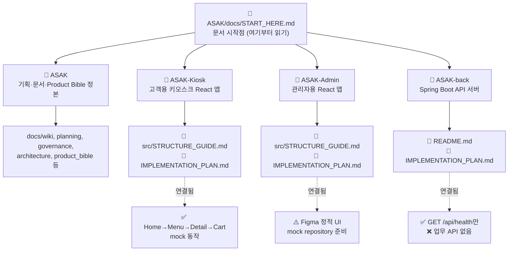
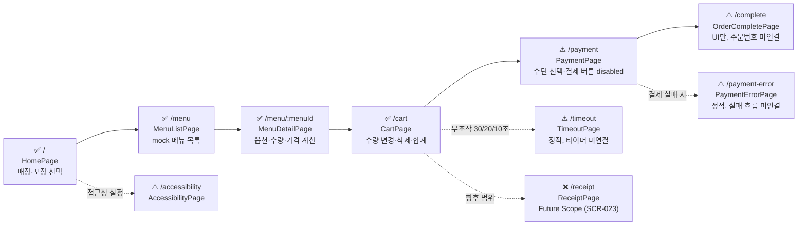
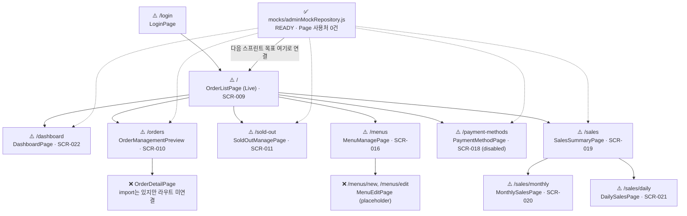
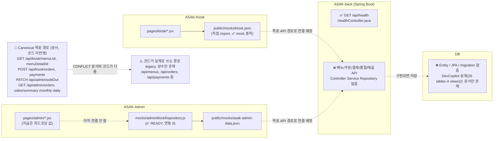
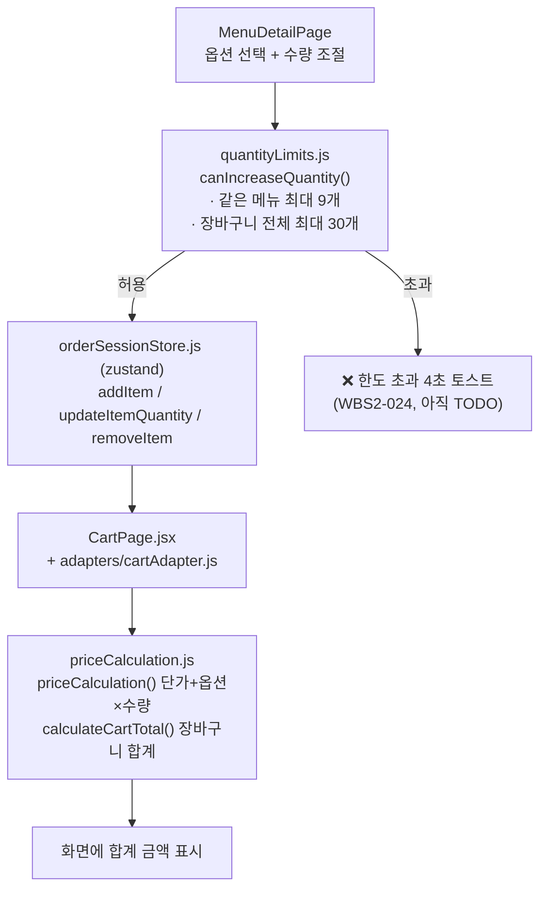
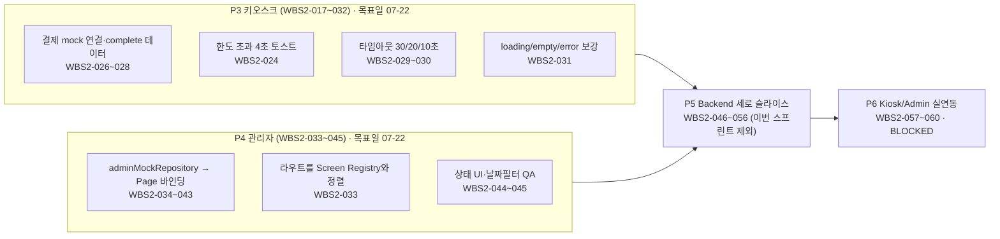

# ASAK 전체 흐름도 (Mermaid)

> 기준일: **2026-07-20** · 코드 실측 기준 (문서 주장이 아니라 실제 파일/라우트를 확인함).
> 문서 입구: [START_HERE](../START_HERE.md)
> 이 문서는 **그림으로 보는 요약**입니다. 상태 표로 자세히 보려면 [Current Implementation Map](../planning/current-implementation-map-2026-07-16.md), 코드-문서 충돌은 [Document–Code Gap Report](../architecture/document-code-gap-report-2026-07-16.md), 할 일은 [WBS 2.0](wbs-v2-2026-07-16.md)을 보세요.

## 범례 (모든 그림 공통)

| 표시 | 의미 |
|---|---|
| ✅ | mock으로 화면까지 동작함 (버튼 누르면 실제로 움직임) |
| ⚠️ | 화면(UI)만 있고 데이터/흐름은 아직 안 붙음 |
| ❌ | 코드가 아예 없거나, 라우트에 연결이 안 됨 |
| 📄 | 문서 (코드 아님) |

> 초보자용 팁: ✅는 "만져보면 동작", ⚠️는 "보이기는 하는데 눌러도 안 움직임", ❌는 "아직 없음"이라고 이해하면 됩니다.

---

## 1. 저장소·문서 구조

이 프로젝트는 코드 저장소 3개 + 문서 저장소 1개, 총 4개로 나뉩니다. 모든 문서는 `ASAK/docs/START_HERE.md` 한 곳에서 시작합니다.

**어디서 뭘 하나?**
- `ASAK` (문서 저장소): 기획, WBS, Canonical 계약, Product Bible을 관리합니다. 앱 코드는 없습니다.
- `ASAK-Kiosk` / `ASAK-Admin`: 실제 화면 코드(React)가 있는 곳입니다.
- `ASAK-back`: Spring Boot 서버 코드가 있는 곳인데, 지금은 헬스체크(`/api/health`)만 동작합니다.

관련 문서: [Kiosk 구조 가이드](../../ASAK-Kiosk/src/STRUCTURE_GUIDE.md) · [Kiosk 구현 계획](../../ASAK-Kiosk/IMPLEMENTATION_PLAN.md) · [Admin 구조 가이드](../../ASAK-Admin/src/STRUCTURE_GUIDE.md) · [Admin 구현 계획](../../ASAK-Admin/IMPLEMENTATION_PLAN.md) · [Backend 구현 계획](../../ASAK-back/IMPLEMENTATION_PLAN.md)

---

## 2. 고객 키오스크 주문 흐름

`ASAK-Kiosk/src/apps/kiosk/KioskApp.jsx`의 `<Routes>`를 그대로 따라간 그림입니다. Home부터 장바구니까지는 실제로 mock 데이터로 움직이고, 결제부터는 화면만 있고 아직 안 움직입니다.

**핵심 근거 파일**
- 라우트 정의: `ASAK-Kiosk/src/apps/kiosk/KioskApp.jsx`
- 장바구니 상태 유지: `ASAK-Kiosk/src/store/orderSessionStore.js` (zustand — 화면을 이동해도 값이 유지됨)

관련 WBS: `WBS2-017~032` (P3 키오스크) · 자세한 라우트 표는 [Kiosk 구조 가이드](../../ASAK-Kiosk/src/STRUCTURE_GUIDE.md) 참고.

---

## 3. 관리자 운영 흐름

`ASAK-Admin/src/apps/AdminApp.jsx`가 URL을 화면에 연결합니다. 전부 Figma 정적 화면이며, `adminMockRepository.js`는 준비돼 있지만 **어느 화면도 아직 이걸 쓰지 않습니다** (연동 0건).

**핵심 근거 파일**
- 라우트 정의: `ASAK-Admin/src/apps/AdminApp.jsx`
- mock 유일한 입구: `ASAK-Admin/src/mocks/adminMockRepository.js` (화면은 이 파일이 아니라 하드코딩 값을 아직 씀)

관련 WBS: `WBS2-033~045` (P4 관리자) · 자세한 라우트 표는 [Admin 구조 가이드](../../ASAK-Admin/src/STRUCTURE_GUIDE.md) 참고.

---

## 4. 데이터/API 목표 흐름 (Kiosk·Admin → API → DB)

지금은 화면 → API → DB로 이어지는 실제 연결이 **거의 없습니다.** Kiosk/Admin은 둘 다 화면이 mock JSON 파일을 직접 읽고, 백엔드는 헬스체크만 동작합니다. 아래 그림은 "지금 코드가 쓰는 경로(legacy)"와 "문서가 정한 목표 경로(Canonical)"를 함께 보여줍니다.

**꼭 알아야 할 충돌 (Canonical vs 코드)**
- API 경로: 문서(Canonical)는 `/api/kiosk/menuList`처럼 앞에 `kiosk`/`admin`을 붙이지만, 코드 상수는 아직 `/api/menus`처럼 짧은 legacy 경로입니다.
- 금액 필드: 문서는 `totalAmount`, `approvedAmount`를 쓰지만, 지금 `orderSessionStore`는 `totalPrice` 같은 이름을 씁니다. 나중에 adapter에서 이름만 맞출 계획입니다.
- 백엔드: 위 API들은 전부 **목표**이고, 지금 실제로 동작하는 건 `GET /api/health` 하나뿐입니다.

자세한 표: [Document–Code Gap Report](../architecture/document-code-gap-report-2026-07-16.md) · [Canonical Contract Decisions](../governance/canonical-contract-decisions-2026-07-16.md) · [Backend 구현 계획](../../ASAK-back/IMPLEMENTATION_PLAN.md)

---

## 5. 가격·수량·장바구니 흐름

메뉴 상세 화면에서 옵션·수량을 고를 때 "얼마인지"와 "몇 개까지 되는지"를 계산하는 흐름입니다. 이 두 계산은 각각 **파일 하나가 단일 기준**이라서, 다른 곳에서 같은 계산을 다시 만들면 안 됩니다.

**핵심 규칙 (건드리지 말 것)**
1. 가격 계산은 `ASAK-Kiosk/src/utils/priceCalculation.js`만 사용합니다.
2. 수량 한도(메뉴당 9개·장바구니 30개)는 `ASAK-Kiosk/src/utils/quantityLimits.js`만 사용합니다.
3. 한도를 넘기면 `MENU_LIMIT`/`CART_LIMIT` 코드만 돌려주고, 안내 문구(toast)는 화면 쪽에서 4초간 보여줘야 하는데 이 부분은 아직 구현 전입니다 (`WBS2-024`).

---

## 6. 이번 스프린트 WBS 흐름 (P3 Kiosk / P4 Admin)

지금 스프린트(2026-07-20 ~ 07-22)는 **화면을 새로 만드는 게 아니라, 이미 있는 화면에 로직/mock을 연결**하는 작업입니다. Backend(P5)와 실연동(P6)은 이번 스프린트 범위 밖입니다.

**지금 스프린트에서 하지 말 일:** CSS/시안 통째 교체, `priceCalculation`/`quantityLimits` 되돌리기, Admin 기능을 Kiosk 저장소에 새로 만들기, Backend 실연동 먼저 시작하기.

관련 문서: [WBS 2.0 (정본)](wbs-v2-2026-07-16.md) · [WBS 상태 메모](wbs-status-notes.md) · [프론트 3일 실행표](../planning/frontend-wednesday-wbs-2026-07-20.md)

---

## 참고 문서 모음

| 문서 | 용도 |
|---|---|
| [START_HERE](../START_HERE.md) | 문서 전체 입구 |
| [현재 상태 baseline](current-status-baseline.md) | 오늘 기준 구현 현실 1순위 |
| [Current Implementation Map](../planning/current-implementation-map-2026-07-16.md) | 화면·mock·API 상태표 |
| [Document–Code Gap Report](../architecture/document-code-gap-report-2026-07-16.md) | Canonical vs 코드 충돌 상세 |
| [WBS 2.0](wbs-v2-2026-07-16.md) | 실행 할 일 정본 |
| [Kiosk 구조 가이드](../../ASAK-Kiosk/src/STRUCTURE_GUIDE.md) · [구현 계획](../../ASAK-Kiosk/IMPLEMENTATION_PLAN.md) | Kiosk 코딩 시작점 |
| [Admin 구조 가이드](../../ASAK-Admin/src/STRUCTURE_GUIDE.md) · [구현 계획](../../ASAK-Admin/IMPLEMENTATION_PLAN.md) | Admin 코딩 시작점 |
| [Backend 구현 계획](../../ASAK-back/IMPLEMENTATION_PLAN.md) | Backend 코딩 시작점 |

## Documentation status

- Status: **Current (2026-07-20)** — 코드 실측(`KioskApp.jsx`, `AdminApp.jsx`, `orderSessionStore.js`, `adminMockRepository.js`, `priceCalculation.js`, `quantityLimits.js`, `HealthController.java` 확인) 기준으로 작성.
- 이 문서는 그림(흐름도) 전용 요약이며, 상태 판정의 정본은 [Current Implementation Map](../planning/current-implementation-map-2026-07-16.md)입니다. 표와 그림이 다르면 표를 따르세요.
