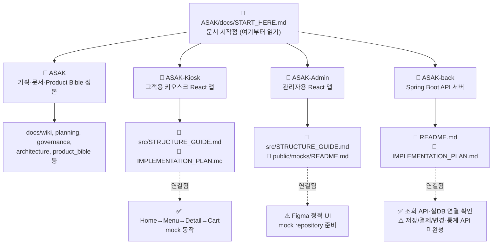
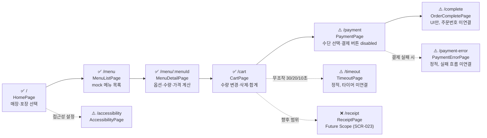
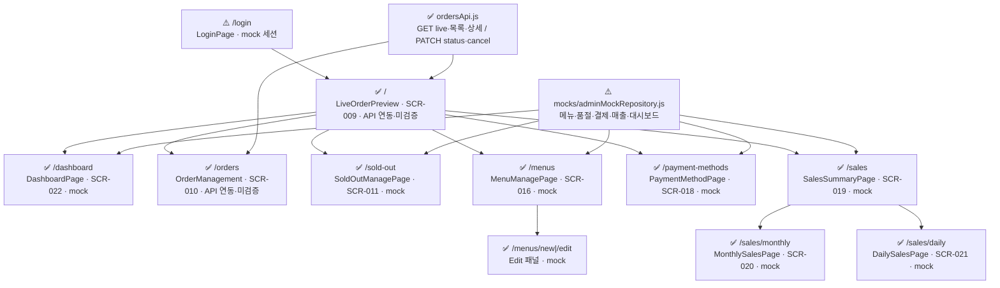
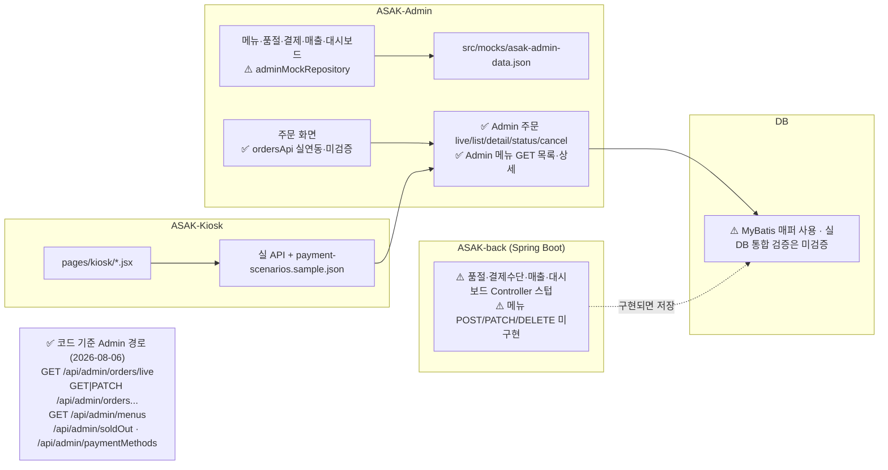
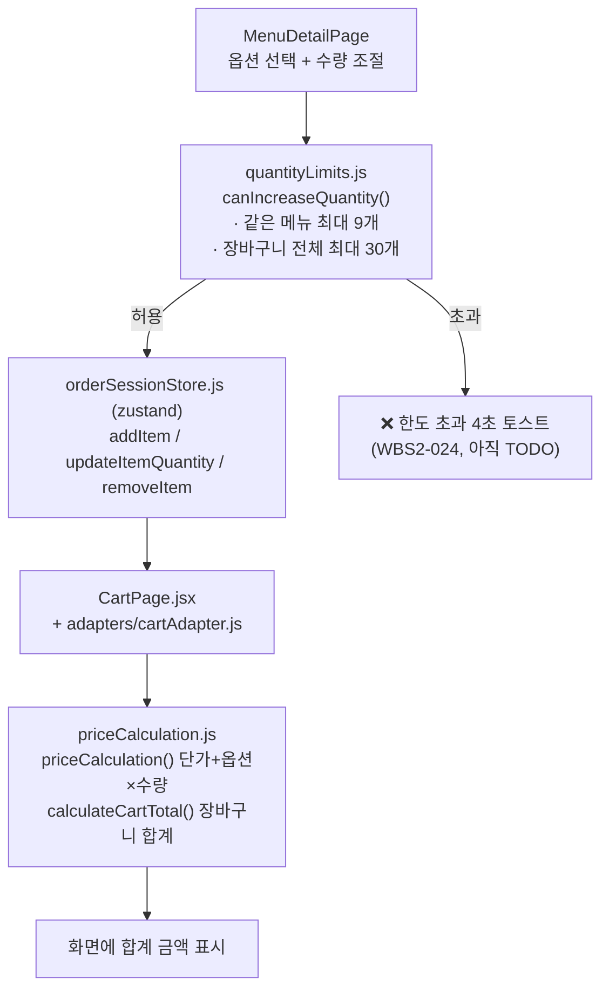
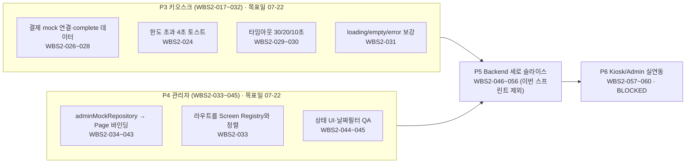

# ASAK 전체 흐름도 (Mermaid)

> 기준일: **2026-08-07** · 코드 실측 기준 (문서 주장이 아니라 실제 파일/라우트를 확인함).
> Admin: 주문(Live·목록·상태·취소) API 연동 **구현됨·미검증**, 메뉴/품절/결제/매출/대시보드는 mock 또는 BE 스텁.
> **이번 주:** Kiosk 장바구니→주문→결제 실연동 · Admin 메뉴 CRUD→품절→결제수단→매출 순.
> 상세: [admin-todo-checklist](../planning/admin-todo-checklist-2026-08-05.md) · [검증 투두](../planning/admin-feature-verify-todos-2026-08-06.md) · [회의록](../operations/meeting-minutes/README.md) · [동기화 보고서](../ai-reports/2026-08-06/asak-doc-sync-admin-devcopilot.md)
> 문서 입구: [START_HERE](../START_HERE.md)
> 상태 표: [구현 맵](../planning/current-implementation-map-2026-07-16.md) · 문서↔코드 차이: [gap report](../architecture/document-code-gap-report-2026-07-16.md) · 할 일: [작업 분해표](wbs.md)

## 범례 (모든 그림 공통)

| 표시 | 의미 |
|---|---|
| ✅ | mock으로 화면까지 동작함 (버튼 누르면 실제로 움직임) |
| ⚠️ | 화면(UI)만 있고 데이터/흐름은 아직 안 붙음 |
| ❌ | 코드가 아예 없거나, 라우트에 연결이 안 됨 |
| 📄 | 문서 (코드 아님) |

> 초보자용 팁: ✅는 "만져보면 동작", ⚠️는 "보이기는 하는데 눌러도 안 움직임", ❌는 "아직 없음"이라고 이해하면 됩니다.

---

## 1. 저장소·문서 구조

이 프로젝트는 코드 저장소 3개 + 문서 저장소 1개, 총 4개로 나뉩니다. 모든 문서는 `ASAK/docs/START_HERE.md` 한 곳에서 시작합니다.

```mermaid
flowchart TB
    START["📄 ASAK/docs/START_HERE.md<br/>문서 시작점 (여기부터 읽기)"]

    START --> ASAK["📁 ASAK<br/>기획·문서·Product Bible 정본"]
    START --> KIOSK["📁 ASAK-Kiosk<br/>고객용 키오스크 React 앱"]
    START --> ADMIN["📁 ASAK-Admin<br/>관리자용 React 앱"]
    START --> BACK["📁 ASAK-back<br/>Spring Boot API 서버"]

    ASAK --> ASAK_DOC["docs/wiki, planning, governance,<br/>architecture, product_bible 등"]

    KIOSK --> KIOSK_DOC["📄 src/STRUCTURE_GUIDE.md<br/>📄 IMPLEMENTATION_PLAN.md"]
    ADMIN --> ADMIN_DOC["📄 src/STRUCTURE_GUIDE.md<br/>📄 public/mocks/README.md"]
    BACK --> BACK_DOC["📄 README.md<br/>📄 IMPLEMENTATION_PLAN.md"]

    KIOSK_DOC -. 연결됨 .-> KIOSK_CODE["✅ Home→Menu→Detail→Cart<br/>mock 동작"]
    ADMIN_DOC -. 연결됨 .-> ADMIN_CODE["⚠️ Figma 정적 UI<br/>mock repository 준비"]
    BACK_DOC -. 연결됨 .-> BACK_CODE["✅ 조회 API·실DB 연결 확인<br/>⚠️ 저장/결제/변경·통계 API 미완성"]
```

**어디서 뭘 하나?**
- `ASAK` (문서 저장소): 기획, WBS, 정본 계약, Product Bible을 관리합니다. 앱 코드는 없습니다.
- `ASAK-Kiosk` / `ASAK-Admin`: 실제 화면 코드(React)가 있는 곳입니다.
- `ASAK-back`: 로컬 폴더명은 유지하지만 실제 원격은 `nayeon0828/ASAK-backend`입니다. Kiosk 메뉴/카테고리 조회·장바구니 검증, Admin 메뉴·주문 조회 경로가 있고, 주문 저장·결제·상태변경/취소·품절·매출은 아직 미완성 또는 미구현입니다.

관련 문서: [Kiosk 구조 가이드](../../../ASAK-Kiosk/src/STRUCTURE_GUIDE.md) · [Kiosk 구현 계획](../../../ASAK-Kiosk/IMPLEMENTATION_PLAN.md) · [Admin 구조 가이드](../../../ASAK-Admin/src/STRUCTURE_GUIDE.md) · [Admin Mock 사전](../../../ASAK-Admin/public/mocks/README.md) · [Backend 구현 계획](../../../ASAK-back/IMPLEMENTATION_PLAN.md)
> Admin 루트 `IMPLEMENTATION_PLAN.md`는 **삭제됨** — 구조 지도·Mock 사전·중앙 WBS/맵을 본다.

---

## 2. 고객 키오스크 주문 흐름

`ASAK-Kiosk/src/apps/kiosk/KioskApp.jsx`의 `<Routes>`를 그대로 따라간 그림입니다. Home부터 장바구니까지는 실제로 mock 데이터로 움직이고, 결제부터는 화면만 있고 아직 안 움직입니다.

```mermaid
flowchart LR
    Home["✅ / <br/>HomePage<br/>매장·포장 선택"]
    Menu["✅ /menu<br/>MenuListPage<br/>mock 메뉴 목록"]
    Detail["✅ /menu/:menuId<br/>MenuDetailPage<br/>옵션·수량·가격 계산"]
    Cart["✅ /cart<br/>CartPage<br/>수량 변경·삭제·합계"]
    Payment["⚠️ /payment<br/>PaymentPage<br/>수단 선택·결제 버튼 disabled"]
    Complete["⚠️ /complete<br/>OrderCompletePage<br/>UI만, 주문번호 미연결"]
    PayError["⚠️ /payment-error<br/>PaymentErrorPage<br/>정적, 실패 흐름 미연결"]
    Timeout["⚠️ /timeout<br/>TimeoutPage<br/>정적, 타이머 미연결"]
    A11y["⚠️ /accessibility<br/>AccessibilityPage"]
    Receipt["❌ /receipt<br/>ReceiptPage<br/>Future Scope (SCR-023)"]

    Home --> Menu --> Detail --> Cart --> Payment
    Payment --> Complete
    Payment -. 결제 실패 시 .-> PayError
    Cart -. 무조작 30/20/10초 .-> Timeout
    Home -. 접근성 설정 .-> A11y
    Cart -. 향후 범위 .-> Receipt
```

**핵심 근거 파일**
- 라우트 정의: `ASAK-Kiosk/src/apps/kiosk/KioskApp.jsx`
- 장바구니 상태 유지: `ASAK-Kiosk/src/store/orderSessionStore.js` (zustand — 화면을 이동해도 값이 유지됨)

관련 WBS: `WBS2-017~032` (P3 키오스크) · 자세한 라우트 표는 [Kiosk 구조 가이드](../../../ASAK-Kiosk/src/STRUCTURE_GUIDE.md) 참고.

---

## 3. 관리자 운영 흐름

`ASAK-Admin/src/apps/AdminApp.jsx`가 URL을 화면에 연결합니다. **주문(Live·목록·상태·취소)은 `ordersApi` → BE**, 그 외(메뉴·품절·결제·매출·대시보드·로그인)는 아직 mock/스텁입니다 (mock ≠ DONE).

```mermaid
flowchart TB
    Login["⚠️ /login<br/>LoginPage · mock 세션"]
    Live["✅ /<br/>LiveOrderPreview · SCR-009 · API 연동·미검증"]
    Dashboard["✅ /dashboard<br/>DashboardPage · SCR-022 · mock"]
    Orders["✅ /orders<br/>OrderManagement · SCR-010 · API 연동·미검증"]
    SoldOut["✅ /sold-out<br/>SoldOutManagePage · SCR-011 · mock"]
    Menus["✅ /menus<br/>MenuManagePage · SCR-016 · mock"]
    MenuEdit["✅ /menus/new|/edit<br/>Edit 패널 · mock"]
    Payments["✅ /payment-methods<br/>PaymentMethodPage · SCR-018 · mock"]
    Sales["✅ /sales<br/>SalesSummaryPage · SCR-019 · mock"]
    Monthly["✅ /sales/monthly<br/>MonthlySalesPage · SCR-020 · mock"]
    Daily["✅ /sales/daily<br/>DailySalesPage · SCR-021 · mock"]

    Login --> Live
    Live --> Dashboard
    Live --> Orders
    Live --> SoldOut
    Live --> Menus --> MenuEdit
    Live --> Payments
    Live --> Sales
    Sales --> Monthly
    Sales --> Daily

    ApiOrders["✅ ordersApi.js<br/>GET live·목록·상세 / PATCH status·cancel"]
    ApiOrders --> Live
    ApiOrders --> Orders
    Mock["⚠️ mocks/adminMockRepository.js<br/>메뉴·품절·결제·매출·대시보드"]
    Mock --> Dashboard
    Mock --> SoldOut
    Mock --> Menus
    Mock --> Payments
    Mock --> Sales
```

**핵심 근거 파일**
- 라우트 정의: `ASAK-Admin/src/apps/AdminApp.jsx`
- 주문 API: `ASAK-Admin/src/api/ordersApi.js` · `useOrdersQuery.js` · `LiveOrderPreview.jsx`
- 나머지 mock 입구: `ASAK-Admin/src/mocks/adminMockRepository.js` (Page에서 JSON 직접 import 금지)
- 셸: 1920×1080 캔버스 + viewport scale · Shared AsyncState/Confirm

관련 WBS: `WBS2-033~045` (P4 관리자) · 자세한 라우트 표는 [Admin 구조 가이드](../../../ASAK-Admin/src/STRUCTURE_GUIDE.md) 참고.

---

## 4. 데이터/API 목표 흐름 (Kiosk·Admin → API → DB)

Kiosk는 메뉴·장바구니·주문은 실 API를 쓰고, 결제 시나리오 예시만 `public/mocks/payment-scenarios.sample.json`에 둡니다. Admin은 **주문 API만 실연동(미검증)** 이고, 메뉴·품절·결제·매출·대시보드는 `src/mocks`입니다. 백엔드는 Admin 주문(Live·목록·상세·상태·취소)과 메뉴 GET이 있고, 품절·결제수단·매출·대시보드는 Controller 스텁입니다.

```mermaid
flowchart LR
    subgraph K["ASAK-Kiosk"]
        K1["pages/kiosk/*.jsx"]
        K2["실 API + payment-scenarios.sample.json"]
        K1 --> K2
    end

    subgraph AD["ASAK-Admin"]
        A1["주문 화면<br/>✅ ordersApi 실연동·미검증"]
        A2["메뉴·품절·결제·매출·대시보드<br/>⚠️ adminMockRepository"]
        A3["src/mocks/asak-admin-data.json"]
        A1 --> B1
        A2 --> A3
    end

    subgraph B["ASAK-back (Spring Boot)"]
        B1["✅ Admin 주문 live/list/detail/status/cancel<br/>✅ Admin 메뉴 GET 목록·상세"]
        B2["⚠️ 품절·결제수단·매출·대시보드 Controller 스텁<br/>⚠️ 메뉴 POST/PATCH/DELETE 미구현"]
    end

    subgraph DB["DB"]
        D1["⚠️ MyBatis 매퍼 사용 · 실DB 통합 검증은 미검증"]
    end

    K2 --> B1
    B1 --> D1
    B2 -. 구현되면 저장 .-> D1

    CodePaths["✅ 코드 기준 Admin 경로 (2026-08-06)<br/>GET /api/admin/orders/live<br/>GET|PATCH /api/admin/orders...<br/>GET /api/admin/menus<br/>/api/admin/soldOut · /api/admin/paymentMethods"]
```

**꼭 알아야 할 충돌 (정본 vs 코드)**
- Admin 결제수단 path: 코드·Engineering Bible는 `/api/admin/paymentMethods`(camelCase). 일부 문서/구 DevCopilot은 `payment-methods`(kebab) — **2026-08-06 동기화는 코드 기준**.
- Live 주문: 코드 `GET /api/admin/orders/live` (구 DevCopilot `orders/active`는 코드에 맞춤 갱신).
- 품절 PATCH: 코드/TODO는 `{targetType,targetId,isSoldOut}` (구 DevCopilot `{menuId}`는 코드에 맞춤 갱신).
- 금액 필드: 문서는 `totalAmount`, `approvedAmount`를 쓰지만, 키오스크 `orderSessionStore`는 `totalPrice` 등 — adapter에서 맞춤.

자세한 표: [Document–Code Gap Report](../architecture/document-code-gap-report-2026-07-16.md) · [정본 계약 결정](../governance/canonical-contract-decisions-2026-07-16.md) · [Backend 구현 계획](../../../ASAK-back/IMPLEMENTATION_PLAN.md)

---

## 5. 가격·수량·장바구니 흐름

메뉴 상세 화면에서 옵션·수량을 고를 때 "얼마인지"와 "몇 개까지 되는지"를 계산하는 흐름입니다. 이 두 계산은 각각 **파일 하나가 단일 기준**이라서, 다른 곳에서 같은 계산을 다시 만들면 안 됩니다.

```mermaid
flowchart TB
    Detail["MenuDetailPage<br/>옵션 선택 + 수량 조절"]

    QL["quantityLimits.js<br/>canIncreaseQuantity()<br/>· 같은 메뉴 최대 9개<br/>· 장바구니 전체 최대 30개"]

    Detail --> QL
    QL -->|허용| Store["orderSessionStore.js (zustand)<br/>addItem / updateItemQuantity / removeItem"]
    QL -->|초과| Toast["❌ 한도 초과 4초 토스트<br/>(WBS2-024, 아직 TODO)"]

    Store --> Cart["CartPage.jsx<br/>+ adapters/cartAdapter.js"]
    Cart --> PC["priceCalculation.js<br/>priceCalculation() 단가+옵션×수량<br/>calculateCartTotal() 장바구니 합계"]
    PC --> Total["화면에 합계 금액 표시"]
```

**핵심 규칙 (건드리지 말 것)**
1. 가격 계산은 `ASAK-Kiosk/src/utils/priceCalculation.js`만 사용합니다.
2. 수량 한도(메뉴당 9개·장바구니 30개)는 `ASAK-Kiosk/src/utils/quantityLimits.js`만 사용합니다.
3. 한도를 넘기면 `MENU_LIMIT`/`CART_LIMIT` 코드만 돌려주고, 안내 문구(toast)는 화면 쪽에서 4초간 보여줘야 하는데 이 부분은 아직 구현 전입니다 (`WBS2-024`).

---

## 6. 이번 스프린트 WBS 흐름 (P3 Kiosk / P4 Admin)

지금 스프린트(2026-07-20 ~ 07-22)는 **화면을 새로 만드는 게 아니라, 이미 있는 화면에 로직/mock을 연결**하는 작업입니다. Backend(P5)와 실연동(P6)은 이번 스프린트 범위 밖입니다.

```mermaid
flowchart LR
    subgraph P3["P3 키오스크 (WBS2-017~032) · 목표일 07-22"]
        P3a["결제 mock 연결·complete 데이터<br/>WBS2-026~028"]
        P3b["한도 초과 4초 토스트<br/>WBS2-024"]
        P3c["타임아웃 30/20/10초<br/>WBS2-029~030"]
        P3d["loading/empty/error 보강<br/>WBS2-031"]
    end

    subgraph P4["P4 관리자 (WBS2-033~045) · 목표일 07-22"]
        P4a["adminMockRepository → Page 바인딩<br/>WBS2-034~043"]
        P4b["라우트를 Screen Registry와 정렬<br/>WBS2-033"]
        P4c["상태 UI·날짜필터 QA<br/>WBS2-044~045"]
    end

    P3 --> P5["P5 Backend 세로 슬라이스<br/>WBS2-046~056 (이번 스프린트 제외)"]
    P4 --> P5
    P5 --> P6["P6 Kiosk/Admin 실연동<br/>WBS2-057~060 · BLOCKED"]
```

**지금 스프린트에서 하지 말 일:** CSS/시안 통째 교체, `priceCalculation`/`quantityLimits` 되돌리기, Admin 기능을 Kiosk 저장소에 새로 만들기, Backend 실연동 먼저 시작하기.

관련 문서: [작업 분해표](wbs.md) · [WBS 상태 메모](wbs-status-notes.md) · [프론트 3일 실행표](../planning/frontend-wednesday-wbs-2026-07-20.md) *(Historical)*

---

## 참고 문서 모음

| 문서 | 용도 |
|---|---|
| [START_HERE](../START_HERE.md) | 문서 전체 입구 |
| [현재 상태 baseline](current-status-baseline.md) | 영역별 요약 |
| [구현 맵](../planning/current-implementation-map-2026-07-16.md) | SCR별 상세 |
| [Current Implementation Map](../planning/current-implementation-map-2026-07-16.md) | 화면·mock·API 상태표 |
| [Document–Code Gap Report](../architecture/document-code-gap-report-2026-07-16.md) | 정본 vs 코드 충돌 상세 |
| [작업 분해표](wbs.md) | 실행 할 일 정본 |
| [Kiosk 구조 가이드](../../../ASAK-Kiosk/src/STRUCTURE_GUIDE.md) · [구현 계획](../../../ASAK-Kiosk/IMPLEMENTATION_PLAN.md) | Kiosk 코딩 시작점 |
| [Admin 구조 가이드](../../../ASAK-Admin/src/STRUCTURE_GUIDE.md) · [Mock 사전](../../../ASAK-Admin/public/mocks/README.md) | Admin 코딩 시작점 (`IMPLEMENTATION_PLAN` 삭제됨) |
| [Backend 구현 계획](../../../ASAK-back/IMPLEMENTATION_PLAN.md) | Backend 코딩 시작점 |

## Documentation status

- Status: **Current (2026-07-20)** — 코드 실측(`KioskApp.jsx`, `AdminApp.jsx`, `orderSessionStore.js`, `adminMockRepository.js`, `priceCalculation.js`, `quantityLimits.js`, `HealthController.java` 확인) 기준으로 작성.
- 이 문서는 그림(흐름도) 전용 요약이며, 상태 판정의 정본은 [Current Implementation Map](../planning/current-implementation-map-2026-07-16.md)입니다. 표와 그림이 다르면 표를 따르세요.
