# ASAK 사용자 시나리오 명세

> Notion 03. 사용자 시나리오 · SC-001~024 (2026-07-06)

## 전체 주문 흐름

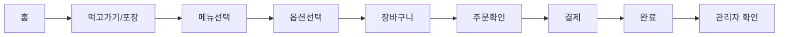
```mermaid
flowchart LR
    A[홈] --> B[먹고가기/포장]
    B --> C[메뉴선택]
    C --> D[옵션선택]
    D --> E[장바구니]
    E --> F[주문확인]
    F --> G[결제]
    G --> H[완료]
    H --> I[관리자 확인]
```

## 시나리오 목록 (24건)

### SC-001 신규 고객의 기본 주문 흐름 (FWD-UI-001)

- **시작**: ASAK 키오스크 화면 진입(처음 방문 고객)
- **종료**: 결제 완료 후 주문번호가 화면에 표시됨
- **기본 흐름**: 홈 → 먹고가기/포장 → 카테고리·메뉴 선택 → 옵션 선택 → 장바구니(SCR-005) → 주문 확인(SCR-006) → 결제(SCR-007) → 주문 완료(SCR-008)
- **예외**: 옵션이 헷갈려 이전 단계로 돌아가도 선택 내용이 유지됨 (사용자가 지적한 키오스크 취소 시 초기화 문제 개선)
- **상태**: 초안

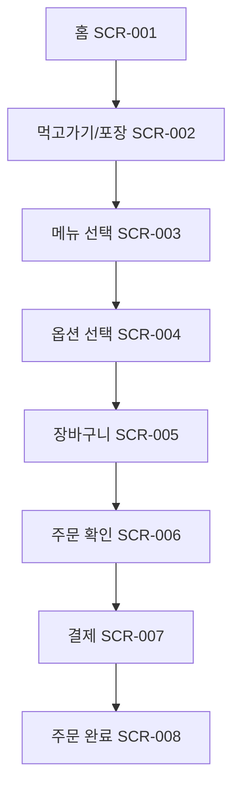
```mermaid
flowchart TD
    A[홈 SCR-001] --> B[먹고가기/포장 SCR-002]
    B --> C[메뉴 선택 SCR-003]
    C --> D[옵션 선택 SCR-004]
    D --> E[장바구니 SCR-005]
    E --> F[주문 확인 SCR-006]
    F --> G[결제 SCR-007]
    G --> H[주문 완료 SCR-008]
```

### SC-002 재방문 고객의 빠른 주문(속도 중심) (FWD-UI-001)

- **시작**: 재방문 고객이 키오스크 사용 시작
- **종료**: 결제 완료 및 주문번호 표시, 화면 전환 5회 이내 목표 (2026-07-05 수정: 4단계→5회, 주문확인 화면 반영)
- **기본 흐름**: 메뉴 선택 → 추천조합 기본값 → 장바구니(SCR-005) → 주문 확인(SCR-006) → 결제(SCR-007) → 완료(SCR-008)
- **예외**: 없음
- **상태**: 초안

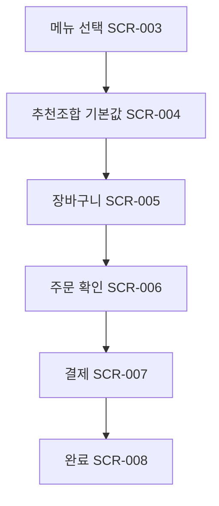
```mermaid
flowchart TD
    A[메뉴 선택 SCR-003] --> B[추천조합 기본값 SCR-004]
    B --> C[장바구니 SCR-005]
    C --> D[주문 확인 SCR-006]
    D --> E[결제 SCR-007]
    E --> F[완료 SCR-008]
```

### SC-003 품절 판매 항목이 포함된 상황에서의 주문 (FWD-PAY-002)

- **시작**: 관리자가 특정 재료 또는 옵션 항목을 품절 처리한 상태
- **종료**: 고객이 품절되지 않은 항목으로 주문 진행
- **기본 흐름**: 품절된 판매 항목은 회색 처리된 채 SOLD OUT 표시됨 → 선택 불가 → 고객이 다른 항목으로 대체 선택
- **예외**: 핵심 재료 또는 베이스 재료가 품절된 경우 해당 메뉴 또는 관련 카테고리 메뉴가 품절 표시됨
- **상태**: 초안

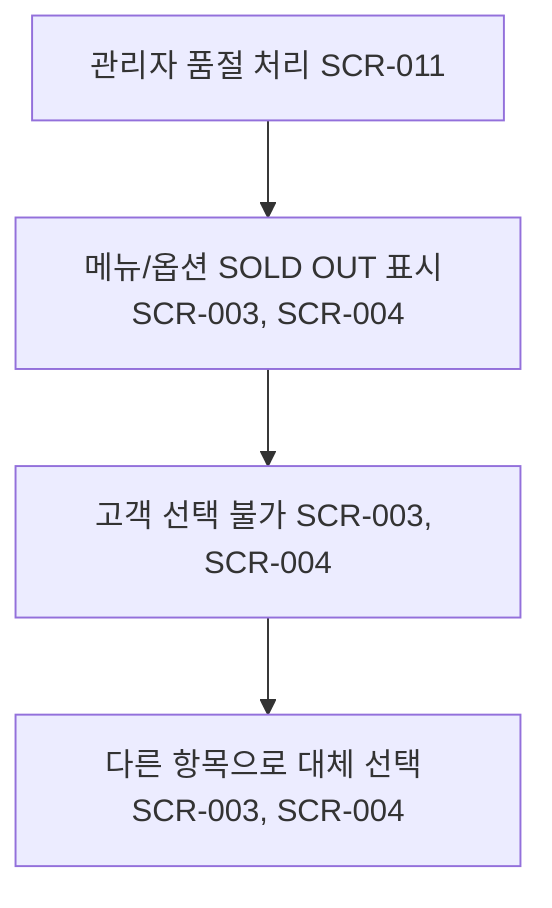
```mermaid
flowchart TD
    A[관리자 품절 처리 SCR-011] --> B[메뉴/옵션 SOLD OUT 표시 SCR-003, SCR-004]
    B --> C[고객 선택 불가 SCR-003, SCR-004]
    C --> D[다른 항목으로 대체 선택 SCR-003, SCR-004]
```

### SC-004 결제 성공 흐름(수단 노출 포함) (FWD-MENU-001)

- **시작**: 장바구니에 1개 이상 메뉴가 담겨있음
- **종료**: 결제 승인 완료 및 주문번호 표시
- **기본 흐름**: 장바구니(SCR-005) → 주문 확인(SCR-006) → API-005 주문 생성 → 결제(SCR-007) → 승인 → 주문 완료(SCR-008)
- **예외**: 없음(정상 흐름)
- **상태**: 초안

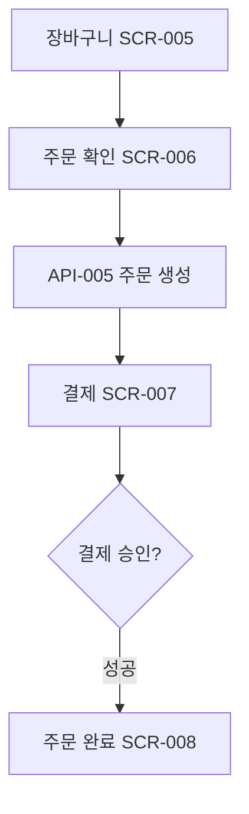
```mermaid
flowchart TD
    A[장바구니 SCR-005] --> B[주문 확인 SCR-006]
    B --> C[API-005 주문 생성]
    C --> D[결제 SCR-007]
    D --> E{결제 승인?}
    E -->|성공| F[주문 완료 SCR-008]
```

### SC-005 결제 실패 흐름 (FWD-PAY-002)

- **시작**: 결제 진행 중
- **종료**: 재시도 성공 또는 직원 호출 안내
- **기본 흐름**: 결제 진행 → 승인 실패 응답 수신(금액 불일치/주문 만료 등) → 실패 원인 화면 안내 → 결제 재시도 유도
- **예외**: 장바구니 내용은 유지되며 사용자가 다시 결제를 시도할 수 있음
- **상태**: 초안

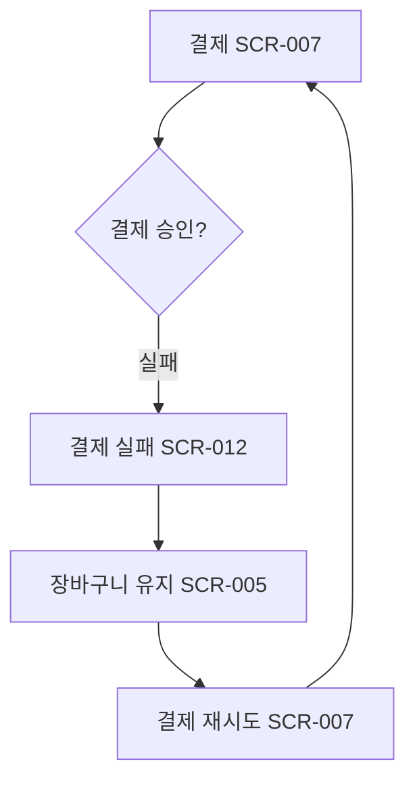
```mermaid
flowchart TD
    A[결제 SCR-007] --> B{결제 승인?}
    B -->|실패| C[결제 실패 SCR-012]
    C --> D[장바구니 유지 SCR-005]
    D --> E[결제 재시도 SCR-007]
    E --> A
```

### SC-006 멤버십 스탬프 1회 확인 후 자동 적립 (LMIS-MEMBER-001)

- **시작**: 결제 단계 진입
- **종료**: 결제완료 화면에 적립 여부가 표시됨(결제 전/후 이중 확인 없음)
- **기본 흐름**: 결제 진행 중 멤버십 적립 여부 1회 확인 → 결제 완료 시 자동 적립 처리 → 결제완료 화면에 적립 결과 표시
- **예외**: 멤버십 미가입 고객은 적립 단계 생략하고 바로 결제 진행
- **상태**: 초안

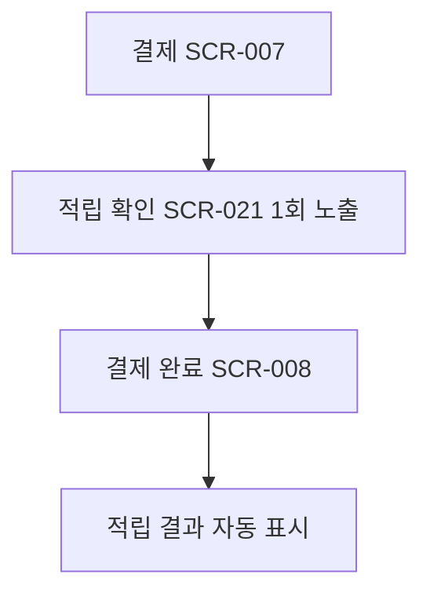
```mermaid
flowchart TD
    A[결제 SCR-007] --> B[적립 확인 SCR-021 1회 노출]
    B --> C[결제 완료 SCR-008]
    C --> D[적립 결과 자동 표시]
```

### SC-007 관리자의 판매 항목 품절 처리 (LMIS-MENU-001)

- **시작**: 재료 또는 메뉴 구성 항목 소진으로 품절 발생
- **종료**: 키오스크 화면에 판매 항목 품절 상태가 반영됨
- **기본 흐름**: 관리자 품절 관리 화면 진입(Week 5 MVP에서는 인증 없이 바로 접근) → 품절 처리할 메뉴/재료 선택 → 품절 토글 ON → 관련 메뉴 목록/메뉴 상세/옵션 선택 화면에 즉시 반영
- **예외**: 같은 재료가 기본 구성과 추가 토핑에 모두 쓰이면 메뉴/상세/옵션 품절 상태에 함께 반영됨
- **상태**: 초안

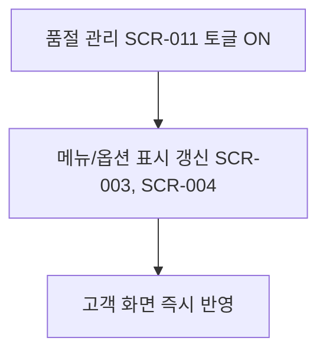
```mermaid
flowchart TD
    A[품절 관리 SCR-011 토글 ON] --> B[메뉴/옵션 표시 갱신 SCR-003, SCR-004]
    B --> C[고객 화면 즉시 반영]
```

### SC-008 관리자의 주문 상태 관리 (LMIS-MENU-001)

- **시작**: 고객이 결제를 완료함
- **종료**: 주문 상태가 완료로 변경되고 관리자 화면에 반영됨
- **기본 흐름**: 주문 접수 → 관리자 주문 목록에 노출 → 주문 상세 확인 → 준비중으로 상태 변경 → 조리 완료 후 완료로 변경
- **예외**: 없음
- **상태**: 초안

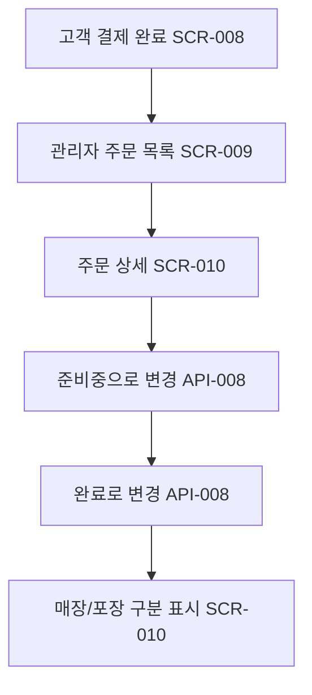
```mermaid
flowchart TD
    A[고객 결제 완료 SCR-008] --> B[관리자 주문 목록 SCR-009]
    B --> C[주문 상세 SCR-010]
    C --> D[준비중으로 변경 API-008]
    D --> E[완료로 변경 API-008]
    E --> F[매장/포장 구분 표시 SCR-010]
```

### SC-009 장바구니 수정(수량변경/삭제) (FWD-CART-002)

- **시작**: 장바구니에 1개 이상 메뉴가 담겨있음
- **종료**: 수정된 내용이 즉시 반영됨
- **기본 흐름**: 장바구니 진입 → 담은 항목 수량 -/+ 조정 → 특정 항목 삭제 → 총금액 자동 재계산
- **예외**: 마지막 1개 삭제 시 장바구니 빈 상태로 메뉴선택 화면으로 유도
- **상태**: 초안

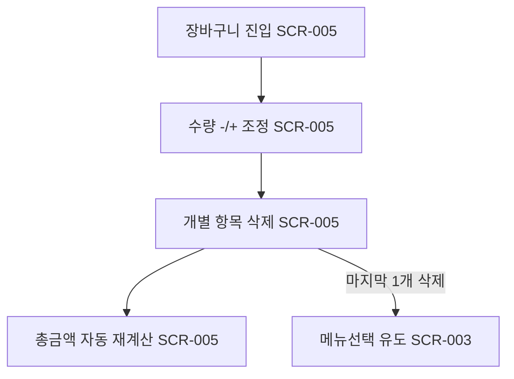
```mermaid
flowchart TD
    A[장바구니 진입 SCR-005] --> B[수량 -/+ 조정 SCR-005]
    B --> C[개별 항목 삭제 SCR-005]
    C --> D[총금액 자동 재계산 SCR-005]
    C -->|마지막 1개 삭제| E[메뉴선택 유도 SCR-003]
```

### SC-010 알레르기/비건 태그 확인 후 주문 (FWD-MENU-008)

- **시작**: 견과류 알레르기가 있는 고객이 메뉴 탐색 중
- **종료**: 고객이 안전하게 메뉴를 선택하거나 회피함
- **기본 흐름**: 알레르기/비건 태그 확인 → 해당 재료 포함 여부 인지 → 태그 기준으로 메뉴 선택/회피
- **예외**: 태그 미표시 재료가 있을 경우 고객이 직접 문의하도록 안내 문구 필요
- **상태**: 초안

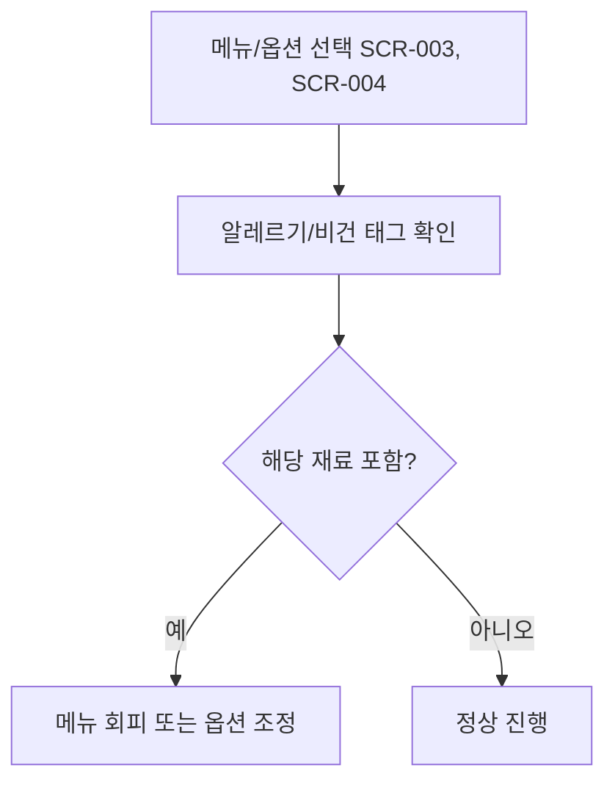
```mermaid
flowchart TD
    A[메뉴/옵션 선택 SCR-003, SCR-004] --> B[알레르기/비건 태그 확인]
    B --> C{해당 재료 포함?}
    C -->|예| D[메뉴 회피 또는 옵션 조정]
    C -->|아니오| E[정상 진행]
```

### SC-011 재료 제외(-) 옵션으로 커스텀 주문 (FWD-CART-001)

- **시작**: 특정 재료를 못 먹는 고객이 옵션선택 단계 진입
- **종료**: 장바구니/주문서에 제외 재료가 명시됨
- **기본 흐름**: 기본 포함 재료 중 특정 항목 "빼기" 선택 → 가격 변동 없이 장바구니에 반영 → 주문서에 제외 항목 표시
- **예외**: 없음(가격 차감 로직 없음을 명확히 확인, 선생님 피드백 6번 반영)
- **상태**: 초안

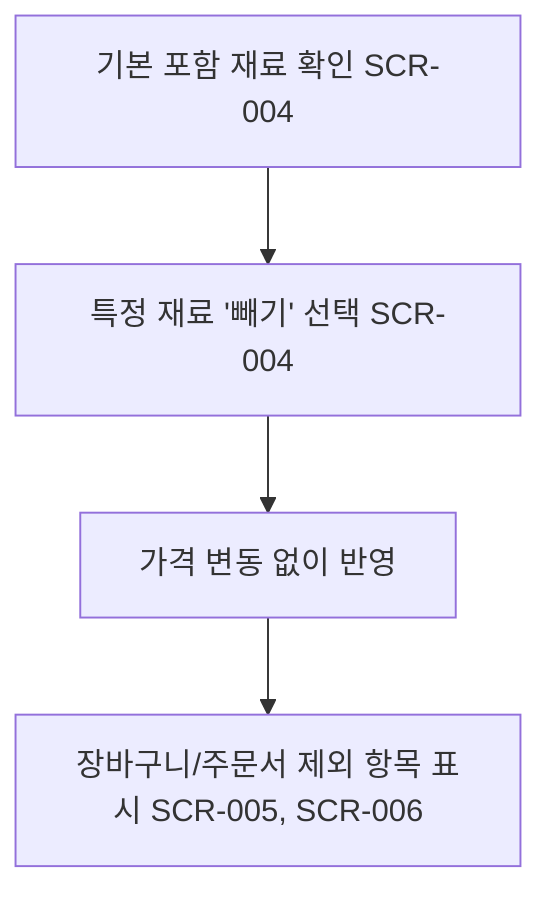
```mermaid
flowchart TD
    A[기본 포함 재료 확인 SCR-004] --> B[특정 재료 '빼기' 선택 SCR-004]
    B --> C[가격 변동 없이 반영]
    C --> D[장바구니/주문서 제외 항목 표시 SCR-005, SCR-006]
```

### SC-012 일정시간 미입력 시 자동 초기화 (FWD-SYS-001)

- **시작**: 주문 진행 중 고객이 자리를 비움
- **종료**: 초기화면으로 전환되고 다음 고객이 깨끗한 상태로 이용 가능
- **기본 흐름**: 고객이 주문 진행 중 자리를 뜨 → 일정시간(예 30초) 동안 입력 없음 → 경고 없이 초기화면으로 자동 복귀 → 장바구니 초기화
- **예외**: 타임아웃 직전 다시 터치하면 타이머 리셋
- **상태**: 초안

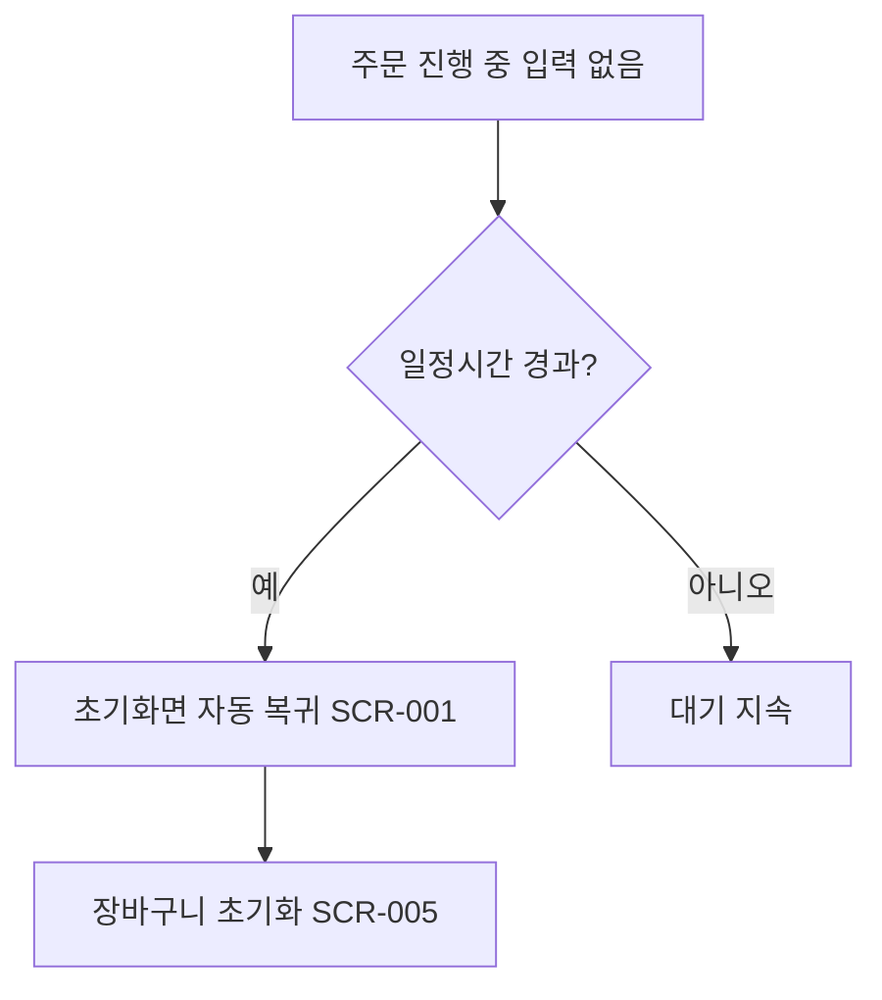
```mermaid
flowchart TD
    A[주문 진행 중 입력 없음] --> B{일정시간 경과?}
    B -->|예| C[초기화면 자동 복귀 SCR-001]
    B -->|아니오| D[대기 지속]
    C --> E[장바구니 초기화 SCR-005]
```

### SC-013 접근성 옵션으로 저시력 고객 주문 (FWD-UI-001) (FWD-UI-004)

- **시작**: 저시력 고객이 키오스크 이용 시작
- **종료**: 안내 없이 주문 완료
- **기본 흐름**: 저시력 고객이 초기화면 진입 → 글자크기 확대 옵션 인지 → 큰 글자/높은 대비로 메뉴 탐색 → 주문 완료
- **예외**: 없음
- **상태**: 초안

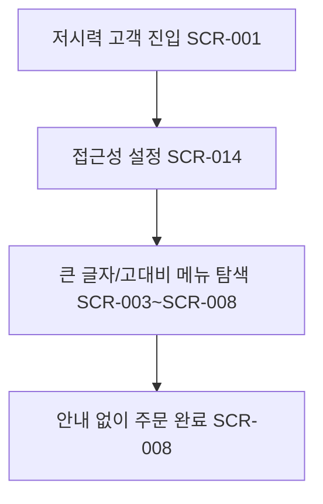
```mermaid
flowchart TD
    A[저시력 고객 진입 SCR-001] --> B[접근성 설정 SCR-014]
    B --> C[큰 글자/고대비 메뉴 탐색 SCR-003~SCR-008]
    C --> D[안내 없이 주문 완료 SCR-008]
```

### SC-014 매장/포장 여부 선택 (FWD-ORDER-001)

- **시작**: 홈 화면에서 주문시작 버튼 클릭
- **종료**: 주문에 orderType(EAT_IN/TAKE_OUT) 구분값이 저장되어 장바구니로 이동
- **기본 흐름**: 홈 화면에서 주문시작 클릭 → 먹고가기/포장 선택 → 선택값(orderType)을 장바구니와 주문확인 단계까지 유지 → 주문 생성 시 orderType에 반영
- **예외**: 선택 없이 다음 단계로 진행 불가(필수 선택)
- **상태**: 초안

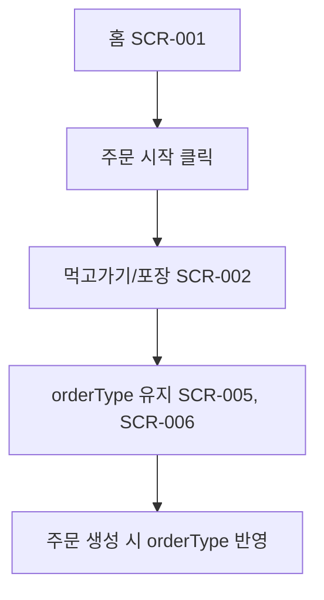
```mermaid
flowchart TD
    A[홈 SCR-001] --> B[주문 시작 클릭]
    B --> C[먹고가기/포장 SCR-002]
    C --> D[orderType 유지 SCR-005, SCR-006]
    D --> E[주문 생성 시 orderType 반영]
```

### SC-015 영수증 출력 여부 선택 (RTOS-DEVICE-001)

- **시작**: 결제 승인 완료 직후
- **종료**: 영수증 출력 완료 또는 화면 주문번호 표시
- **기본 흐름**: 결제 완료 화면에서 영수증 출력 여부 선택 → 출력 선택 시 모의 프린터 요청 → 미선택 시 화면 주문번호로 대체
- **예외**: 프린터 오류 시 화면 주문번호로 자동 대체
- **상태**: 초안

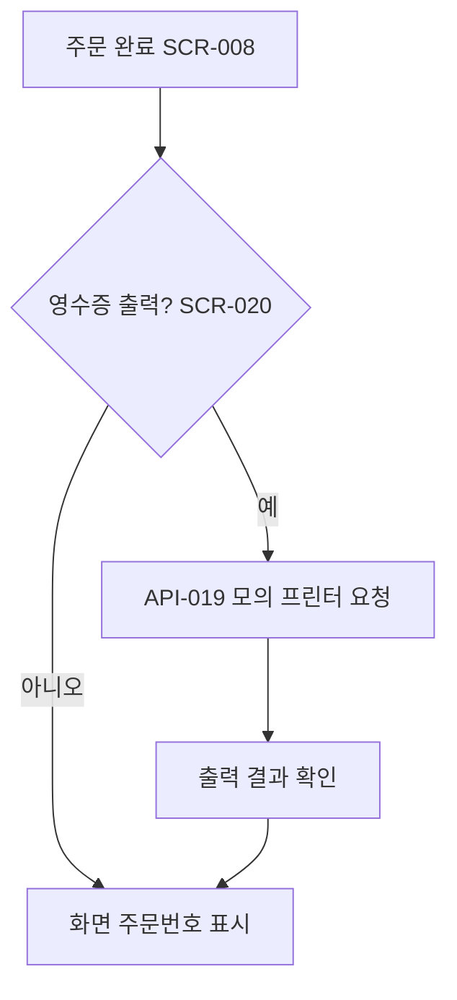
```mermaid
flowchart TD
    A[주문 완료 SCR-008] --> B{영수증 출력? SCR-020}
    B -->|예| C[API-019 모의 프린터 요청]
    B -->|아니오| D[화면 주문번호 표시]
    C --> E[출력 결과 확인]
    E --> D
```

### SC-016 QR/바코드로 쿠폰 인식 후 결제 (RTOS-DEVICE-004 (EXCLUDED))

- **시작**: 고객이 모바일 쿠폰을 보유하고 있음
- **종료**: 할인 적용된 금액으로 결제 완료
- **기본 흐름**: 결제 단계 진입 → 모바일 쿠폰/멤버십 바코드 스캔 → 할인 자동 적용 → 잔액 결제 진행
- **예외**: 스캔 실패/만료된 쿠폰 시 오류 메시지 안내 후 일반결제로 진행
- **상태**: 초안

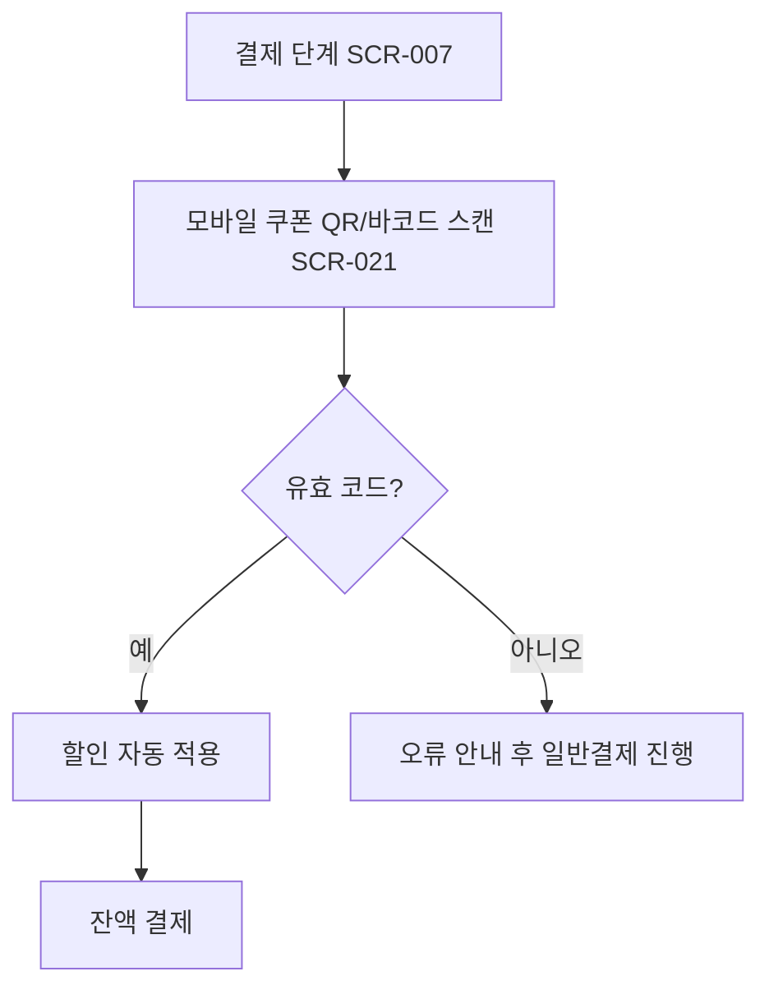
```mermaid
flowchart TD
    A[결제 단계 SCR-007] --> B[모바일 쿠폰 QR/바코드 스캔 SCR-021]
    B --> C{유효 코드?}
    C -->|예| D[할인 자동 적용]
    C -->|아니오| E[오류 안내 후 일반결제 진행]
    D --> F[잔액 결제]
```

### SC-017 관리자의 신규 메뉴 등록 (LMIS-MENU-004)

- **시작**: 관리자가 신규 메뉴를 추가하려는 상황
- **종료**: 신규 메뉴가 키오스크 메뉴선택 화면에 즉시 노출
- **기본 흐름**: 관리자 로그인 → 신규 메뉴 등록(이름/가격/이미지/카테고리) → 옵션그룹 연결 → 저장
- **예외**: 필수값 누락 시 저장 불가 안내
- **상태**: 초안

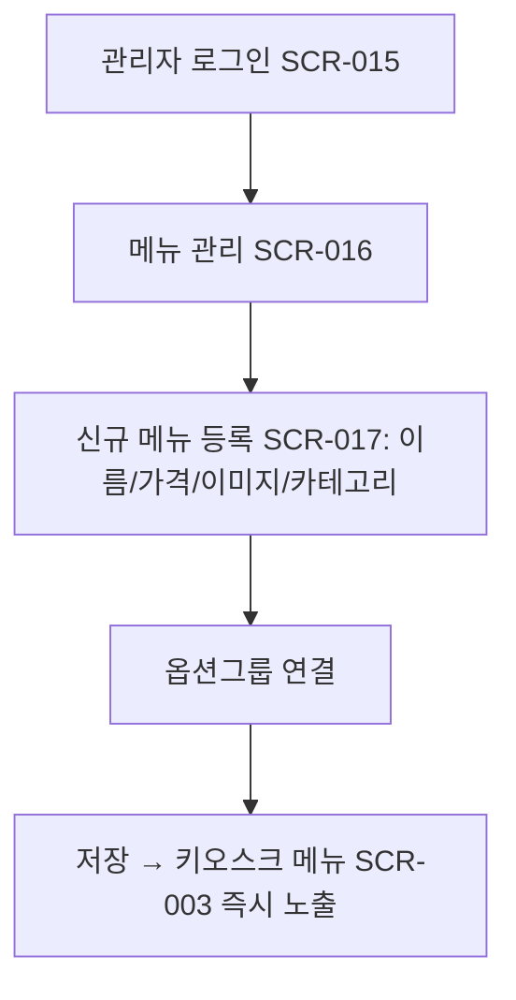
```mermaid
flowchart TD
    A[관리자 로그인 SCR-015] --> B[메뉴 관리 SCR-016]
    B --> C[신규 메뉴 등록 SCR-017: 이름/가격/이미지/카테고리]
    C --> D[옵션그룹 연결]
    D --> E[저장 → 키오스크 메뉴 SCR-003 즉시 노출]
```

### SC-018 관리자의 일별 매출 조회 (LMIS-ORDER-005)

- **시작**: 관리자가 매출 현황을 확인하려는 상황
- **종료**: 기간별 매출/판매량이 화면에 표시됨
- **기본 흐름**: 관리자 로그인 → 기간 선택 → 일별 매출/메뉴별 판매량 조회
- **예외**: 해당 기간에 데이터가 없을 경우 공백 상태 안내
- **상태**: 초안

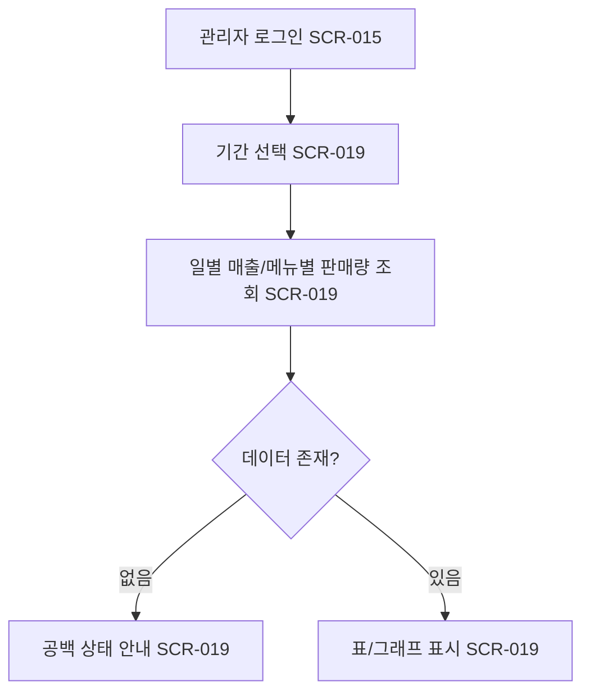
```mermaid
flowchart TD
    A[관리자 로그인 SCR-015] --> B[기간 선택 SCR-019]
    B --> C[일별 매출/메뉴별 판매량 조회 SCR-019]
    C --> D{데이터 존재?}
    D -->|없음| E[공백 상태 안내 SCR-019]
    D -->|있음| F[표/그래프 표시 SCR-019]
```

### SC-019 피크타임 다중 주문 동시처리 (DEV-SYS-001)

- **시작**: 점심시간대 다수 고객 동시 접근 가정
- **종료**: 동시 요청이 목표 응답시간 내에 처리됨
- **기본 흐름**: 동일 시간대에 여러 고객이 동시에 메뉴 조회/주문 진행 → 응답 지연 없이 처리
- **예외**: 부하 증가 시 응답 지연이 발생하면 로딩 인디케이터로 안내
- **상태**: 초안

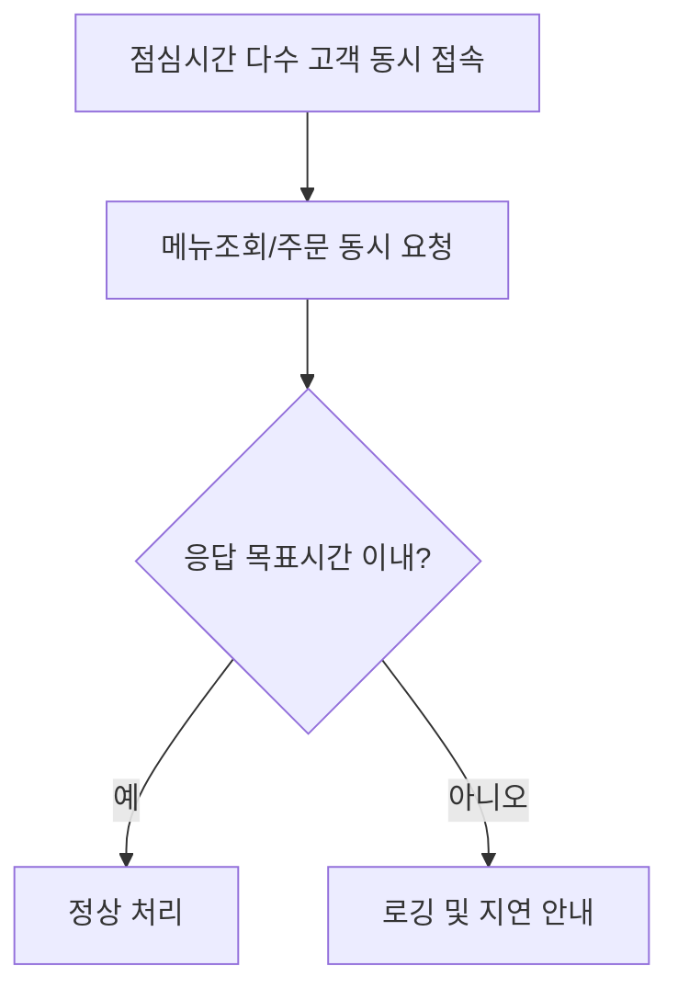
```mermaid
flowchart TD
    A[점심시간 다수 고객 동시 접속] --> B[메뉴조회/주문 동시 요청]
    B --> C{응답 목표시간 이내?}
    C -->|예| D[정상 처리]
    C -->|아니오| E[로깅 및 지연 안내]
```

### SC-020 드레싱 별도포장 추가 주문 (FWD-MENU-002)

- **시작**: 옵션선택 단계에서 드레싱을 하나 더 맛보고 싶은 고객
- **종료**: 장바구니에 기본 드레싱과 별도포장 드레싱이 각각 표시됨
- **기본 흐름**: 기본 드레싱 선택 → 드레싱 별도포장 추가 선택(균일가) → 장바구니에 드레싱 2개(기본+추가) 반영 → 주문서에 별도포장 표시
- **예외**: 없음
- **상태**: 초안

```mermaid
flowchart TD
    A[기본 드레싱 선택 SCR-004] --> B[별도포장 드레싱 추가 선택 SCR-004]
    B --> C[장바구니에 드레싱 2개 표시 SCR-005]
    C --> D[주문서에 별도포장 안내 SCR-006]
```

### SC-021 토핑 개별 수량 조절 주문 (FWD-UI-001)

- **시작**: 특정 토핑(예: 에그)을 더 많이 원하는 고객이 토핑선택 단계 진입
- **종료**: 선택한 수량만큼 장바구니에 가격이 반영됨
- **기본 흐름**: 토핑 목록에서 특정 토핑 + 버튼으로 수량 증가 → 가격이 수량만큼 배수로 자동 재계산 → 같은 토핑을 최대 5개까지 중복 담을 수 있음
- **예외**: 최대치 도달 시 + 버튼 비활성화 및 안내
- **상태**: 초안

```mermaid
flowchart TD
    A[토핑 선택 SCR-004] --> B[+ 버튼으로 수량 증가 SCR-004]
    B --> C[가격 수량만큼 자동 재계산 SCR-005]
    C --> D{최대 5개 도달?}
    D -->|예| E[버튼 비활성화 안내 SCR-004]
    D -->|아니오| F[계속 담기 가능 SCR-005]
```

### SC-022 관리자의 주문서 추가/제외 재료 확인 (LMIS-ORDER-006)

- **시작**: 커스텀 옵션이 포함된 주문이 접수된 상황
- **종료**: 관리자가 선택 옵션과 제외 재료를 구분해 조리 준비할 수 있음
- **기본 흐름**: 커스텀 옵션이 포함된 주문 생성 → 관리자 주문 목록에서 해당 주문 선택 → 주문 상세에서 선택 옵션과 제외 재료 확인 → 조리 준비
- **예외**: 없음
- **상태**: 초안

```mermaid
flowchart TD
    A[커스텀 옵션 포함 주문 접수 SCR-008] --> B[관리자 주문목록 SCR-009]
    B --> C[추가 재료 강조 SCR-010]
    C --> D[제외 재료 강조 SCR-010]
    D --> E[조리 준비]
```

### SC-023 핵심 API 응답속도 검증 (DEV-SYS-002)

- **시작**: 개발 완료 후 부하테스트 진행 시점
- **종료**: 각 API가 명시된 목표 응답시간 내에 응답함
- **기본 흐름**: 메뉴목록/옵션조회/결제 각 API 호출 → 목표 응답시간(2초/1초/3초) 내 응답 확인
- **예외**: 목표시간 초과 시 병목 구간(DB 인덱스, 쿼리문) 점검
- **상태**: 초안

```mermaid
flowchart TD
    A[개발 완료 후 부하테스트] --> B[메뉴목록 API-001 - 목표 2초]
    B --> C[옵션조회 API-004 - 목표 1초]
    C --> D[결제 API-006 - 목표 3초]
    D --> E{목표시간 내 응답?}
    E -->|아니오| F[병목 구간 점검]
```

### SC-024 최종 통합 리허설에서 주문-결제-관리자 확인 (FWD-ORDER-001)

- **시작**: Week 5 MVP(8/1) 또는 최종 발표(9/2) 전 전체 데모 환경이 준비되어 있음
- **종료**: 고객 주문 완료와 관리자 주문 확인/상태 변경까지 한 번에 시연 가능
- **기본 흐름**: 1. 홈(SCR-001) 주문 시작 → 2. 먹고가기/포장(SCR-002) → 3. 메뉴·옵션(SCR-003/004) → 4. 장바구니·주문확인(SCR-005/006) → 5. 결제(SCR-007) → 6. 완료(SCR-008) → 7. 관리자 주문 확인·상태변경(SCR-009/010)
- **예외**: 결제 실패, 품절 항목 포함, 필수 옵션 미선택, 관리자 상태 변경 실패 시 해당 화면과 API 오류 응답을 기준으로 재시도 또는 오류 안내를 확인한다.
- **상태**: 확정

```mermaid
flowchart TD
    A[홈 SCR-001] --> B[먹고가기/포장 SCR-002]
    B --> C[메뉴·옵션 SCR-003/004]
    C --> D[장바구니·주문확인 SCR-005/006]
    D --> E[결제 SCR-007]
    E --> F[완료 SCR-008]
    F --> G[관리자 확인 SCR-009/010]
```
